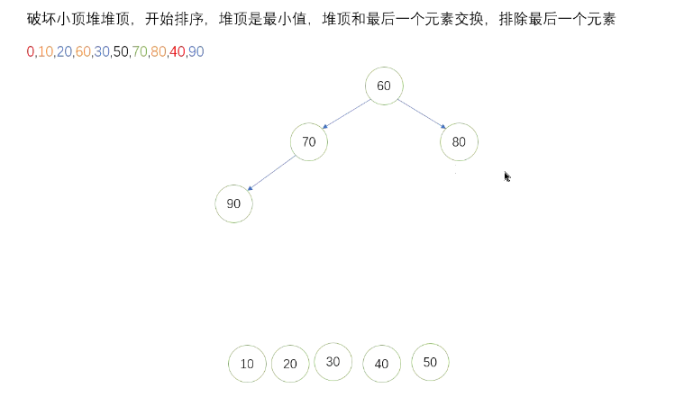
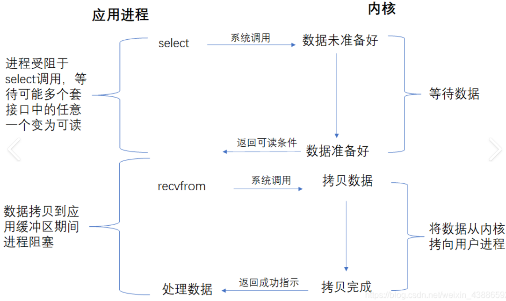

# 1 安装GO

## 1.1 安装GO运行环境

```
https://go.dev/
https://golang.google.cn/
```


### 1.1.1 基础知识扫盲

```bash
#win有两个版本msi版本不需要修改PATH路径
命令行输入go:
	在当前OS环境中查找命令（可执行文件），但目录太多不方便使用，所以依赖于PATH指定的路径。操作系统会去PATH指定的所有目录找go，找不到报错。windows优先再当前目录，找不到才去找PATH。

环境变量: 操作系统运行环境中提前定义好的变量
	PATH：如果你在命令行输入一端字符，shell解析它，被解释为可执行的文件（命令）：
	GOROOT: GO的安装路径
	GOPATH: 当前用户家目录 $HOME/go (第三方包安装路径)
	PATH: %USERPROFILE%/go/bin = GOPATH + bin = /root/go/bin
		win中的%USERPROFILE% = 家目录
		bin = binary 二进制/编译完成的可执行文件
		GOROOT + bin
	pkg目录:缓存第三方包文件bin日录:第三方包通过go install命令下载并编译好的可执行文件的存放
	go install命令:下载第三方包到$GOPATH/go/下面的缓存包文件们到该目录，编译好可执行文件放到$GOPATH/go/bin
	go get命令:下载第三方包到$GOPATH/g0/下面的缓存包文件们到该目录，以后编程用这些包


#查看win变量
win + r -- cmd -- 输入set

Path=C:\Program Files\Java\jdk1.8.0_281\bin;C:\Program Files (x86)\Common Files\Oracle\Java\javapath;C:\Program Files\Java\jdk-1.8\bin;D:\VM17.0\bin\;C:\Program Files (x86)\Common Files\Intel\Shared Libraries\redist\intel64\compiler;C:\Windows\system32;C:\Windows;C:\Windows\System32\Wbem;C:\Windows\System32\WindowsPowerShell\v1.0\;C:\Windows\System32\OpenSSH\;C:\Program Files (x86)\NVIDIA Corporation\PhysX\Common;C:\Program Files\NVIDIA Corporation\NVIDIA NvDLISR;C:\WINDOWS\system32;C:\WINDOWS;C:\WINDOWS\System32\Wbem;C:\WINDOWS\System32\WindowsPowerShell\v1.0\;C:\WINDOWS\System32\OpenSSH\;C:\Program Files\dotnet\;D:\XshellXftp\Xshell\;D:\XshellXftp\Xftp\;E:\Xmanager\;C:\Users\50569\AppData\Local\Programs\Python\Python311\Scripts\;C:\Users\50569\AppData\Local\Programs\Python\Python311\;C:\Users\50569\AppData\Local\Microsoft\WindowsApps;;D:\Pycharm\PyCharm Community Edition 2023.2.1\bin;;E:\vscode\Microsoft VS Code\bin
```


#### 1.1.1.1 通用添加环境变量mac/linux

```bash
#默认
GOPROXY缺省是https://proxy.golang.org,direct
#go1.16之后不用配置
go env -w GO111MODULE=On
#Go Module代理加速仓库服务
go env -w GOPROXY=https://mirrors.aliyun.com/goproxy/

#验证
go env 
```


### 1.1.2 win安装 

#### 1.1.2.1 配置PATH路径

```bash
#使用msi版本的安装方法会自动配置PATH --> 下载包 --> 然后解压到指定的目录
此电脑--右击--高级系统设置
```


**一个是当前用户PATH/一个是全局PATH**


#### 1.1.2.1 windows配置方法


### 1.1.3 linux安装

#### 1.1.3.1 解包

```bash
wget https://dl.google.com/go/go1.22.2.linux-amd64.tar.gz
tar xvf go1.22.2.linux-amd64.tar.gz -C /usr/local
```

#### 1.1.3.2 设置环境变量

```bash
export PATH:$PATH:/usr/loacl/go/bin/
export GOPROXY=https://mirrors.aliyun.com/goproxy/
export GOROOT=<go安装路径>
export GOPATH=$HOME/go
export PATH=$PATH:$GOROOT/bin/  	 #go程序在这里
export PATH=$PATH:$GOPATH/go/bin/	 #三方依赖默认存在这里
#验证
go env 
go version
```


#### 1.1.3.3 设置环境变量 七牛云

```
Go 1.13 及以上（推荐）

打开你的终端并执行

$ go env -w GO111MODULE=on
$ go env -w GOPROXY=https://goproxy.cn,direct
完成。

macOS 或 Linux

打开你的终端并执行

$ export GO111MODULE=on
$ export GOPROXY=https://goproxy.cn
或者

$ echo "export GO111MODULE=on" >> ~/.profile
$ echo "export GOPROXY=https://goproxy.cn" >> ~/.profile
$ source ~/.profile
完成。

Windows

打开你的 PowerShell 并执行

C:\> $env:GO111MODULE = "on"
C:\> $env:GOPROXY = "https://goproxy.cn"
或者

1. 打开“开始”并搜索“env”
2. 选择“编辑系统环境变量”
3. 点击“环境变量…”按钮
4. 在“<你的用户名> 的用户变量”章节下（上半部分）
5. 点击“新建…”按钮
6. 选择“变量名”输入框并输入“GO111MODULE”
7. 选择“变量值”输入框并输入“on”
8. 点击“确定”按钮
9. 点击“新建…”按钮
10. 选择“变量名”输入框并输入“GOPROXY”
11. 选择“变量值”输入框并输入“https://goproxy.cn”
12. 点击“确定”按钮
```


## 1.2 安装GO开发环境

```c
商业：Goland
免费：VSCode（JS ES TS开发第一工具） go语言/伟哥推荐 
     https://code.visualstudio.com/Download
```

### 1.2.1 安装Vscode

无脑安装向导


#### 1.2.1.1 Vscod配置

```bash
#直接在扩展中搜索 go插件
```

新建项目（开发根目录）


```bash
#安装完go会自动弹出强依赖也要安装
install all = 调试编译开发全部安装
```


```
gopls和glv最重要一定要确保他俩安装成功
go install 第三方包下载到 GOPATH指定下目录下，编译好可执行文件放到GOPATH/go/bin/
	下载第三方包 -- 编译 
go get 
	直接下载到GOPATH指定下目录下，以后编程用这些
```


```bash
#vscode 命令行
ctrl + j
```


**如果下载失败尝试手动安装 或者更换GOPROXY的代理地址**

```bash
#官网地址
https://pkg.go.dev/golang.org/x/tools/gopls
go clean -modcache

#必须安装
go install -v github.com/go-delve/delve/cmd/dlv@latest
go install -v golang.org/x/tools/gopls@latest
#不是必须，代码语法检测
go install -v honnef.co/go/tools/cmd/staticcheck@latest
```

**安装完检查**


#### 1.2.1.2 hello-word

```go
package main

import "fmt"

func main() {
	fmt.Println("hello-word")
}

//运行
go run main.go

//调试Vscode  F5(自动保存+编译+调试)
如果按 F5 报错
//确保在项目的根目录 在TERMINAL输入 go mod init www.zed.org
Build Error: go build -o c:\Users\50569\Desktop\golang\project\test\__debug_bin3602295647.exe -gcflags all=-N -l .
go: go.mod file not found in current directory or any parent directory; see 'go help modules' (exit status 1)
```


会生成一个go mod文件


#### 优化配置


**安装插件** 

outline map

提高代码阅读效率

curl + 左键


postfix 补全代码


# 2 初识GO语言

## 2.1 GO命令

```go
go install  //下载第三方包到$GOPATH/g0/下面的缓存包文件们到该目录，编译好可执行文件放到$GOPATH/go/bin
go get 		//下载第三方包到SGOPATH/go下面的缓存包文件们到该目录，以后编程用这些包。如果开启了go模块，包依赖记录在go.mod中
	-u 更新包
go mod		//包管理
	go mod init <name>
	go mod tidy   //扫描当前项目，把go.mod文件中不依赖的第三方包删除，也可以把依赖的第三方包加入

go env
go version
go build 	 //编译
	-o 指定文件
go run		 //编译+运行

fmt 自动格式化代码  gols自动支持
```


## 2.2 项目结构

官方没有提供布局方案


## 2.3 计算机基础


```
冯诺依曼体系五大部件
	CPU:
	运算器
		一般给的一个任务，cpu要花几个震荡周期完成。主频越高越好
		假设3个滴答完成一次计算，请问频率高、低哪个省时间?主频越高越好，但是频率有天花板，所以上多核
	控制器
总线Bus：数据总线、控制总线 
存储器Memory:内存，掉电丢失，速度快
	运行内存:掉电丢失的芯片
	内部存储内存:相当于掉电不丢失的硬盘
	线性编地： 类似于门牌号对应一个内存地址 102 103 看下图
	
	
输入设备Input:数据输入
输出设备output:
输入输出设备不能和CPU直接打交道，CPU必须通过和内存交互进行数据交换。因为cpu中没有大量存储的空间。
	寄存器：为了本次计算所需数据服务
	缓存：cache（为了加速计算，预读取指令）Mb
	CPU亲缘性 避免CPU切换无法充分利用缓存
		1、2KB、3多核共享缓存
显卡：数字信号输入给显卡，显卡输出到显示器 
主板：骨架、神经系统

芯片组：
时钟振荡器
	脉冲信号，触发数字电路工作，频率越快CPU越快
	所有的数字设备都要利用产生的脉冲信号工作
	CPU运行频率是最高的3.xGhz
	
运行速度
CPU -- 内存（TB） 
IO设备，相对内存很漫 硬盘(PB)  固态 相对内存都特别慢

内存快但是掉电丢失 成本高
硬盘慢，但是可以持久化数据

除非有必要尽量在内存中读写，可以提高性能

程序向CPU发送指令  CPU找内存要数据 把需要的数据提前加载的内存中的cache中
```


**CPU并不直接从速度很慢的I0设备上直接读取数据，CPU可以从较慢的内存中读取数据到CPU的寄存器上运算器**
CPU计算的结果也会写入到内存，而不是写入到I0设备上


强类型语言

必须编译


弱类型  python  shell

强类型  C GO java

- 数据声明必须指定明确类型

- 不支持隐式类型转换，类型转换必须强制

- 代码编译成本地可执行代码

- 不需要虚拟机来运行
- 支持垃圾回收

### 不会写作业，刚开始，不要看答案，不会写，用中文写思想逻辑


# 3 GO基础语法

## 3.1 注释

```go
// 多行注释
/*
	a
	b
	a b c
*/


// TODO： 未完成任务
// NOTE： 请注意
// Deprecated： 告诉别人已经废弃了
// 一行一句代码

package main

import "fmt"

func main() {
	fmt.Println("lixijun")
	// TODO 未完成
}

```


## 3.2 命名规范

```bash
#大驼峰 如果要在包内外可见，就采用大驼峰命名
UserName
#小驼峰 如果只在包内可用，就采用小驼峰命名
userName
#sank
user_name

#条件变量、循环变量可以是单个字母或单个单词，Go倾向于使用单个字母。Go建议使用重短小

#常量用驼峰
在其他语言中，常量多使用全大写加下划线的命名方式，Go语言没有这个要求
对约定俗成的全大写，例如PI

函数/方法的参数、返回值应是单个单词或单个字母、函数可以是多个单词命名、类型可以是多个单词命名

方法由于调用时会绑定类型，所以可以考虑使用单个单词
包以小写单个单词命名包名应该和导入路径的最后一段路径保持一致
接口优先采用单个单词命名一般加er后缀。Go语言推荐尽量定义小接口，接口也可以组合
```


## 3.3 关键字

```bash
https:/lgolang.google.cn/ref/spec
#不能乱改
```

Go自己要用的

| 序号 | 关键字        | 说明                                                 |
| ---- | ------------- | ---------------------------------------------------- |
| 1    | `break`       | 用于终止最近的 `for` 或 `switch` 语句。              |
| 2    | `case`        | 用于定义 `switch` 语句的一个分支。                   |
| 3    | `chan`        | 用于声明通道，通道是一种允许并发程序之间通信的类型。 |
| 4    | `const`       | 用于声明常量。                                       |
| 5    | `continue`    | 跳过当前循环的剩余代码，直接开始下一次循环。         |
| 6    | `default`     | 用于定义 `switch` 语句中的默认分支。                 |
| 7    | `defer`       | 用于安排一个函数在调用它的函数退出前执行。           |
| 8    | `else`        | 用于定义 `if` 语句的“否则”分支。                     |
| 9    | `fallthrough` | 用于 `switch` 语句中，表示继续执行下一个 `case`。    |
| 10   | `for`         | 用于创建循环。                                       |
| 11   | `func`        | 用于声明函数。                                       |
| 12   | `go`          | 用于启动一个新的并发线程，称为 goroutine。           |
| 13   | `goto`        | 跳转到程序中的指定行。                               |
| 14   | `if`          | 用于执行条件判断。                                   |
| 15   | `import`      | 用于导入其他包。                                     |
| 16   | `interface`   | 用于定义接口。                                       |
| 17   | `map`         | 用于声明映射类型。                                   |
| 18   | `package`     | 用于定义包。                                         |
| 19   | `range`       | 用于迭代数组、切片、映射和通道。                     |
| 20   | `return`      | 用于从函数返回。                                     |
| 21   | `select`      | 用于创建多个通道操作的并发形式。                     |
| 22   | `struct`      | 用于定义结构体。                                     |
| 23   | `switch`      | 用于执行多个 `case` 的条件分支选择。                 |
| 24   | `type`        | 用于定义类型。                                       |
| 25   | `var`         | 用于声明变量。                                       |


## 3.4 预定义标识符

```bash
https://golang.google.cn/ref/spec#Predeclared identifiers
#可以但别
```


| 标识符       | 说明                                                 |
| ------------ | ---------------------------------------------------- |
| `bool`       | 布尔类型，表示真或假。                               |
| `byte`       | 8位的整数，代表一个ASCII码。                         |
| `complex64`  | 复数类型，由两个32位浮点数表示实部和虚部。           |
| `complex128` | 复数类型，由两个64位浮点数表示实部和虚部。           |
| `error`      | 错误类型，用于错误处理。                             |
| `float32`    | 32位浮点数。                                         |
| `float64`    | 64位浮点数。                                         |
| `int`        | 普通整数，大小取决于运行环境的架构（32位或64位）。   |
| `int8`       | 8位整数。                                            |
| `int16`      | 16位整数。                                           |
| `int32`      | 32位整数。                                           |
| `int64`      | 64位整数。                                           |
| `rune`       | 代表一个Unicode码点的整数类型。                      |
| `string`     | 字符串类型，由一系列字节组成。                       |
| `uint`       | 无符号整数，大小取决于运行环境的架构（32位或64位）。 |
| `uint8`      | 8位无符号整数。                                      |
| `uint16`     | 16位无符号整数。                                     |
| `uint32`     | 32位无符号整数。                                     |
| `uint64`     | 64位无符号整数。                                     |
| `uintptr`    | 无符号整数，用于存储指针的二进制表示。               |


## 3.5 内置函数

| 标识符    | 说明                                 |
| --------- | ------------------------------------ |
| `make`    | 用于创建切片、映射和通道。           |
| `new`     | 用于分配一个类型的新实例。           |
| `len`     | 获取字符串、切片、映射或通道的长度。 |
| `cap`     | 获取切片或通道的容量。               |
| `append`  | 用于追加元素到切片。                 |
| `copy`    | 用于复制切片内容。                   |
| `close`   | 关闭一个通道。                       |
| `complex` | 创建一个复数。                       |
| `real`    | 返回复数的实部。                     |
| `imag`    | 返回复数的虚部。                     |
| `panic`   | 触发一个运行时恐慌。                 |
| `recover` | 用于从恐慌中恢复。                   |


## 3.6 标识符

- 一个名字，本质上是个字符串，用来指代一个值
- 只能是大小写字母、数字、下划线，也可以是Unicode字符
- 不能以数字开头
- 不能是Go语言的关键字
- 尽量不要使用“预定义标识符"，否则后果难料
- 大小写敏感

**建议**

不要使用中文非必要不要使用拼音，尽量遵守上面的命名规范，或形成一套行之有效的命名规则。


```bash
#什么是标识符
a = 100  a指代100, a就是就是代表100的名称，a = 100 的标识符
100是数字，常量，不可变的值  字面常量
100+1=101，100还是那个100，1还是那个1，101就是101
并没有修改 100 也没有修改1 而是出现了一个新的值

 100 + 1  100 + 2 100 + 3 替换成  a + 1  a + 2  a + 3 


如果
a = 200 说明a背后指代的值可以变化（a变了）；所以可以变化的指代值的标识符，称为变量标识符
如果说a的指代一旦关联，不可变，a这个标识符指代的值不能改变了，称为常量标识符
```


## 3.7 字面常量

它是值，不是标识符，但本身就是常量，不能被修改。

Go语言中，boolean、rune、integer、float、complex、string都是字面常量。其中，rune（int32）、integer、flaat、complex常量被称为数值常量。

```
数字1就是1，数字100就是100，两个加起来=101 但是来的1 和 100 并没有改变


"ab" + "c" = "abc"  ab还是以前的ab，c也是c 得出一个新的值是 abc (字符串类型)

‘ab’  ‘c’  （字符类型）只能放一个字符

true false iota

var 变量名
const常量名= 初值 常量必须在定义是直接赋初值

const c ="abc“
const d int = 100 //字面常量100关联
const e uint8 = 100 // 右边无类型常量100 ，和左边有类型常量uint8e关联
// int 8bits -- 1bytes -128~127 -- 0~255

const d  = ”100“ // 类型推导 根据右边推断左边
const d  = 100   // 默认推导为 int   int 和 uint8两码事

如果左边没有指定类型，会根据右边的默认类型推导出他的类型。
字面常量本身是有类型的，
```

以上字面常量在Go中也被称为无类型常量untyped constant.无类型常量的缺省类型为bool、rune、int、float64、complex128或字符串,

注意:Go语言的常量定义，必须是能在编译器就要完全确定其值，所以，值只能使用字面常量。这和其他语言不同!例如，在其他语言中，可以用常量标识符定义一个数组，因为常量标识符保证数组地址不变，而其内元素可以变化。但是Go根本不允许这样做。


```go
在go语言中值有类型之分 
	无类型常量untyped constant
		无类型并不不是真的没有，而是有默认值；
		const a int = 101 // 正常写法
		const(   		  // 推导写法，根据右边数值的缺省类型推导出左边标识符的类型
			b = "abc"
			c = 100
		)

const a = "abc" 赋值语句
// 右边是无类型常量，它的缺省类型是string，左边a没有指定类型，a会进行类型推导，会依赖右边的类型，所以a被推测为string类型
```


## 3.8 iota

```
iota 批量定义常量
是从成批的第一个常量开始计数
```


范例：

```go
// 单独iota 从0开始
const a = iota	// 0 
const b = iota	// 0 
```


```go
// 批量定义
const (
	SUN = iota // 0
	MON = iota // 1
	TUE = iota // 2	
)

const (
	SUN = iota // 0
	MON
	TUE
)

const(
	a = iota // 0
	b 		// 1
    c		// 2
    _		// 按道理是3，但是丢弃了
    d		// 4
    e = 10  // 10
    f		// 10
    g = iota// 7
    h		// 8

)


const(
	m = 0          // iota = 0 * 2
    n			   // iota = 1 * 2
    a = 2 * iota   // iota = 2 * 2
    b			   // iota = 3 * 2
    c        	   // iota = 4 * 2
    d			   // iota = 5 * 2
)

a b c d 分别是 4 6 8 10
```


```bash
其他语言
const a = [1,2]

在go语言中，常量不可以定义数组
var a = [3]int{100,200,300}  // 代表定义变量 指定数组中有三个元素，而且必须是int类型

const a = [2]int{100,200}  报错
{}可以在花括号写元素
Go语言的常量定义，必须是能在编译器就要完全确定其值，所以，值只能使用字面常量。(必须给定值而且不能变)
但是数组的值可以更换，违背了const，所以在go中只能定义为var

其他语言是按照开头只要开头指向的内存地址不变那么就可以定义为常量

```


## 3.9 常量

```
cpu要使用的数值都要放在内存里面，因为磁盘太慢了。
“abc” 可以直接使用，但是如果是100个字符每次都用手敲很麻烦，所以我们可以给100个字符 起一个名字标识符
a = "100个字符" 后续使用我们用a指代100个字符。
“100” 是我给定的值 是我写出来的值 = 字面常量
我给定的值 计算机拿去运算比如 a + 1 = 101  并不会改变我们原来a的值  而是诞生了一个新的值
我可以给 a 这个标识符赋值 让他代表 100 这个字面常量

如果a的指代可以变化=变量
如果a的指代不可以变化 = 常量 但也可能是a有类型要求，同类型可以再次赋值=变量


如果不可以
	a有类型要求，不可以改变类型，同类型可以再次赋值，
	a是变量a就是不可以再被赋值，a和第一个赋给它的值之间的联系不可改变，a称为常量标识符
	
	
在其他语言中
	const a = [11,22]
	const a = [11,22,33]
	const a = [1231]
	可以这样玩，因为a指向内存中的数组开头的地址没变
	
在GO语言中
	const a = [2]int{1,2}
	必须指定数组的长度，但数组中的值可以变，长度不能变，因此不能被定义为常量。
	数组好比是一个容器 里面可以存放多个元素，元素可以变。可变就不能定义为常量
```


定义：

```ABAP
常量:标识符的指向的值一旦建立，不可改变，要求定义是必须建立关联
变量:标识符的指向的值建立后，可以改变
	1类型也可以变，往往动态语言JS、Python，举例a=100，a="abc",a=[1,2,3]
	2只能同类型可变
```


## 3.10 变量


```go
func main(){
	var a = 100
		a = 200
}

func main(){
	var a  		// 错误 因为GO是强类型语言，需要定义类型，但右边没有字面常量，无法根据默认类型推导a的类型
	var a int   // 正确 虽然没有赋值但是给定了类型。 GO特性 零值可用
    const b int // 错误 常量没有零值可用
    var a = 100 // 重复定义 不可以
}


常量可以批量定义，因为他会继承上一个赋值语句，可以进行类型推导。
变量批量定义必须要指定类型，因为它可以为空，为空就不能推导，不能确定类型，就报错哦。

var a int , b int // 错误
var a,b int // 可以 如果要写在一行，必须同类型，并且在最后指定类型
var a,b int = 100,200 //正确 要一起赋值
var(
	a int 
    b int 
)
```


### 3.10.1 短格式变量

```go
func main(){
	a := 100 // 短格式 变量定义 = 定义了变量标识符a 右边可以推导出类型 a 的类型
    a,b，c := 100,"avc".'d'// 短格式批量定义，依次对应推导   定义 赋值 推导
    
    a,b = b,c // 纯粹的赋值 没有类型推导  要注意类型，类型不同会报错
}

              	      // 短格式只能写在func中，不能再全局中定义 //


package main
func main() {
	var a,b = 100,200
	a:=123     // 这样显示重复定义
	c,d := 300,400
	var t = "lxj"
	t,f := "aolgei",123 // 这样就忽略了重复赋值，但类型必须一样，go给自己挖坑了属于是
	println(a,b)
	println(c,d,t,f)
}


// 定义 + 赋值
var a int = 100
// 定义 + 赋值 + 类型推导
	b := 200
// 存粹的赋值
	c = b


// 交换赋值
package main
import "fmt"

func main() {
	var a,b int = 100,200
	c,d := 123,456
	a,b = c,d  // 类型不匹配无法交换
	fmt.Println(a,b,c,d)
	var (
	 m = 1
	 n = 2
	)
	m,n = n,m // 赋值语句 = 从右往左执行，右边先定格
	2 1   2 1
	fmt.Println(m,n)

	// 其他语言交换变量
	tmp := m        
	 1
	m = n 
	2
	n = tmp 
	1
}

```


**注意：**

```
变量的定义赋值 从右往左边，右边的值先定下来，依次给左边赋值

如下：
	m = 111 
	n = 222
	
	m,n = n , m 
222,111 < 222 , 111
最后：
	m = 222
	n = 111
	
	
var a,_,c = 1 2 3 int 
	blank 黑洞 只能在左边写
	空白标识符
```


```ABAP
标识符写代码时候，用来指代某个值的。编译后还有变量、常量标识符吗?
没有了，因为数据在内存中，内存访问靠什么?地址，标识符编译后就没有了就换成了地址了

源代码本质是文本文件
编译，源代码编程成二进制可执行文件
运行这个磁盘上的二进制可执行文件，运行在当前0s上，变成进程，进程要不要占内存空问?要的吗?变量、常量、值在这块内存中放着
```


**包内包外**

```go
// 同一个目录下只能有一个包
main  函数叫做入口函数

// 包内可见 不同文件用同一个包 我在B文件顶一个 var b = "abc" （全局变量，包内可见） 我在A文件调用这个包虽然没有定义也可以使用B定义变量；
var ABC = 100  // 全局包外可见/包内也可以

使用 imoprt 导入的包 如果是包外可见 就可以用 如果是小写就不能用
使用package 使用同一个包 即使不在同一个文件中定义过也可以跨文件调用。同一个包内不同的go文件可以互相访问变量，但是就近原则

全局不能用短格式
```


# 4 类型

## 4.1 布尔型

```go
// bool在go中不是int类型，也不是其他整数类型。在go中，boo1就是布尔型，和整型没有关系，就是完全不同的类型。
true false 字面常量 = bool
```


## 4.2 数值型

复数：complex64 complex128

### 4.2.1 整型

- 长度不同:int8、int16(C语言short)、int32、int64(C语言long)  可以描述负数因为可以带符号
  - 最高位是符号位
  - rune类型本质上就是int32

- 长度不同无符号:uint8、unit16、uint32、uint64 不可以描述负数 因为是无符号

  u即unsigned，最高位不是符号位

  - ​	byte类型，它是uint8的别名

- 自动匹配平台:int、uint  

  int类型它至少占用32位，但一定注等同于int32，不是int32的别名。要看CPU，32位就是4字节，64位就是8字节。但是，也不是说int是8字节64位，就等同于int64，它们依然是**不同类型**

虽然他们都是整型这一类，但他根本上完全不同的类型，go语言对类型极其敏感，不能互操作。


**扩展知识**

```
计算机世界这有二进制数据，每一个位bit表示0或者1，最多表达2种可能性
unsigned = 无符号 以int8 和 uint8 举例：
8bits，总共能够表达256种状态
	int8 -- 1byte -- 8bits 标识正负数将最高位留出来不表示数据状态，用0表示正数 用1表示负数，剩余7bit标识数字
		7bits，总共能够表达256种状态 -128-128
		表示 十进制2
		0 0000010
		表示 十进制-2
		1 0000010
		但计算机中实际上是补码（符合位不动，其余位按照位取反，最后加1）
		1 1111101 取反
		1 1111101  +1
		1 1111110
补码：把减法当作加法，在计算机中所有减法都变成加法，5 - 4 = 1 怎么来的 5 + （-4）= 1 
uint8 -- 1byte -- 8bits 不能标识负数，所有位都用来标识数字
	8bits，总共能够表达256种状态只能标识正数
	十进制2
	00000010
```

 


### 4.2.2 类型

示例：

```go
func main(){
	var m int64 = 50
	fmt.printf("%T %d\n",m,m)
	fmt.printf("%+v\n",string(m))
    fmt.printf("%s\n",string(m))
    fmt.printf("%T %d\n",rune(m))  //rune tyep = int32 
    fmt.printf("%T %d\n",rune(m),rune(m)) // 占位符，每位在右边写，很繁琐
    fmt.printf("%T %[1]d\n",rune(m)) // 整个函数括号中的值是一个数组，有索引（下标）元素已逗号分割，也就是一个逗号一个值对应一个索引。
    
    fmt.printf("%[1]T %[3]d %[2]d %d\n",100，200，300，400) // 最后一个%d的值是什么
    // 最后一个%d值300，前面占位符指定是某个索引，它的值就是索引对应的元素。
    // 如果下一个占位符没有给定索引，那么它的值将根据上一个 %[index]d + 1,来推导出当前占位符的值   
}
// 通过强制类型转换，打印出来，并不是字符"50"，而是“2”。
// go语言会把string中的数值，看作为ascii或unicode码，所有go语言回去查编码表。
```

实例：


**格式输出**

```go
fmt.Println Print line 输出到控制台并换行
fmt.Printf("%T %T %T %T \n",a,b,c,a + b + c)  // format
Printf 在控制台打印 f是format
%T 占位符 和后面的值依次对应
T 表示type，取值的类型

%d digital 数值型，往往用于整数形
%s 用打印string类型的值
%q 带引号的字符串%s
%c character 字符输出
%f float 浮点数输出，默认精度.000000
%.2f 表示小数点后两位
%3f 表示宽度 即打印宽度 右对齐

fmt.Printf("%[2]T %[1]d\n", rune(m), string(m)) 值从1开始编
%[indes]，从1开始编号，下一个如果没有指定索引，索引默认是index+1 注意：溢出

type rune = init32  类型别名rune  他是4tytes或32bits int
type myint int32  // 这不是别名 这里没有 =  这里的意思是 我基于int32 新定义了一个新的类型 myint  在go中只要是不同的类型就是不同的
type 可以定类型

type B = int32 // 类型别名，B和int32就是同一种类型的不同名字B、rune(go内建的)、int32是一个类型的不同名称罢了
	var a B = 10 
	var a rune = 10 
```


```go
package main

import "fmt"

func main() {
	var k = 100
	w := 100
	var r int = 100
	fmt.Printf("%T %T %T %T\n", k, w, r, k+w+r)
	var m int64 = 999
	fmt.Printf("%T %d \n",m,m)
	// fmt.Printf(k+w+r+m) // 不可以加 因为go语言是强类型  int 和 int64 根本不是同类型
	fmt.Println(k+w+r+int(m)) // 强制类型转换，可能会失败
}
```

**强制类型转换:**把一个值从一个个类型强制转换到另一种类型，有可能转换失败。

 **与其他语言不同，即使同是整型这个大类中，在Go中，也不能跨类型计算、如有必要，请强制类型转换**


示例：

```go
package main
import "fmt"

func main() {
	var k = 100
	w := 100
	var r int = 100
	fmt.Printf("%T %T %T %T\n", k, w, r, k+w+r)
	var m int64 = 999
	fmt.Printf("%T %d \n", m, m)
	// fmt.Printf(k+w+r+m) // 不可以加 因为go语言是强类型  int 和 int64 根本不是同类型
	fmt.Println(k + w + r + int(m))         // 强制类型转换，
	fmt.Printf("%+v\n", string(m))          // 数值可以转成字符串 ϧ ，（ascli或unicode码）
	fmt.Printf("%T %d\n", rune(m), rune(m)) // rune = int32  4bits 32bytes
	fmt.Printf("%[1]T %[1]d\n", rune(m))    // 格式化左边可以写右边的索引，默认右边第一个数值索引是1
	fmt.Printf("%[2]T %[1]d\n", rune(m), string(m))
	fmt.Printf("%d,%d;%d.%d]\n", 100, 200, 300, 400)          // 100,200;300.400]  左边只替换%d占位符
	fmt.Printf("%[1]d %[3]d %[2]d %d \n", 100, 200, 300, 400) // 错误 100 300 200 400 正确 100 300 200 300 如果当前没有给定索引，就按照上一个索引的值+1算出当前的索引
	fmt.Printf("%[1]d %d %[2]d %d \n", 100, 200, 300, 400)    // 100 200 200 300
}
```


##### **类型别名**

```go
package main
import "fmt"

func main() {
//	var a = 100
//	var b int64 = 200
//	var c rune = 300 // type rune = init32  类型别名rune  他是4tytes或32bits int

	//这两个的意思完全不同
	type B = int32    B 指代 int32   B可以和int32类的值互操作      类型别名
	type x int32	  我创建了一个型类型X 他的类型是int32新的类型	重新定义 虽然你的本质也是int32 但是你是新的类型
	
	type x int32
	type B = int32 
	var G B = 100
	var m x = 111
//	fmt.Println(G + m)    因为G的类型是B B是int32 m的类型是x x类是也是int32 但是x是新定义的类型 不能直接计算
fmt.Println(G + int32(m)) 强制类型转换
}

```

##### **二刷**

```go
// 类型别名，rune的类型 = int32，别名就是rune代表int32。不是型类型，可以互相操作。
type rune = int32
// 定义新类型zedint，它的类型是int32，不是别名。
type zedint int32 

虽然本质int32，但 rune 和 zedint 不是相同的类型，zedint是基于int32定义的新类型

type A int32
type B = int32

var c B = 100
var d rune = 200
fmt.println( c + d ) // 可以相加，因为B是int32的别名，rune也是int32的别名。类型一样可以相加。
var m A = 1000
fmt.println( c + m ) // 不能相加，因为c的类型是B，B是int32的别名，而m是A类型，A != int32
fmt.println( c + int32(m) ) // 类型转换
```


### 4.2.3 字符和整数

```go
package main
import "fmt"

func main() {a
	var a = '测'
	fmt.Printf("%T %[1]d\n",a)   
}
打印：int32 27979（10进值）

fmt.Printf("%T %[1]d %[1]c\n",a)
// '测' 单引号在GO中默认是rune类型 rune类型是 int32 的别名
// '测' 是字面表达，实际上最终存在计算机中是数字，这是一种方便我们书写代码的格式化，实际上程序会自动转换成数字。
// %d解释为整数，%c解释为字符。内存中一个数据，看你赋子它什么类型，就可以看到不同的东西。

rune 类型保存的是字符，字符的unicode码。
重新赋值，不是重新定义，不会改变类型
```

示例：

```go
var a = '测'
	a = 'abc' // 错误，字符只能是单个，多个就要定义为“abc”
	a = 'c'   // 正确，重新赋值，a的类型是什么type rune = int32，重新赋值类型不变。不是重新定义
fmt.printf("%T %[1]d %[1]c\n",c)
			int32  99   c
	a = 99 	  //  这里不同于定义变量时，不会使用类型推导，而是给a重新赋值为99。千万不能理解成99是int缺省类型。在定义变量时，没指定才会用缺省。这里a 已经时rune类型，而rune就是int32，int32可以定义99整数呀。			*****涉及到隐式类型转换，请看下一小节*****
fmt.printf("%T %[1]d %[1]c\n",c)

	a = '0x63' // 不对，这是代表整数
    a = '\x63' // 正确，告诉Go语言'\x63'代表的是一个字符。虽然是一串数字，但是他代表一个字符

// 计算机本质都是数值，重点是如何解释，如果解释为数值那么就是数值。如果解释为字符，那么就去查ascii码表。
实例:
    func main(){
        var b = '测'
    fmt.printf("%T %[1]d %[1]c\n",b)
    int32 27979 测 
        b = 27979 // 隐式类型转换 b = int32(27979)
    fmt.printf("%T %[1]d %[1]c\n",b)
    int32 27979 测 
    }
```

##### 结论

```abap
可以认为Go语言中没有字符类型，本质上是int32的别名。习惯性称rune为字符型。所谓的字符型，也就是rune类型，说白了字符型就是整数。
```

##### 隐式类型转换

```GO
// 这两条赋值语句意义相同，语法糖（隐式类型转换），提高开发效率。
var a int32 = 100 // 隐式类型转换
var a int32 = int32(100) // 如果等于号右边是untyped constant，会根据等于号左边的类型对等于号右边的类型，进行隐式类型转换。
	a = 99 // 什么意思？= 隐式类型转换
// 在上面已经确定变量标识符a的类型为int32，右边的99是字面常量缺省类型int。
// a = 99 重新赋值，而不是重新定义所以类型不变。
   a = int32(99)  等价于  a = 99

// 隐式类型转换只作用于 untyped constant
var z int32 = 10086
var x int64 = z // 报错，不可以因为z是int32，x是int64。需要手动进行类型转换
var x int64 = int64(z)
         n := z // 可以n没有指定类型，可以利用Z做类型推到。
```

##### 自动类型提升

```go
var m int32 = 100
		 n := 2.2
fmt.printf(n+m)		 	 // 不能相加，因为m类型是int32,n类型是float64。
fmt.printf(n+float64(m)) // 强制类型转换可以相加

fmt.printf(100+2.2)  // 可以相加，untyped constant的特权，有隐式类型转换
fmt.printf(float64(100) + 2.2) 

var x int = int('测')
var x int = '测' // 测 = int32 = 4byte = 27979 = unicode码 
var x  = ”测“    // string utf-8
```


### 4.2.4 浮点数

示例：

```go
	var m int32 = 100 // 左边类型int32 右边int 会做隐式类型转换等价于 m int32 = int32(100)
	var n = 2.6       // float64
	// fmt.Println(m+n) m 和 n 不能直接加因为类型不同
	fmt.Println(float64(m) + n)    // 强制类型转换
	fmt.Println(100 + 2.65)        // 可以加 因为untyped constant类型隐式类型转换 100是int 2.6是float 会把100提升为float64
	fmt.Printf("%f\n", 100+2.65)   // 默认 .000000
	fmt.Printf("%.2f\n", 100+2.65) // %.2f 小数点后两位
	fmt.Printf("%30f\n", 100+2.65) // %30f 宽度右对齐，30包括打印打字符多余的用空格补充，打印的数值会把宽度覆盖，如果宽度覆盖了打印的值，多余的用空格补。如果没覆盖则看不出。
	fmt.Printf("%-30f\n", 100+2.65)// %-30f宽度左对齐
	fmt.Printf("%30.1f\n", 100+2.65)// %-30.1f宽度左对齐并且只显示小数点后1位
```

图示：


示例：

```
var c rune = '中' // 字符用单引号。想一下，计算机中有中文吗？
fmt.printf("%T %c %d\n",c,c,c)
int32 测 27979

var c byte = '中' // 报错， '中 '= rune = int32 > 1 byte 
var m byte = 'a'  // 正确， a是ascii表，不超过 1 byte

var e rune = 27979
fmt.printf("%T %c %d\n",e,e,e)
int32 测 27979
```

```ABAP
字符串是由若干个字符组成，在内存中使用utf-8编码。而rune只能保存一个字符，输出是unicode。
```


### 4.2.5 进制转换

常见进制有二进制、八进制、十进制、十六进制。重点掌握二进制、十六进制。

十进制逢十进一;十六进制逢十六进一;二进制逢二进一

**什么是权**

```
"权" 指的是每个数位上的数值所代表的实际大小.由于在不同的数位上，相同的数字代表的实际值是不同的。
“权”的概念是为了帮助我们理解在不同进制数系统中，每个数位上的数字是如何转化为实际数值的。
```

**按位权算**

权的值 = 当前基数位置的幂次方 （第几位就几次方）

即每一位的数值乘以它所处位数的基数幂次。

**按位乘权求和**

```bash
当我用十进制表示数字的值时：每个数字在某个特定位置上的值，由其在该位置上的数值乘以该进制基数的位置次幂
第一位（从右向左）通常代表的是0次方，第二位代表的是1次方。（千3 百2 十1 个0）
#总结(^托字符代表幂运算)
sum(每位的数值 = 位置上的数字 x 权(基数的位置次幂))
2^3 2^2	2^1	 2^0
ob1  1   1    0
每进一位就翻一倍，所以权是该进制的次方
```

**基数**

- 在二进制系统中，基数是2，因为每一位只能是0或1，即2的0次幂或2的1次幂。
- 在十进制系统中，基数是10，因为每一位可以是0到9，即10的0次幂到10的1次幂
- 每一位上可能出现的不同数字的最大数量。
  -  十进制的基数是10，因为每个位置上的数位可以是0到9。
  - 二进制的基数是2，因为每个位置上的数位可以是0或1。
  - 八进制的基数是8，因为每个位置上的数位可以是0到7。
  - 十六进制的基数是16，因为每个位置上的数位可以是0到15。


**进制**

- “二进制”是一个进制数制，它使用基数2，只有两个数字符号：0和1。
- “十进制”是一个进制数制，它使用基数10，有十个数字符号：0到9。

```
十进制 1234  =  1 * 10^3 + 2 * 10^2 + 3 * 10^1 + 4 * 10^0 = 1000 + 200 + 30 + 4 = 1234
二进制 0011  =  0 * 2^3  + 0 * 2^2 + 1 * 2^1  + 1 * 2^0 =  0 + 0 + 2 + 1 = 3 
八进制 3145  =  3 * 8^3  + 1 * 8^2 + 4 * 8^1  + 5 * 8^0 = 1536 + 64 + 32 + 5 = 1637
```

练习：

```bash
#二进制和十六进制之间的转换基于它们基数之间的关系：十六进制是基于16的数制，而二进制是基于2的数制。由于16是2的4次幂，所以每4位二进制数可以表示一个十六进制数位。
二进制    十六进制
0000        0
0001        1
0010        2
0011        3
0100        4
0101        5
0110        6
0111        7
1000        8
1001        9
1010        A
1011        B
1100        C
1101        D
1110        E
1111        F
```

**总结**

```ABAP
四位二进制数可以转换为一个十六进制数，是因为二进制的四位可以表示的取值范围是 0-15，十六进制单个数字的取值范围也是0-15（0-f），所以四位二进制可以映射成单个十六进制数。
三位二进制数映射成单个八进制数（同理）
```

练习：

```bash
#二进制和八进制转换基于他们之间的基数关系：8进制的基数是8，而二进制的基数是2.由于8是2的3次幂，所以每3位二进制可以表示一个8进制数。
二进制    八进制
 000		0
 001		1
 010		2
 011		3
 100		4
 101		5
 110		6
 111		7

0b11 110 = 0o 36 = 30  
0b1 1110 = 0x 1E = 30  

0b11 10 0 011 = 0o 343 = 227 
0b1110   0011 = 0x E3  = 227 
0o 343 = 0b 11100011
0x E4 = 0b 1110 0100
```

练习：

```c
无符号数为例，8位，256
    00000000
    11111111 = 0xff
BCD
8421
ob1111 = 1 + 2 + 4 + 8 = 15 = F
ob1110 = 0 + 2 + 4 + 8 = 14 = E
ob1100 = 0 + 0 + 4 + 8 = 12 = C
ob1000 = 0 + 0 + 0 + 8 = 8  = 8 

二进制到16进制 每4位一段
0b 1001 =  9 = 0x9
0b 1010 = 10 = 0xa
0b 1011 = 11 = 0xb
0b 1100 = 12 = 0xc
0b 1101 = 13 = 0xd
0b 1110 = 14 = 0xe
0b 1111 = 14 = 0xf

二进制到8进制 每3位一段

0b 0 000
```


```
十六进制转为二进制
0xF8 按位展开即可，得到 0b1111 1000

八进制转二进制
0o644 按位展开即可，得到 0b110 100 100
```


**十进制转二进制**


**有符号无符号数**

```go
// 无符号数，8位256状态，[0 - 255]
00000000 = 0
11111111 = 255
// 有符号数比无符号数少一位,少的第一位0代表正数或1代表负数，虽然比无符号数少一位，但还是256状态
0_0000000 - 0_1111111 = 0_0x7F [0 - 127] 	128个数字，128状态
1_0000000 - 1_1111111（-127） = 1_0x7F [-1 - -128]	
			1_00000000（-128）		      128个数字，128状态  -1 - 128
```


## 4.3 转义字符

每一个都是一个字符，rune类型（int32）。可以作为单独字符使用，可以作为字符串中的一个字符

```
\a	bell
\b	backspace
\f	feed
\n	new line
\r	return
\t	tab
\v
\\  \号是转换别人的符号  \\表示把\转意成 \原本的意思
\'  单引号是用来界定字符类型的   让'代表本身的意思\' 而不是界定字符,代表单引号
\"  双引号是用来界定字符串类型的 让"代表原来的意思\" 而不是界定字符穿，代表双引号
```

问题：在Go中‘\n’和"\n"有什么区别？

```
类型不同，'是字符'，“是字符串”
'\n' 是字符，字符 = rune  =  int32 = 整数
反引号用来定义多行字符串，或者频繁出现”“简化编程。
```


## 4.4 字符串

Go语言中不能使用单引号定义字符串

单引号用来表示字符，字面量表达，本质上是int 32 (rune)或 byte( uint8)

双引号和反引号用来表示字符串字面量 ""|``

```go
package main
import "fmt"

func main(){
    var s = "abc"
    	s = "z\tx\nc"
    	a = `x\nz\t`   // ``中的转义字符失效，但键盘中的功能键可以生效
    fmt.println(s)
    fmt.println("~~~~~~~~~~")
    fmt.println(a)
}
// 打印结果
z	y
c
~~~~~~~~~~
x\nz\t
```


打印结果：


##### TAB键

```go
一个tab键是八个字符
前面有多少字符，并不会影响tab键的起始点。

 tab键
12345678
x       y     // 源码x\ty，三个字符，而显示9个字符。
xvf     y
xxxxxxxx        y
字符或字符串，所占用的字节数（占用多少字节，内存和磁盘使用量），在不同的显示设备中展示的宽度
// 单引号用来多行输出，或者代码中有双引号不用频繁转义。

var a = "x\ty\n\"'z'\""  // 一共9个字符，拆开数。
x
\t
y
\n
\"
'
z
'
\"
var a = "'" // 双引号中的单引号为什么不需要转义
a 的类型是字符串，字符串中有一个字符 ‘ 单引号。所以不需要转义，没有歧义
```


####  字符串格式化

```go
%v	适合所有类型数据，调用数据的缺省打印格式
	%+v	详细打印
	%#v 更详细打印
%T 	打印值的类型
%%	打印百分号本身

整数
%b 二进制； %o 八进制；%O 代表有前缀；%x 十六进制小写；%X16 进制大写
%U 
%c 利用数字查表  把rune类型映射成 unticoer
%q 想看中文字符 类似%c

浮点数
%e %E 科学计数
%f %F小数表示法
%g 内部自动选择%e还是%f；%G 自动选择%E、%F

字符串/切片
%s
%q  qoute引号


指针
%p 十六进制地址
```


#### 输出函数

输出到标准输出 stdout

- Print : 使用缺省格式输出，空格分割
- Println：使用缺省格式输出，空格分割，最后追加换行
- Printf：按照指定的格式符输出

不输出到控制台，而是输出到字符串，用来拼接字符串

- Sprint ：相当于print，不过输出为string
- Sprintln：相当于println，不过输出为string
- Sprintf：相当于printf，不过输出为string

```go
package main

import "fmt"

func main() {
	var s = 27979 // 6 x 16^3 + 13x16^2 + 4x16^1 + 11 =
	fmt.Printf("%+v %[1]d %[1]b %[1]o  %[1]x %[1]X %[1]c %[1]U\n", s) // %c查表 unicode
	t := fmt.Sprintf("%+v %[1]d %[1]b %[1]o  %#[1]x %[1]X %[1]c %[1]U\n", s)
	// Sprint 要给他一个变量，把输出的字符串保存到变量t中。
    // fmt.print(s) 调用缺省格式输出
	// fmt.Println(t) 调用缺省格式输出 + \n
	// 生产字符串，然后输出到标准输出
    // 用后面写的变量，填充前面的字符串占位符，最后输出到标准输出
}

6d4b 等于多少字节
转成二进制    0110 1101    0100 1011  1位16进制数表示4位二进制，8位1字节，2两个字节
```


# 5 操作符

```go
// 随笔
定义变量
var a,b int = 100 200
a,b := 10,"abcd" 
```


在Go语言中，1就是整数，true就是bool。这点和其他语言不同，1可以代表true。

下图是其他语言中的示例：这里我们用1代表true，0False

## 5.1 逻辑运算表


```
非逻辑：
	真取反假
	假取反真
与逻辑（乘法）：
	0 x 0 = 0
	0 x 1 = 0
	1 x 0 = 0
	1 x 1 = 1
或逻辑（加法）：
	0+0=0
	0+1=1
	1+0=1
	1+1=1 (虽然是加法，但是按位或，不存在进位，每一位计算只在当前位数上)
```


## 5.2 算数运算符

```
+、-、*、/、%、++、--
5 / 2 整数 / 整数 = 整数 会四舍五入
（-5 ）/ 2  
取摸运算就是求余数 5 % 2 = 1 

+ - x / ,因为他么都需要两个操作数 = 双目运算符
-5，负号只需要一个操作数 = 单目运算符（优先级高）
在Go语言中后缀递增(i++,i--)不可以写在函数中(i++是语句)。

Go中没有++i，--i
前缀递增递减和后缀递增递减的区别：
i++,i--和++i，--i的区别，前者先返回数值比较条件，然后++。后者先++，然后返回值后在比较条件。 
延迟递增
即时递增
```


## 5.3 常量计算问题

常量分为typed类型和untyped constant

常见错误

```go
var a int = 1
var b float32 = 2.3
fmt.Println(a*b) // 报错，因为int和float32类型不同，除非强制类型转换，GO语言这种情况不会进行隐式类型转换

var a = 1
var b = 1.1
fmt.Println(a*b) // 错误，类型不同，强制类型转换，变量都有类型，不会做隐式转换。

fmt,Println(1*1.1) // 可以，无类型常量，会做隐式类型转换

var a = 1 * 2
fmt.Printf("%T %[1]v %[1]d\n",a)
因为右边使用的都是字面常量，而字面常量都是无类型常量untyped constant，它会在上下文中隐式转换。Go为了方便，不能过于死板，增加程序员转换类型的负担，在无类型常量上做了一些贴心操作。
```

**上面的常量被赋给了变量，这些变量就确定了类型，虽然他们指向的值是字面常量，但是计算使用变量，但变量的类型不一致，报错。**


## 5.4 位运算符

**&位于（逻辑与）**

```
与运算就好比是个筛子15 & 9  按位透传
1111
1001
1001
只要9有的数就可以透传我们想要的数字，9是0就把我梦原来的数字过滤掉了
??? & 1
01010101010100101/0
00000000000000001
00000000000000001/0
未知数最后一位如果是1那么结果就是1，未知数最后以为如果是0，结果就是0。前面的位全被过滤掉了，只有最后1位没有每过滤。

？？？& 15 什么意思，只取后四位
1010101010100100011
0000000000000001111


&^  取反与运算，按位清除 0是1  1是0
1001
1101
0100


15 & 5 = 5
1111
0101
0101
15 &^ 5 = 10
1111
0101
1010
```


**|位或（逻辑或）**


**^异或（不同为真）**


```
移位 << >> (相当于乘法，每移动1位，就是1次方)
1 << 1
移动前：0000 0001
移动后：0000 0010
1 << 2
移动前：0000 0001
移动后：0000 0100
3 << 1
移动前：0000 0011
移动后：0000 0110
```


## 5.5 比较运算符

```go
< > == !=  >=  <= 双目运算符号，比较表达式，需要两个操作数。对于Go语言来说不管什么一定要有类型，比较的结果一定是bool型。 两个操作数只要是整型就可以比较。
结果：true|false
5 > 3
5 > 'a'  // 可以本质都是整数
5 > "a"  // 不可以，类型差距太大
5 == "a" // Go不可以，其他语言可以，跨类型比较是不是同类型。但从语义上分析，跨类型比较根本无法计算


逻辑与运算：&& 
逻辑或运算：||
逻辑取反： ! 
逻辑运算符，只能操作逻辑值bool型，true和false。返回的结果是什么？也是bool型。
在Go中不可以用逻辑运算符操作非bool.在其他语言中，可以做某些类型等效看作bool
1 = true, 0 = false,空串看作false,非空串看作true。
1 && 5 > 1  // 报错

短路
true || false || false || false // 第一个为真，那么后续是真，1 任何数或都是1，有一个1，就算真
false|| false || true   // 判断第一个加，判断第二个家，判断第三个真，
false && true && true // 最后还是0，因为0x任何数=0
 0         1

true && false || false
先比较，后逻辑
5 > 3 && 4 > 2 
```


## 5.6 赋值运算符


示例：

```
a += 8
a = a + 5 
a += 10 + 5 
a = a + 10 + 5 
a *= 10 + 5 
a  = a* (10 + 5) 
```


## 5.7 三元运算符

Go中没有三元运算符

没有 ?:的原因是，语言的设计者看到这个操作经常被用来创建难以理解的复杂表达式。在替代方案上，if-else 形式虽然较长，但无疑是更清晰的。一门语言只需要一个条件控制流结构。


## 5.8 指针操作

```
变量标识符的本质，指向指代某个值，编译后会被解释成内存地址。
指针是一种类型某种类型的值，本质上是一个大整数，简单说这个整数就是内存中的门牌号，房间中住着一个客人就是我们的数值。
*int是指向int类型数据的指针的一种类型
0xc000018088 内存地址，门牌号，利用这个门牌号，可以找到房间中的100数值。
*变量指针 表示通过指针取值
&变量 表示通过变量取地址
```

示例：

```go
func main(){
	a := 100 // 编译后，100数值存在内存中的某个地址，而a变量标识符指向这个地址。但a不是指针类型它是缺省int。a的类型是由它指向的值决定，
    b := &a // 取地址操作符
    fmt.Printf("%T %[1]v\n",b)
    c := *b // 通过地址取内容，c的类型是int
    fmt.Printf("%T %[1]v\n",c)
    
    fmt.Println( a == c )
    fmt.Println( b == &c ) // 地址不相等，*b提取内容，然后在内存中开辟新的门牌号放入房间（副本），赋值给c
    b指代a（100）的门牌号也就是内存地址，但b在内存中也有自己的门牌号。
    
    var d = a 
    fmt.Println(d == a)     true
    fmt.Println(&d == &a)   false // 赋值在Go中，往往是建立副本，重新赋值
    目前来看，只要定义赋值就会开辟新的内存空间，创建副本赋值给标识符
}
显示：*int 0xc000018088
显示：int 101
```


## 5.9  优先级


```
单目 > 双目
算数 > 位移 > 比较 > 逻辑 > 赋值  
记不清直接上括号
```


# 6 程序控制

- 顺序
  - 按照先后顺序逐条执行
  - 例如：先到厕所，脱裤子，蹲下，拉屎

- 分支
  - 根据不同的情况判断，条件满足执行某些条件下的语句
  - 例如：洗手，吃饭，饭没熟，躺会，如果饭熟了吃饭。没饭就点外卖
- 循环
  - 满足条件就是循环执行，不满足条件就不执行
  - 例如：先洗手，先看看饭菜好了没，没好就过一会儿再看看，再看看，没好，再看看，直到饭菜好了，直接吃饭，退出查看饭好没好的循环。


## 6.1 单分支

```go
// Go语音对类型比较敏感，条件只能bool，或者是可以返回bool值的表达式
// 条件成立进入，并执行代码块，为了防止风格问题，左花括号只能写在if同一行
if condition {
	代码块
}

if 5 > 2 {
	fmt.Print(a)
}
```

注意：Go语言中，花括号一定要跟着if、for、func等行的最后，否则语法出错。这其实就是为了解决C
风格、Java风格之争。

- condition必须是一个bool类型，在Go中，不能使用其他类型等效为布尔值。if 1 {} 是错误的
- 语句块中可以写其他代码
- 如果condition为true，才能执行其后代码块


## 6.2 多分支

```go
// 如果满足条件1 执行条件1，就不能进入其他if语句，如果以上都不成立，执行最后一个else。
if condition {
	代码块1
} else if condition {
	代码块2
} else if condition {
    代码块3
} else if condition {
	代码块4
} else {
	代码块 // 最后一个else很重要，容易出现逻辑漏洞，以上情况都不满足，那么都不满足咋办，执行什么操作。这里就必须要考虑是不是要加一个else来兜底。
}
```


```go
func main(){
	a := 5
	if a < 0 {
		fmt.Print("negative")
	} else if a == 0 { // 走到这一层，表示a不小于0，也就是a可能大于0
		fmt.Print("zero")
	} else {	// a 大于 0 
		fmt.Print("big")
	}
}

嵌套写法 两层嵌套和三层嵌套，多了太恶心
if a < 0 {
    fmt.Print("negative")
} else {
    if a == 0 {
        fmt.Print("zero")
    } else {
        fmt.Print("big")
    }
}
```


## 6.3 switch分支

```go
func main(){
	a := 5
	switch a {
	case 1:
		fmt.Print("1")
	case 2:
		fmt.Print("2")
    case 5:
        fmt.Print("5")
	default:
		fmt.Print("a 不是1 and 2")
	}
}

////
func main(){
	a := 5
	switch  { // switch后面写什么类型，case就是什么类型。 如果switch后面不写，默认bool
	case a > 1: // 报错：a > 1 返回的值true false，返回的值不能转换为int ? 为什么要转换为int呢？谁是int？
		fmt.Print(a)
    case a == 0:
        fmt.Print(a)
    case a > 0 || a == 0:
        fmt.Print(a)
    default:
        fmt.Print(-shu)
	}
}

////
func main(){
	switch a := 5;a { // 这个a只能再当前switch中用 封号代表作用域，其实相当于switch后面啥也没写
	case 1:
		fmt.Print("1")
        fallthrough // 下落穿透，满足第一个case直接语句块跳过其他case，直接执行其他的case语句块，C语音语音中默认自动下落，需要加break阻止。而再Go中默认关掉，想使用就要fallthrough而且哪层加就再那层传头，要先都穿，都得加。
	case 2:
		fmt.Print("2")
        fallthrough
    case 5:
        fmt.Print("5")
	default:
		fmt.Print("a 不是1 and 2")
     fmt.Print(a) // 无法打印a
	}
}
```

恶习（尽量别用）：C语言的switch有穿透效果，而Go语言没有。如果想在Go语言中实现穿透效果，使用fallthrough穿透当前case语句块。但是，大家使用C语言的时候，一般都不想要使用这种穿透效果，所以，如非必要，不要使用fallthrough。


## 6.4 特殊if

switch可以写成 switch a:=20;a这种形式，也就是可以在表达式a之前写一个语句后接一个分号。if也
可以这样

```go
if score,line := 50,90; score > line {
		fmt.Print(good)
} else {
	fmt.Print(sb)
} // score,line 只能作用与当前if语句
```


## 6.5 for循环

注意：Go语音中没有提供while关键字，只有一种循环，简洁。

**C风格for**

```go
for i := 0; i < 6; i++ {
    fmt.Print(i)
}
1. i := 0 init初始化，在循环开始之前，只执行一次
2. i < 5  bool,中间部分只能是bool值，这个bool值是true才能执行后续花括号中的语句一次。
		  如果要执行第二次，需要test检验这个表达式的值是否是true，如果是继续，如果是false，abort
3. i++    循环体如果执行过一次的结尾时执行。

先初始化，判断i是否小于6，如果i小于6，进入循环体执行代码块。循环体执行完 i++
最后+到6，在做一次test返回false，循环终止，最后i = 6。

	i := 0; 
for i < 6; i++ {
    fmt.Print(i)
}
fmt.Print(i) // 把i在外面定义，生效范围变大，最后i=6退出循环
显示：6

for 不写就是true i++ {
    fmt.Print(i)
}
// 特殊写法
for i := 1; i < 5; {} // 需要在循环体内部解决死循环的问题，因为如果i的值不变一直小于5，一直执行。
for i := 1;; {}  // 没有条件，默认为true，必须在循环体语句块中解决死循环问题。
for i < 10 {}	 // for condition {} condition循环条件
// 下面这两句一样
for {} 			 // 死循环
for ;; {}        // 死循环 相当于for true {}
```


### 6.5.1 continue和break

```go
for i := 0; i < 10; i++ {
    if i%2 == 0 {
        continue // 结束当前循环的这一次，然后执行i++，去test，判断能否执行下次循环
        	     // 循环可以嵌套，结束当前循环就是找离continue最近的for，按代码缩进找
    }
    fmt.Print(i)
}


for i := 0;;i++ { // 没写结束条件，死循环。
    if i == 10 {
        break
    }
    if i%2 == 0 {
        continue 
    }
    if i > 10 {  // 放在这里必须大于等10
        break    // 终止当前循环 
       
    }
	fmt.Print(i)
}

MYFOR:
    for i:= 0; ; i+=2 { // 改成1基数，改正0偶数  i+=2调整步长
        if i >= 10 { 
            break MYFOR // 退出MYFOR循环。用于嵌套循环时，退出终止多层循环，可也用goto替代
          //  goto END	无条件跳转
        }
        fmt.Print(i)
    }
END:
fmt.Print(退出)
0
2 
4
6
8 

```


### 6.5.2 goto和label

这是一个被很多语言尘封或者废弃的关键字，它会破坏结构化编程，但是确实能做到便利的无条件跳
转。

- 跳出多重循环使用，但是问题是为什么要用多重循环?
- 到同一处标签处统一处理，例如统一错误处理。问题是，写个函数也可以实现。

有时候也能简化一些代码，但是它是双刃剑，**不要轻易使用**。

goto需要配合标签label使用，label就像代码中的锚点，goto将无条件跳到那里开始向后执行代码。

```go
for i := 0; ; i++ { 
	if i%2 == 0 { // i & 1 == 0 转成2进制与
		continue
	}
	fmt.Print(i)
	if i > 10 {
		goto out
	}
}
tou:
fmt.Print(退出)
```


### 6.5.3 for range

遍历容器中的内容，比如一个字符串是由多个字符组成。容器内所有元素遍历。

```go
// 遍历：按照某种顺序输出（线性），不重复的把所有元素输出出来。不关心容器内部元素是否有序。
	a := "asd123"
 	for i,v := range a {
    fmt.Println(i,v)
}
// 字符串中是由单个字符组成，单个字符是rune，也就是int32对应unicode表数字
0 21
1 45  
2 78
3 65
4 123
5 15
6 47

// 在Go语言中，i 字节索引，ascii表 英文占1个字节。字符串中文utf-8，占三个字节
// for range会自动把字符串转换成utf-8 > unicode
asd  测  试     utf-8 3byte
012 345 678
	b := "asd测试"
 	for i,v := range b {
    fmt.Println(i,v)
    fmt.Printf("%T %[1]v\n",v) // rune 是unicode码
}
0 21
1 45  
2 78
3 27979
6 35797
```


### 6.5.4 嵌套循环

#### 6.5.4.1 99乘法表

```go
package main

import "fmt"

func main() {
	for i := 1; i <= 9; i++ {
		// fmt.Print(i,i,i,i,i,i,i,i,i,i,i,i)
		// fmt.Print(i, 1)
		// fmt.Print(i, 2)
		// fmt.Print(i, 3)
		// fmt.Print(i, 4)
		// fmt.Print(i, 5)
		// fmt.Print(i, 6)
		// fmt.Print(i, 7)
		// fmt.Print(i, 8)
		// fmt.Print(i, 9)
		// fmt.Println()
		for j := 1; j <= i; j++ {
			fmt.Printf("%d%c%d%c%d\t", i, '*', j, '=', i*j)
		}
		fmt.Println()
	}
}
```


#### 6.5.4.2 斐波那契数列

```go
// F(n)=F(n−1)+F(n−2)
// 打印小于100的斐波那契数列
func fib(limt int) {
    a,b = 1,1
    fmt.Print(a,b)
    for  {
        a,b = b, a+b
        if b > limt {
            break
        }
        fmt.Print(b)
    }
}
func main(){
    fib(100)
}
```


**个人理解**

```
初始 a,b = 1,1 ,但我要算一个新值a+b,我把新的值给b，但是我想要计算出下一次的值，就必须把b原来的值给a,也就是上一次的值
```

**梳理过程：**

1. **初始值**：
   - `a` 代表当前项，`b` 代表前一项。
   - 初始时：`a = 1`, `b = 1`。

2. **计算新值**：
   - 我们需要计算新的当前项，即 `a + b`。

3. **交换值**：
   - 为了计算下一次的值，我们需要保留上一次的值。
   - 因此，我们首先将 `b` 的值（前一项）赋给 `a`（当前项）。
   - 然后将 `a + b` 的和赋给 `b`（新的当前项）。

4. **重复过程**：
   - 这个过程会重复进行，每次迭代都会更新 `a` 和 `b` 的值，生成斐波那契数列的下一项。

让我们用代码和注释来具体说明这个过程：

```go
a, b := 1, 1  // 初始化 a 和 b 为斐波那契数列的前两项

// 计算新值
a, b = b, a+b  // 将 b 的值赋给 a，将 a 和 b 的和赋给 b

// 现在：
// a = 1 (上一次的值)
// b = 2 (新的当前项，即 1 + 1)
// 因为要往下继续计算，所以就必须由A记录上一次的值，B来存储新的值，他俩相加计算出新的值给B，B的久值给A，不断迭代。
```

再次迭代：

```go
a, b = b, a+b  // 将 b 的值赋给 a，将 a 和 b 的和赋给 b

// 现在：
// a = 2 (上一次的值)
// b = 3 (新的当前项，即 2 + 1)
```

继续迭代：

```go
a, b = b, a+b  // 将 b 的值赋给 a，将 a 和 b 的和赋给 b

// 现在：
// a = 3 (上一次的值)
// b = 5 (新的当前项，即 3 + 2)
```

这样，我们就可以看到斐波那契数列是如何通过不断更新 `a` 和 `b` 的值来生成的。每次迭代，`a` 存储上一次的值，而 `b` 存储新的当前项。

希望这个梳理能帮助你更清晰地理解这段代码的逻辑。如果还有其他问题，随时告诉我。

## 6.6 随机数

标准库"math/rand"
我们使用的是**伪随机数**，是内部写好的公式计算出来的。这个公式运行提供一个种子，有这个种子作为起始值开始计算。

- src:= rand.NewSource(100)，使用种子100创建一个随机数源
- rand.New(rand.NewSource(time.Now().UnixNano())，利用当前时间的纳秒值做种子
- r10:= rand.New(src)，使用源创建随机数生成器
- r10.Intn(5)，返回[0,5)的随机整数

```go
func main(){
    rand.seed(1)  // 1.20 之后修改种子
	fmt.println(rand.intn(10)) // 快捷随机 0 - 9 随机数 1.20版本以后才有

        src := rand.NewSource(10) // 种子的源头，也就是随机数公式的起始点。也就是说公式是死的，只要起始点一样算出的值就一样。
        gen := rand.New(src)	  // 随机数生成器，使用src源。
    	for i := 0; i < 10; i++ {
        fmt.Println(gen.intn(8))
		}
    // 只要种子一直变化，那么计算的源头就一直变化，得出的值就不同 1.20之前这么些。
    src := rand.NewSource(time.now().unixnano()) // 取当前实际，纳秒
    gen := read.New(src)
    for a := 0; a < 10; i++ {
        fmt.Println(gen.intn(5))
    }
}
```


# 7 数据结构

## 7.1 数值处理

### 7.1.1 取整数部分

```go
fmt.Print(1/2,3/2,5/2)
fmt.Print(-1/2,-3/2,-5/2)
fmt.Print("~~~~~~~~~~~~~~~~~~~~~")
fmt.Print(math.Celi(2.01),math.Celi(2.5),math.Celi(2.99)) // 只要大于2就往高位取，比2大，3
fmt.Print(math.Celi(-2.01),math.Celi(-2.5),math.Celi(-2.99)) // -2最大取-2
fmt.Print("~~~~~~~~~~~~~~~~~~~~~")
fmt.Print(math.Floor(2.01),math.Floor(2.5),math.Floor(2.99))   // 取小值
fmt.Print(math.Floor(-2.01),math.Floor(-2.5),math.Floor(-2.99)) 
fmt.Print("~~~~~~~~~~~~~~~~~~~~~")
fmt.Print(math.Round(2.01),math.Round(2.5),math.Round(2.99)) // Go中是 四舍五入
fmt.Print(math.Round(-2.01),math.Round(-2.5),math.Round(-2.99))
fmt.Print(math.Round(2.01),math.Round(2.5),math.Round(2.99))

运行结果(只保留了整数，小数点后面舍弃了。)
0 1 2 
0 -1 -2 
~~~~~~~~~~~~~~~~~~~~~
3 3 3 
-2 -2 -2 
~~~~~~~~~~~~~~~~~~~~~
2 2 2 
-3 -3 -3 
~~~~~~~~~~~~~~~~~~~~~
2 3 3      
```

- / 整数除法，截取整数部分
- math.ceil 向上取整
- math.Floor 向下取整
- math.Round 四舍五入


## 7.2 标准输入

Scan:空白字符分割，回车提交，换行符当作空白字符。

可以用逗号作分隔符，但仅限于整型。字符串不行，会把逗号识别为字符串。

```go
func main() {
    var (
        name string
        foot  int 
    )f
	n,err := fmt.Scanf("%s %d",&name,&foot)
    if err != nil{
        panic(err)	// 程序要崩溃，不再执行后续代码。
    }
    
    
    if err == nil {
        fmt.println(n,name,age)   // err 为nil=成功，成功时拿到了几个参数。
    } else {
         fmt.Println(err) 		  // nil空,没有错误
    }
}
   
// 我定义了a和b，我希望他们的值来源于标准输入。但Scan函数需要知道a和b的内存地址，才能操作他的值。
&a 和 &b 分别是变量 a 和 b 的内存地址。当你调用 fmt.Scan(&a, &b) 时，你告诉 fmt.Scan 函数从标准输入读取两个值，并将它们分别存储在由 &a 和 &b 指定的内存位置（即变量 a 和 b 的内存位置）。然后，fmt.Scan 会返回成功读取的项数 n（如果一切正常，应为 2）以及可能发生的任何错误 err。如果 err 为 nil，则表示没有错误发生，并且 a 和 b 已被成功赋值。
```

fmt.scanf("%s,%d"，&name，&age)中%s会和后面的非空白字符分不清楚，用 abc,20 是匹配不上的，因为除空白字符外，都可以看做是字符串。所以，建议格式字符串中，一律使用空格等空白字符分
害。


# 8 线性数据结构

## 8.1 通用概念

**逻辑概念**

- 线性表，有序序列，是一种可以按照特定顺序存放元素的容器。

**物理实现**：在内存中怎么表达该序列。内存是线性编地址。

- 顺序表：使用连续的内存单元存储该序列的所有元素。把内存中一块连续的空间拿出来，按照元素占用字节划分。一个元素占几个字节，把这几个字节作为一个存储单元，按照顺序存储。内存的顺序就是数据的顺序。
  - 数组

- 链接表：每一个元素都在内存中，但元素并不是连续的存储在内存中。散落在内存的不同位置。前一个元素指向下一个元素。

  - 列表，
  - 单向：前一个元素指向下一个元素。

  - 双向：前一个元素指向下一个元素，下一个元素指向上一个元素。

**顺序表图示：**


**单向链表图示：**


### 8.1.1 顺序表Array

```ceylon
Go每个元素占用的一样，在定义数组是就要明确类型。
对顺序表来数
	要开辟一块连续的内存空间，容器占用的内存称为容量，最多容纳多少个元素。
	当前容器目前的元素个数，称为长度	
    Create：
    	容器元素个数 + 1
    	append，如同排队，在当前长度尾部追加。容量满了，容器不可变将无法增加。 
    	insert，如同插队；
    		末尾插入 = append
    		中间插入:占用要插入的地址，把当前位置与其后所有元素后移。
    		起始插入:所有元素统统后移。
    		数据移动消耗时间，规模越大代价越大。
    Read：
		定位问题：首地址 + 偏移(该类型的字节数 * 索引)，定位要用索引计算得到元素的内存地址，不用遍历，效率极高。如果使用内容定位，那么就要遍历每个元素的内容依次比较，效率极低。
		获取内容：使用索引直接定位该位置，拿走内容。
        遍历：容器中的元素，不管有没有顺序，我们都要不重复的将所有元素挨个摸一遍。
             从首地址开始，按顺序挨个偏移取内容
    Update：
        容器cap和len不变
        定位/修改
        
    Delete：
    	容器元素个数 -1 
    	队尾元素移除，影响最小。pop
    	remove
    		队尾 = pop
    		中间 = 后面数据统统前移
    		队首 = 后面数据统统前移
    		数据移动消耗时间，规模越大代价越大。
顺序表适合在末尾增删
在容器如果元素满了，涉及到扩容，需要在连续的存储空间后面继续扩容。如果内存碎片化严重要进行垃圾回收。如果实在扩不了，就要整体搬走。如果有就直接在后面扩容，没有就GC，还没有就整体迁移到能满足扩容后结果的地址上。
```

**顺序表定位：**

不论是链表还是顺序表，当我们定义 a = [1,2,3,4,5]  这个数组最终会存储在内存中，而a变量指向这个数组的首地址。

首地址 + 偏移（4byte * 3）


**顺序表插入元素图示：**


**顺序表删除元素图示：**


**扩容图示：**


### 8.1.2 链接表List

```ceylon
链表是个容器可以放元素。定义一个变量指向链表第一个元素地址即可。
链表看似在内存中散落无序，但链表通过双向/单项的指针来实现线性表，实现一种有序序列的物理存储。
	Create：
    	尾部追加 修改原来尾部指向新的元素，新的末尾元素指向nil，修改容器tail指向新的尾部
    	中间插入 断开两个元素的连接，两个元素分别和新元素连接相互指向，没有数据挪动，代价不大。
    	首部插入 原来第一个元素和新的首部元素互相指向，修改容器Head指向新的尾部，数据不用挪动，代价地
    Read：
    	定位:使用索引定位，因为再内存中是不连续的，所以无法使用内存偏移的方式遍历或者查找。通过haed找到首部元素，依次编索引。如果使用内容定位，那么就要遍历每个元素的内容依次比较，效率极低。通过遍历元素找到下一个元素的地址。
    	
        获取内容：
    	
    Updatae：
    	定位/更新
    	head和tail定位快
    	如果使用内容定位，需要从开头或者结尾开始，依次遍历所有内容，比较。
    	同样是利用索引，顺序表快，因为不管有多少个元素，都是一个四则公式直接推算。
    Delete
    	容器元素个数 -1 
    	末尾删除 用tail定位尾部删除末尾元素，tail指向原尾部的前一个元素，作为新tail
    	中间删除 通过遍历定位，当前元素删除，前驱元素和后继元素重新建立链接。
    	首部删除 用haed定位首部删除首部元素，head指向原首部下个元素，作为新haed。
    
链表比较适合头部和中间偶尔尾部的增删
不涉及到扩容，它不像连续表一上来就给个固定的容器不够扩容，这个散落存放只要找到一块能放元素的地方，放下之后修改链接地址即可。容量和len一致，不需要提前开辟空间，用的适合找个位置放就可以（元素和容量一样）
```


**链表使用索引定位元素：**


**链表图示：**


**链表新增元素：**


### 8.1.3 总结对比

**定位谁快：**

```
顺序表
	只知道开头的情况下，只需要明确要找那个索引，通过索引计算偏移，可以直接拿到地址取内容。
链接表
	只知道开头的情况下，需要通过开头元素指向第二个元素，再通过第二个元素拿到指向第三个元素的地址。
	说白了，只知道开头的情况下，即使有索引，也无法拿到索引对应的内容。需要通过head拿到0，再通过0拿到1，依次类推。
```

**定位问题：**

```
顺序表（Array）
顺序表，也称为数组，是一种数据结构，其中元素在内存中连续存储。每个元素都有一个索引（位置），这个索引通常是基于0的。由于元素是连续存储的，如果您知道数组的起始地址（头部）和想要访问的元素的索引，可以通过简单的数学计算（如索引乘以元素大小）直接获取到该元素的内存地址，进而访问该元素。这种方式访问速度快，时间复杂度为O(1)，但插入和删除操作可能较慢，因为可能需要移动大量元素。

链表（Linked List）
链表也是一种数据结构，与顺序表不同，链表中的元素在内存中不必连续存储。每个链表节点包含两个部分：存储数据的区域和指向下一个节点的指针。头节点（head）是链表的第一个节点，通过它开始遍历整个链表。

单向链表中，每个节点只能指向下一个节点。因此，如果只知道链表的头部，要访问特定索引的元素，确实需要从头开始，依次跟随每个节点的指针，直到达到目标索引。这意味着访问时间取决于索引的位置，最坏情况下时间复杂度为O(n)。

双向链表中，节点除了有指向下一个节点的指针外，还有指向前一个节点的指针，这可以提高某些操作的效率，但查找特定索引元素的基本过程仍然是线性的。

总结
在顺序表中，如果知道开头（即数组的基地址）和索引，可以直接计算出目标元素的地址，访问速度快。
在链表中，即使是已知开头（头节点），要访问列表中的某个特定索引位置，都需要从头开始逐个遍历节点，直到到达目标索引，这使得访问速度相对较慢，特别是对于大索引值的情况。
```


**对比习题：**

1.链接表对于增删适合吗？

```
如果增删发生在首部和中间（尾部也没问题），链接表适合，因为删除和新增元素，并不会导致大规模的数值迁移。只需要重新修改链接，修改指针地址。
如果增删频率集中再尾部，顺序表适合。因为只需要删除最后一个元素即可，不会导致数据迁移，且也不需要修改指针，也不需要修改tail指向。
```

2.手里有一个内容，我想问该线性表中有没有这个内容，用什么链表还是顺序表

```
就不该这个做，因为用内容定位查找，需要依次遍历线性表中的所有元素的内容依次对比，效率非常低。

这里不能使用二分法查找，索引有序但是我们要找的是索引中的内容。  
排序只是有顺序是序列，并不是已某种指标排序后的结果。
sequence和sort是一回事吗?
```


无法二分查找


3.我手里有索引，用什么线性表？

```
顺序表定位快
```

4.我手里有索引，要插入和删除数据，用什么线性表？

```
插入和删除连接表更合适(通用)。如果删除和增加都集中在尾部，则顺序表更合适。但插入数据要考虑到扩容问题，如果在尾部频繁插入数据，直到扩容那么顺序表就不适合，因为要扩容，涉及到数据迁移和copy,所以使用链表更合适。不过这一问题比较容易解决，在开始就定义合适大小的顺序表
```

5.增删操作随意且需要经常要使用索引定位

```
链表
```


## 8.2 数组

- **长度不可变**
- 内容可变
- 可索引
- 值类型
- 顺序表

**定义**

```go
,func main() {
    声明:
 	var a int    // 0值
    var a0 []int // 切片，0值
    var a1 [5]int // 定义数组一定要明确元素个数，0值[0 0 0]
    // var a2 [...]int  // 推导，根据元素个数推导数组容量
    var a3 = [3]int{} // 数组的字面量定义 类型:[3]int，{}表示字面量定义处,左边类型推导
    // var a4 [3]int = [3]int{} 太罗嗦
    var lang = 3
    const lang = 3
    var a5 = [lang]int{} // 变量不可以，长度可变。定义常量可以，长度确定。
   	// const a6 = [3]int 数组不能定义为常量，因为数组中的内容可以修改，无法确定。
    
    a7 := [3]int{1,2} // 元素可以小于容量，没给值用0填充，但元素不可以大于容量。
    a8 := [...]int{1,2,3} // 字面量定义用，用元素推导长度
    
    a9 := [5]int{1,2}
    fmt.Println(len(a9),cap(a9)) // array len = cap 因为定义是容量定死，元素没给0填充
    
    a10 := [5]int{0:1,2:300,4:666} // 填充指定索引值，使用索引定位
    
    二维数组
    a11 := [3][6]int{{1,2,3,4,5,6},{11,22,33,44,55,66},{1,1,1,1,1,1}} // 定义嵌套数组，外层外层数组有三个元素，三个元素又是三个数组，每个数组可以存放4个元素
    
    
    var b := [5]int{1,200,300}
    // 遍历
    fmt.printf("%p\n",&b)
    b[2] = 500  // 修改数组内元素的内容，地址并不会改变。
    for i := 0; i < len(b); i++ {
        fmt.println(i,b[i],&b[i])
    }	// 定义数组类型的变量标识符，指向的是此数组在内存中第一个元素的地址。其他元素的地址，是用元素类型所占用的空间 * 索引得到。
    b[2] = 500

    
    
    
    
    // 遍历
    for i,v := range b {
        fmt.println(i,v)
    }
    
        for _,v := range b {
        fmt.println(v)
    }
}
数组必须在编译时就确定长度，之后不能改变长度数组首地址就是数组地址所有元素一个接一个顺序存储在内存中元素的值可以改变，但是元素地址不变
```


**特殊的字符串**

```go
var c := [5]string{"zed","abc","xyz"}
for i :=0; i < len(c); i++ {
    fmt.println(i,&c[i])
}
fmt.printf("%p",&c)
// 通过遍历数组并取出地址，我发现他们的内存地址是有规律的。
0 0xc00006e050
1 0xc00006e060
2 0xc00006e070
3 0xc00006e080
4 0xc00006e090

0xc00006e050

// 然后我修改数组内容的长度,字符串的大小已超过16字节,但为什么打印的结果还是16字节一个一个的顺序存放呢？大小都以及溢出了。
var c := [5]string{"zed","abc","xyxxxxxxxxxxxxxxxxxxxxsssssssssssssssxxxxxxxxxxxxxxxxxz"}
for i :=0; i < len(c); i++ {
    fmt.println(i,&c[i])
}
fmt.printf("%p",&c)
0 0xc00006e050
1 0xc00006e060
2 0xc00006e070
3 0xc00006e080
4 0xc00006e090

0xc00006e050
```

**解释**

```
字符串是字面常量，一旦定义不可改变，不同的字符串长度不同。但是我把不同长度的字符串放在数组里面，他们的长度不一，间隔怎么划分呢?
测试后发现数组中每个字符串元素的存储单元都是16字节。实际上这16字节放的并不是字符串的内容，而是指向字符串的指针。因此string数组中存放的元素是指针，指针大小可以确定，所以是顺序存放。每个字符串自己是连续的，所有字符串元素并不能确定是连续的。
```


**长度和容量**

- cap即capacity，容量，表示给数组分配的内存空间可以容纳多少个元素

- len即length，长度，指的是容器中目前有几个元素

  由于数组创建时就必须确症的和len对数组来说相等。元素个数且不能改变长度所以不需要预留多杀的内存空间，因此cap

**索引**

索引从0---len -1


### 8.2.1 值类型

数组的值完全复制

用它给别的标识符赋值，会复制副本。

函数传入参数时，会复制副本。函数返回值，也是复制副本。

缺点：副本太多浪费内存，来解决这个问题：切片


## 8.3 切片slice

- 长度可变
- 内容可变
- 引用类型，和值类型不一样
- 底层基于数组，依赖于顺序表

**啥是切片：**

```apl
在Go语言中，切片（slice）是对数组的一个连续片段的引用，它提供了对数组的一个子集进行访问的功能。切片是一个引用类型，它包含了对底层数组的引用（通过指针）、切片的长度（len）和切片的容量（cap）。切片本身并不包含它所引用的底层数组的数据，但它提供了访问这些数据的方式。
```

**切片中的标头值(header)：**

```apl
指向底层数组的指针：这个指针指向了切片所引用的底层数组中的第一个元素的内存地址。通过这个指针，切片可以访问到底层数组中的数据。
长度（len）：切片的长度表示切片当前包含的元素个数。当对切片进行遍历或者索引操作时，长度决定了可以访问的元素范围。
容量（cap）：切片的容量表示从切片的起始位置到底层数组的末尾，还可以容纳的元素个数。容量决定了在不重新分配底层数组的情况下，切片可以扩展到的最大长度。
标头值的作用在于，它们提供了切片访问和操作底层数组所需的所有信息。通过这些信息，切片可以高效、安全地访问和操作底层数组中的数据。
```

**切片中存储的是什么：**

```apl
切片本身并不存储任何数据，它只存储了标头值。这些数据（即切片所引用的底层数组中的数据）实际上存储在底层数组中。切片只是通过标头值中的指针来引用这些数据。
```

**切片的地址：**

```apl
当我们谈论切片的地址时，我们实际上是指切片标头值在内存中的地址。这个地址是一个指针，它指向了存储切片标头值的内存位置。由于切片是一个引用类型，所以切片的地址通常存储在栈上（如果切片是局部变量），或者存储在堆上（如果切片是通过new关键字分配的）。通过切片的地址，我们可以访问到切片的标头值，进而访问到它所引用的底层数组中的数据。
```


```ABAP
变量被重复赋值（注意类型），变量的地址不变。
```

```go
// 不同于数组，数组在定义时必须给定长度，容量固定且不给值会默认初始化为0值。
// 切片在定义时，如果给了容量和长度也就是当前元素个数，他只会对给了元素个数的元素进行初始化，
package main

func main() {
	c := []int{10, 20, 30} // len=3 cap=3
	c1 := []int{}          // 切片字面定义 len=0 cap=0
	var c2 = []int{}
	var c3 []int // 声明c3的类型并没有赋值（没有=），所有不能写{} len=0 cap=0


	// make函数 构建切片、map、chan
	var c4 = make([]int, 1, 5)
	fmt.Printf("%d %d %d\n",c4,len(c4),cap(c4))
	
    var a5 = make([]int,1,5) // 定义切片，len 1，cap 5，第一个元素被占用，但没有给值，默认0填充
    var a6 = make([]int,0,5) // 定义切片，len 0，cap 5，容量为5，切片中一个元素都没有。
    fmt.Printf("%v %d %d %p\n",a6,len(a6),cap(a6),%a6)
    a6 = make([]int,5,5) // len 5,cap 5,重新给a6赋值，发现旧a6和新a6的地址一样。
    fmt.Printf("%v %d %d %p\n",a6,len(a6),cap(a6),%a6)
}
```


### 8.3.1 内存模型


```apl
1 底层数组，数组容量不可变，元素内容能变
2 slice header标头值或slice descriptor描述符
    type slice struct {
        array unsafe.Pointer // 指针，指向底层数组的首地址int
        len	// 表示当前切片的元素个数
        cap // 表示当前切片可以最多放几个元素int
        }
注意上面三个结构体的属性都是小写，所以包外不可见。1en函数取就是len属性，cap函数取cap属性

指针可以通过取底层数组的第一个元素的地址，即切片第一个元素的地址，从而获得底层数组的地址。 
	var a = []int{10,20,30}
	fmt.Printf("%v %d %d %p %p\n",a,len(a),cap(a),&a,&a[0]) // 拿到底层数组地址对比
解读:
    var a=make([lint,1,5) len=1,cap=5  打印：[0]
    var a=[]int{10,1112}
    []int 切片类型,元素有3个，len=3;cap=3  打印：[10 11 12]
    &a 表示这个切片的地址，header这个结构体的表头值。
    &a[0] 表示a1且表的第一个元素的地址，由于第一个元素存储在底层数组中，数组第一个元素地址就是数组地址
```


**解释下图：**
	我定义一个变量a0，它的类型是[]int，在内存中创建了一个切片并用a0指代这个切片的地址。这个切片中存了header，header中存了三个值，底层数组的地址、len 、cap。切片为了存储数据必须依赖底层数组。


**make定义图示**

​	我定义一个变量a0，它的类型是[]int，在内存中创建了一个切片并用a0指代这个切片的地址。这个切片中存了header，header中存了三个值，底层数组的地址、len 、cap。 这块连续的地，我先占上，我目前只给放了一个元素进去，没有赋初值但我表示用了一个元素，go语音没办法只能初始化为0值。其他为空值。


**重新赋值地址不变**


### 8.3.2 切片append

**代码示例:**

```go
func main() {
	a0 := []int{100} // len 1,cap 1
    fmt.Printf("a0 %v %p %p;%d %d\n",a0,&a0,&a0[0],len(a0),cap(a0))
    a0 = make([]int,2,5) // len 2,cap 5, a0重新赋值,header内存地址不变。
    fmt.Printf("a0 %v %p %p;%d %d\n",a0,&a0,&a0[0],len(a0),cap(a0))

    a0 = append(a0,200) // a0的容量5，目前长度2，追加第三个元素。打印:[0 0 200]，返回一个新的标头值信息 新的指针或新的len或新的cap,追加一定变的len。
    fmt.Printf("a0 %v %p %p;%d %d\n",a0,&a0,&a0[0],len(a0),cap(a0)) // len 3,cap 5
    
    a1 := append(a0,1,2) // append操作会返回一个新的header，把返回的header赋值给新的变量a1，a1的地址和a0的地址肯定不一样，因为是重新定义变量。a0的第一个元素地址和a1的第一个元素的地址是相同的，因为底层数组一样，而且a0的len3，cap5，我加两个元素，a1变成len5，cap5。并不会引起数据迁移重新创建数组
    fmt.Printf("a1 %v %p %p;%d %d\n",a1,&a1,&a1[0],len(a1),cap(a1)) // len 5,cap 5
    fmt.Printf("a0 %v %p %p;%d %d\n",a0,&a0,&a0[0],len(a0),cap(a0)) // len 3,cap 5 我这这里打印a0,实际上这个数组中也有后添加的1和2，只是因为截取的范围不一样所以打印结果看不到1和2。
    
    a2 := append(a0,-1)
    fmt.Printf("a0 %v %p %p;%d %d\n",a0,&a0,&a0[0],len(a0),cap(a0)) // len 3,cap 5 
	fmt.Printf("a1 %v %p %p;%d %d\n",a1,&a1,&a1[0],len(a1),cap(a1)) // len 5,cap 5
    fmt.Printf("a2 %v %p %p;%d %d\n",a2,&a2,&a2[0],len(a2),cap(a2)) // a2是基于a0扩容，a0的len 3，cap 5,在a0的基础上增加就是第四个元素，并不会触发扩容。但由于a1以及把底层数组追加满了，只能在底层数组上修改。  打印结果是[0 0 200 -1],但这样其实会影响到a1的，[0 0 200 -1 2]
    
    a3 := append(a2,3,4,5)
    fmt.Printf("a0 %v %p %p;%d %d\n",a0,&a0,&a0[0],len(a0),cap(a0)) // len 3,cap 5 
	fmt.Printf("a1 %v %p %p;%d %d\n",a1,&a1,&a1[0],len(a1),cap(a1)) // len 5,cap 5
    fmt.Printf("a2 %v %p %p;%d %d\n",a2,&a2,&a2[0],len(a2),cap(a2)) // len 4,cap 5
    fmt.Printf("a3 %v %p %p;%d %d\n",a3,&a3,&a3[0],len(a3),cap(a3)) // len 7,cap 10 在a2上追加三个元素，但a2 len 4,cap 5。超过了最大容量 a3 len 7,cap 5。 这次返回的标头值不仅仅len变了，cap也要变，array 指针地址也会变。因为超过了最大容量，触发扩容，go要去内存中找一块新的连续内存地址，把旧的元素copy到新的地址上，并且扩容。
    
    a4 := append(a3,11,12,13,14) // 因为a3的len 7，cap 10，追加的元素超出了最大容量，所以要生成新的底层数组。 a4 len 11,cap 20。
}
```

打印结果：


**图示切片追加**

```
首先定义 a0切片类型，len 1，cap 1,然后重新赋值a0 len 2，cap 5。header内存地址不变。但切片底层数组容量变大了，而且初始元素使用了两个只不过没给值。所以header值的地址不变，但beader中的array指针地址改变了。
```


```go
a0 = append(a0,200) // a0的容量5，目前长度2，追加第三个元素。返回一个新的标头值信息 新的指针或新的len或新的cap,追加一定变的len。打印:[0 0 200]
```


```go
// 由于a0和a1的len和cap不一样，就导致他们虽然是用的同一个底层数组，但显示的结果不同。
a1 := append(a0,1,2) // append操作会返回一个新的header，把返回的header赋值给新的变量a1，a1的地址和a0的地址肯定不一样，因为是重新定义变量。a0的第一个元素地址和a1的第一个元素的地址是相同的，因为底层数组一样，而且a0的len3，cap5，我加两个元素，a1变成len5，cap5。并不会引起数据迁移重新创建数组
    fmt.Printf("a1 %v %p %p;%d %d\n",a1,&a1,&a1[0],len(a1),cap(a1)) // len 5,cap 5
    fmt.Printf("a0 %v %p %p;%d %d\n",a0,&a0,&a0[0],len(a0),cap(a0)) // len 3,cap 5 我这这里打印a0,实际上这个数组中也有后添加的1和2，只是因为截取的范围不一样所以打印结果看不到1和2。
```


```go
    a2 := append(a0,-1)
    fmt.Printf("a0 %v %p %p;%d %d\n",a0,&a0,&a0[0],len(a0),cap(a0)) // len 3,cap 5 
	fmt.Printf("a1 %v %p %p;%d %d\n",a1,&a1,&a1[0],len(a1),cap(a1)) // len 5,cap 5
    fmt.Printf("a2 %v %p %p;%d %d\n",a2,&a2,&a2[0],len(a2),cap(a2)) // a2是基于a0扩容，a0的len 3，cap 5,在a0的基础上增加就是第四个元素，并不会触发扩容。但由于a1以及把底层数组追加满了，只能在底层数组上修改。  打印结果是[0 0 200 -1],但这样其实会影响到a1的，[0 0 200 -1 2]
总结：
如果多个切片共用一个底层数组，而且数组刚好满了无法追加，会触发扩容。但这时候我用其他容量没满的切片append，会导致数据被覆盖/修改/
```


**超过最大容量，底层数组地址变了**

```
a3 := append(a2,3,4,5)
因为是基于a2追加，a2 len 4，cap5。所以并没有复制原来的2到新的数组
```


**扩容策略**


### 8.3.3 引用类型


### 8.3.4 子切片

切片可以通过指定索引区间获得一个子切片，格式为slice[start:end]，规则就是前包后不包。选取当前切片的一段，到一个新的切片。

cap的意思是，从beader中指针开始向后到底层数组的最后一个元素的位置还能容纳几个元素 前面指针偏移，但后面只是不显示，所以祛尾不改变容量。

子切片会不会增加元素或减少元素呢?

Go没有为数组、切片提供删除的功能。如果你要在顺序表中频繁删除元素，你做的对吗?市面上有人创建一个别原来切片少一个元素的新的切片，然后复制删除元素的前一段和后一段过去。Go数组增加元素好不好?不存在这个问题

Go切片增加元素好不好?Go只提供了append，why?因为尾部追加影响最小。如果爆了只需要扩容。但扩容不要太频繁，最后创建时一次性给够。不希望对切片这个顺序表在中间或首部插入GO认为频繁对线性数据结构增删，应该用链表。尾部链表直接使用内部保持tai1指针直接找尾部
子切片

```
func main() {
 s1 := []int{10,20,30,40,50} // len 5 cap 5
 
 s4 := s1[1:] // 丢掉索引0
}


3 5 7 9   len 4   4
s1 1 1000 5 7 9 
s2 1000 5 7 9 

```


# 9 数据结构2

## 9.1 ASCII

信息化，数据都二进制化，计算机中所有的数据都是二进制的数值，

97int，代表十进制97,0x61  ob0110 0001，数字可以表示，那么字符呢

计算机中只有数据，数字，因此要建立数字和字符的映射关系。只能认为规定某个数字代表某个字符。

在战后，美国计算机发展迅速，因此第一张ASCII表诞生了，因为要信息化。

用1个字节，256状态，用低7位128种状态就够了，0~127，都有对应的字符，可见字符、不可见字符、控制字符

欧洲一些国家的语音，大部分是拼写字母，字符少，可以用不同的字符排列组合成不同的单词 

剩下的128被其他国家所利用，演变成自己的  

法语 129 代表 毛

德语 129代表 毛，有一个篇文章既有法语又有德语，这个字符改怎么显示


在东方有我们中国页要做i信息化，但我们的字符是方块字，不是拼写字，每个字都有独立的意思，我也不能把每个字拆车笔画就更多字符了，因此我们的中文编码表

一个数字对应一个中文字符，但我们的中文字符太多了，一个字节根本不够而且一个字节还被ascii占用了一半，因此我们用2个字节代表一个中文字符。

```ABAP
中文用多字节存储，是因为中文字数太多，无法用一个字节最大256个数字 与正文汉字建立映射关系  
```

2字节，65536状态，表示字符

​	GB2312、GBK、GB18030

所有的编码表都兼容单字节的ACSII表，问题来了，有一篇文章是多语言。字符都是010101，一篇文章如果多种语音共存，他要查什么编码表显示？遇到一个中文查一下中文表？遇到一个英文查一下英文？日文？俄文？

全球编码统一的问题：unicode，多字节，一张编码表解决全球多数字符的映射

```ABAP
本质都是二进制的，从二进制角度看，存的都是某种编码的码点对应的数字。但是人喜欢字符，展示给人看得时候，应用正确的编码表来解密这些码点，找到码点对应的字符显示到屏幕，打印到纸张
```


 

## 9.2 字符串

本质上来说，计算机中一切都是字节的，字符串也是多个字节组合而成，就是多个字节形成的有序序列。但是对于多字节编码的中文来说，用一个字节描述不了，需要多个字节表示一个字符，Go提供了rune类型。


```ABAP
当你在 Go 语言中使用双引号 " 创建一个字符串时，比如 str := "世界"，这个字符串字面量 "世界" 本身就是 Unicode 字符的序列。

字符串字面量中的每个字符（如 '世' 和 '界'）实际上是 Unicode 码点。例如，'世' 的 Unicode 码点是 U+4E16，'界' 的 Unicode 码点是 U+754C。

当编译器处理字符串字面量时，它会根据每个字符的 Unicode 码点，将这些字符转换为 UTF-8 编码的字节序列。

UTF-8 编码是一种变长编码，可以将 Unicode 码点映射为不同长度的字节序列，以节省存储空间并确保兼容性。
最终，这些 UTF-8 编码的字节序列会被存储在内存中作为字符串的实际内容。
```

**底层原理**

```bash
#理论
字符串的本质是字符的序列，这些字符通过某种编码方案（如ASCII、Unicode等）被转换为可以被计算机处理和存储的二进制表示形式。当我们谈到“查对应的编码表”时，实际上是指将字符映射到其对应的数字码点（在Unicode中称为码位或代码点）。这些码点随后以特定的编码格式（如UTF-8、UTF-16等）被编码为二进制数据，并存储在内存中。

在展示字符串时，计算机需要执行反向操作。它使用相同的编码方案来解码存储在内存中的二进制数据，将其转换回原始的码点序列。然后，它会查找一个或多个字体文件，这些字体文件包含了将码点映射到可视字符（字形）的信息。这个过程称为字体渲染或文本渲染。

字体文件通常包含了字形图像，这些图像可以以不同的方式表示，包括点阵（位图）和矢量图形。点阵字体使用像素网格来表示字形，而矢量字体则使用数学公式来描述字形的形状，允许无限缩放而不损失清晰度。

最后，渲染引擎（如操作系统的图形库或浏览器的渲染引擎）负责将字形图像放置在屏幕上的正确位置，并应用任何必要的样式和效果（如颜色、大小、字体样式等）。这样，用户就可以看到屏幕上显示的字符串了


#总结
字符串的本质就是，去查对应的编码表，然后对应的数字也就是码点存入内存中，展示的时候在用对用的编码表去查码点对应的字符，然后去找对应的字体和点阵输出到屏幕
```


**UTF-8** 

```
当解析UTF-8编码的文本时，解码器会根据每个字节的起始位来判断它应该是一个单字节字符还是多字节字符的起始部分或中间部分。
如果一个字节的最高位是0，则它是一个单字节字符（ASCII字符）。
如果一个字节的最高两位是11，则它是一个多字节字符的起始部分。接下来的字节的最高位必须是10，表示它们是该多字节字符的中间部分或结束部分。
解码器会持续读取字节，并根据上述规则将它们组合成完整的Unicode码点。
```

- **单字节字符**：ASCII字符（Unicode码点在U+0000到U+007F之间）使用单个字节表示，字节的最高位为0，其余7位用于表示字符的码点。

- **双字节字符**：Unicode码点在U+0080到U+07FF之间的字符使用两个字节表示。第一个字节以`110`开头，后面跟随5位表示码点的高位部分；第二个字节以`10`开头，后面跟随6位表示码点的低位部分。
- **三字节字符**：Unicode码点在U+0800到U+FFFF之间的字符使用三个字节表示。第一个字节以`1110`开头，后面跟随4位表示码点的高位部分；接下来的两个字节都以`10`开头，分别跟随6位表示码点的中位和低位部分。
- **四字节字符**：Unicode码点在U+10000到U+10FFFF之间的字符使用四个字节表示。第一个字节以`11110`开头，后面跟随3位表示码点的高位部分；接下来的三个字节都以`10`开头，分别跟随6位表示码点的其余部分。

```
fmt.Println(string(127))
fmt.Println(string(0x6d4b))
fmt.Println(string(0x612345))
```


虽然可以看做是字符组成的有序序列(字符序列)，但从类型上来说是独立的string。

```go
func main() {
	s1 := "abc"
	s2 := "测试"
	fmt.Println(len(s1),len(s2)) // 显示字节长度而不是切片中的元素个数
    // string虽然可以看做是字符组成的有序序列(字符序列)，但从类型上来说是独立的string。
    // 但是我们可以把它转换成字符序列或字节序列
    fmt.Println([]byte(s1))
    fmt.Println([]rune(s1))
    fmt.Println([]byte(s2))	**理解**1 
    fmt.Println([]rune(s2)) **理解**2
    
    fmt.Println(string([]byte{49,0x41,91})) // 因为是转字符串，Go去判断每个字节的起始来判断用多字节编码还是单字节编码。这里肯定是单字节，查ascii
    fmt.Println(string([]byte{230,181,139})) // 因为是转字符串，Go去判断每个字节的起始来判断用多字节编码还是单字节编码。这里肯定是多字节，查utf/unicode
}
```

**小原理**

```
在Go语言中，string 类型确实可以被看作是字符组成的有序序列，这里的“字符”通常指的是用户可见的文本元素，比如英文字母、数字、标点符号、中文字符等。但是，从计算机内部存储的角度来看，string 实际上是由字节（byte）组成的序列。

在Go中，string 类型和 []byte（字节切片）类型是不同的，但它们之间可以很容易地相互转换。当你把一个 string 转换为 []byte 时，你实际上是得到了这个字符串在内存中的原始字节表示。

对于ASCII字符串（只包含ASCII字符的字符串），由于ASCII字符集中每个字符都对应一个唯一的字节值，所以 string 和 []byte 之间的转换在逻辑上看起来是等价的：每个字符对应一个字节。但是，对于包含非ASCII字符（如中文字符）的字符串，情况就不同了。

在UTF-8编码中（Go语言默认的字符串编码），一个中文字符通常会被编码为三个字节。因此，当你把一个包含中文字符的 string 转换为 []byte 时，你会看到每个中文字符都被表示为一个包含三个字节的序列。

对于ASCII字符（即那些最高位为0的字符），它们在UTF-8编码下就是一个字节，且这个字节的值就是ASCII字符的码点值。所以，当你有一个只包含ASCII字符的字符串（如"abc"）时，Go语言会简单地按照每个字符的ASCII码点值来存储这些字符，每个字符占用一个字节。

然而，对于非ASCII字符（如中文字符），UTF-8编码会使用多个字节来表示一个字符。对于中文字符，通常需要使用三个字节（尽管这取决于具体的字符）。Go语言在存储这样的字符串时，会按照UTF-8编码规则将这些字符转换为对应的字节序列，并存储这些字节。
```


**理解**1 

```
s2 := "测试"   
fmt.Println([]byte(s2)) 
这段代码意思就是，定义一个字符切片，Go语言会对"测试"进行编码，先判断是不是字符串，然后判断是否多字节，然后用UTF8/uniconde编码，存储到内存中是6个字节每三个字节代表一个字符，然后把存到内存中的6个字节，每一个字节当作一个元素存到这个切片中。我还可以使用 rune 来对这六个字节进行解码，将它们转换回原始的 Unicode 字符。

```

**理解**2

```bash
#转码过程
s2 := "测试"，fmt.Println([]rune(s2)) ，这行代码定义了一个字符串变量 s2，并将其初始化为 UTF-8 编码的字符串 "测试"。在内存中，它们通常会被编码为三个字节的序列。Go会去遍历UTF-8编码的字符串，也就是s2 中的字节序列。解码出两个 Unicode 码点（对应“测”和“试”两个字符）。简单说相当于找到“测试”在unicdoe中对应的码点。然后打印出来

当您执行s2 := "测试"时，Go语言会自动将这两个中文字符以UTF-8编码存储在内存中。这个编码过程对于开发者来说是透明的，因为Go语言的字符串类型就是基于UTF-8编码的。
执行fmt.Println([]rune(s2))时，Go语言会遍历这个字符串，并将每个UTF-8编码的字符解码为对应的Unicode码点（即rune值）。这个过程是反向编码的一个步骤，但不是简单地去查“测试”对应的Unicode码点，而是根据UTF-8编码规则去解码每个字符的字节序列，从而得到对应的Unicode码点。
```


## 9.3 字符串

字面常量、只读

线性数据结构

值类型

utf-8编码


```
实际上Go语言在处理字符串时，会把字符串拆分成单个字符去查unicode表，然后把对应字符的码点存在内存中的某个地址中。但在存如地址中时，需要按照UTF-8编码字节来存储，节省空间。
```


**遍历**

```go
a :="李喜君"
for i := 0; i < len(a); i++{
    fmt.Printf("%d %T %[2]d %[2]c \n",i,s[i])
}

b :="李喜君"
for i,v := range b{
    fmt.Printf("%d %T %[2]d %[2]c %T %[3d %[3]c \n",i,b[i],v) // 注意对比区别，
}

```


### sprintf

```go
 a :="李喜君"
 b :="帅哥"
 c :=fmt.Sprintf("%s是%s",a,b)
 fmt.println(c)

 fmt.Println(strings.Join([]string{a,b},+++))

 // 频繁拼接字符串
 var result strings.Builder // result是该结构体的0值
 result.WriteString(a)
 result.WriteByte('\x20')
 result.WriteRune('\x20')
 result.WriteRune('测')
 result.Write([]byte{230,181,139})
 s := result.String()
 fmt.print(s)
打印结果:
	李喜君  测测
```


### 查询

index：从左到右搜索，

lastindex：

indexAny:

```

```


**大小写**

```
strings.ToUpper()
strings.ToLower()
```


前缀/后缀

```go
a := "www.zed.org"
fmt.Println(strings.HasPerfix(a,"www")) // a字符串是不是以 www 开头  返回bool值
fmt.Println(strings.HasSuffix(a,"org")) // a字符串是不是以 org 结尾
fmt.Println(strings.Contains(a,"o")) // 挨个取值遍历对比，O（n)
```


# 10 函数

### 作用域


### defer

- **延迟执行，函数return 、panic 时执行defer语句**

 函数中语句正常执行，遇到defer语句，扫描注册确定实参值，压入调用栈延迟执行。等待return或panic。
 如果defer后是函数调用并没有实参，那么该语句因为是延迟执行并不能确定当时的值，只能在return或panic，
 之后等待执行到他，才能确定它的值。

```
1. defer后的函数调用在注册时（也就是第一次扫描到defer语句时），注册时确定函数的实参，压入defer调用栈，但并没有执行只是确定值。
2. 但defer后面如果是函数定义+调用，如果函数调用传入的实参，该实参在注册时必须确定其值，但函数并不执行。也就是说即使 defer fmt.Println(count)，当注册时只是确定了count的值并没有执行。如果defer defer func() { fmt.Println(count)}() 我们在后面并没有给入参所以没有确定值，扫描注册到这一行把这个函数调用和定义压入defer调用栈，等待延迟执行。
```


```go
package main

import (
	"fmt"
)

func foo () {
    fmt.Println("开始")
    count := 1
    defer fmt.Println(count)
    count ++
    defer fmt.Println(count)
    count ++
    defer fmt.Println(count)
    count ++
    fmt.Println("结束")
    // panic 之后的defer并没有压入defer(LIFO)中，所以只会执行panic之前以及注册压入LIFO中的defer
    panic()
    defer fmt.Println(1)
    defer fmt.Println(1)
}
输出：
开始
结束
3
2
1

func test() {
    fmt.Println(count)
}
func test1(count int ) {
    fmt.Println(count)
}
var count = 1 
func bar () {
    fmt.Println("开始")
    // count := 1 
    // defer func () {fmt.Println(count)}()
    defer test()
    defer test1(count)
    count ++
    defer fmt.Println(count)
    count ++
    defer fmt.Println(count)
    count ++
    fmt.Println("结束")
}

输出：
开始
结束
3
2
4
```


### 函数递归

#### 理解参数更新逻辑

- **参数解释**：

  - `a` 是 `F(n-2)`，即前前项的斐波那契数。
  - `b` 是 `F(n-1)`，即前项的斐波那契数。
  - `a` 和 `b` 就是下一项的前一项和前两项
  
  **递归逻辑**：
  
  - 每次递归调用时，计算下一项的斐波那契数为 `a+b`，并将其赋值给新的 `b`。
  - 将当前的 `b` 赋值给新的 `a`，这样在下一次递归中，`a` 和 `b` 分别表示前两项的值。
  
  **递归步骤**：
  
  - 通过 `a+b` 计算出新的斐波那契数，并将其更新为 `b`。
  - 将旧的 `b` 作为新的 `a`，为下一次递归准备。
  
  在斐波那契数列中，要计算下一项它是前两项的和。已知当前的前两项分别是 `a` 和 `b`，下一项的值是 `a+b = b`。为了能够在下一次递归中计算出新的斐波那契数项，需要将当前的 `旧的b` 赋值给 `a`。才能基于a+b = b的结果算出下一项，以确保a是a+b = b结果的前两项。满足递归调用时 `a` 和 `b` 分别表示n的前两项。

```go
// 用循环实现，引入逻辑
// 打印第n个斐波那契数
func fib1( n int ) int {
    switch { // bool
    case n < 0:
        panic(" 请输入大于0的数值 ")
    case n == 0:
        return 0
    case n == 1 || n == 2:
        return 1  
    }
    a,b := 1,1
    for i := 0; i < n-2 ; i++ {
        a,b = b,a+b   
    }
 	return b
}

// 打印10个斐波那契数
func main(){
    for i := 0; i < 10; i++ {
        fmt.Println(fib1(i))
    }
}
```


**递归**

- 递推公式

```go
// 1 1 2 3 5 8 13 
// fn = fn-1 + fn-2
func fib( 5 int ) int {             3 
        if n == 1 || n == 2 {
       		 return 1
        }
    return fib(n-2) + fib(n-1)   
} 


                            5 int 
                            fib(3) + fib(4)

3 int 										4 int 
fib(1) + fib(2)								fib(2) + fib(3)
	1 		 1									1	 fib(1) + fib(2)
														 1        1
递归树：这个过程可以想象成一个递归树，从fib(5)开始向下展开，直到所有的叶子节点都是已知的起始条件（1或2）。
分而治之：递归是一种分而治之的策略，它将一个大问题分解为多个小问题，这些小问题与原始问题具有相同的形式，但规模更小。
```

- **循环改递归调用**

  循环次数就是调用次数，就是递归次数，调用一次计算一次

```go
func fib (n,a,b int) int {
	if n < 3 {
		return b
	}
	return fib(n-1,b,a+b)
}  
func(5,1,1)


   a b     	  
 1 1 2 3 5
b已经计算出当前项，对于下一次计算来说，b是前一项，而旧的b是前两项，旧a是前三项。
a + b , 但是要计算新值，计算的新值给b，想要计算出下一次的值，下一次的前一个值就是b，要把就的b值给a，也就是前两个值  

计算新值：将当前的前两个值（a 和 b）相加以得到新值。
更新 b：将计算出的新值赋给 b，这样 b 就保存了最新的斐波那契数。
更新 a：将旧的 b 值（即前一个斐波那契数）赋给 a，为下一次计算做准备。
通过这种方式，每次迭代都会更新 a 和 b 的值，使得 a 始终指向当前项的前一个项，而 b 指向当前项。这样，我们就可以连续计算出斐波那契数列中的后续项。

简单来说：
新值计算：b = a + b（将前两项的和赋给 b）
值传递：a = b（将 b 的旧值赋给 a，以便 a 始终是 b 的前一个值）
这个过程确保了每次迭代都能够利用前两个已知的斐波那契数来计算出下一个数。


在计算斐波那契数列时，初始化两个变量a,b:=1,1。其实就等于 1 + 1 = 2，a 和 b 就是前两项和前一项，我们要算当前项，等于 a + b = n

```


**个人理解**

```go
func fib(n, a, b int) int {  
    if n < 3 {  
        return b  
    }  
    return fib(n-1, b, a+b)  
} 
func (5,1,1)
问：我传入的是5，因为要一次一次计算迭代b的值所以n-1逐一去计算，但由于我们给定了两个初始值和斐波那契的计算规律，这就代表虽然我们传入5，但并不代表要计算5次。

答：当你请求计算斐波那契数列的第5项时，你实际上是在启动一个递归过程，这个过程将基于给定的初始值（第1项和第2项都是1）来逐步计算出后续的项。由于你已经有了前两项，你不需要从零开始计算，而是从第3项开始，通过递归调用，每次计算下一项，直到达到所需的第5项。这个过程涉及到 n 的递减，但并不需要进行5次完整的计算，因为初始的两项已经为你提供了计算的基础。因此，尽管你的目标是第5项，实际上只有3次递归计算是必要的。


循环（第一段代码）是正向逻辑，从第0项开始，逐步计算到第n项。
递归（第二段代码）是反向逻辑，从第n项开始，逐步回溯到第1项。
传统循环是i=0，i++，加到n，满足计算的斐波那契项。
递归相当于是i=n，i<3 i--，逐次计算出 次数对应的斐波那契数列的项
虽然传入的参数3，但并不代表我需要计算三次，我计算1次就能算出结果，也就是n-1次。

//假设Go语言支持i-- for循环模拟递归
func fibLoop(n int) int {
    if n <= 0 {
        return 0
    } else if n == 1 || n == 2 {
        return 1
    }
    a, b := 1, 1
    for i := n; i > n-1 ; i-- { // 从 n 开始递减，直到 i 减少到 2 ,条件不成立返回计算结果
        a, b = b, a+b 
    }
    return b 
}
```

**基准条件**

```
    if n < 3 {  
        return b  
    } 
作为初始值的判断：当你输入 1, 1, 1 作为参数调用 fib(1, 1, 1) 时，函数检查 n < 3 条件，由于 n 等于1，满足条件，函数直接返回 b 的值，这里是1。这是因为斐波那契数列的第1项定义为1，不需要进一步的计算。同样，如果输入 2, 1, 1 调用 fib(2, 1, 1)，由于 n 等于2，也满足 n < 3 条件，函数同样直接返回 b 的值，这里是1，因为斐波那契数列的第2项也是1。

作为递归终止的条件：在递归过程中，每次函数调用都会检查 n < 3 条件。当 n 的值通过递减（n-1）变得小于3时，递归将停止。这是因为对于斐波那契数列来说，当 n 为1或2时，我们已经知道结果，不需要继续递归。递归的终止是必要的，以避免无限递归和计算重复的项。
```


# 11 练习题

## 第二章

1. **有一个数组 [1,4,9,16,2,5,10,15] ,生成一个新切片且新切片每个元素是数组相邻2项之和。**

```go

    arr := [...]int{1,4,9,16,2,5,10,15}
    counte := len(arr) - 1
    slice := make([]int,0,counte)
    for i := 0;i < counte;i++ {
        slice = append(slice,arr[i] + arr[i+1])

    }
```


2. **重复数字统计**

- 随机产生 100 个随机数
- 数字的范围[-100,100]
- 统计出现次数,升序或降序输出.

```go

	r := rand.New(rand.NewSource(time.Now().unixNano))
    total := 100
	nums := make([]int,total,total)

	counte := make(map[int]int)

	keys := make([]int,0,total)
	
	for i := 0;i < total;i++ {
		rand_nums := r.Intn(201) - 100
		// nums = append(nums,n)
		nums[i] = rand_nums
		if _,ok := counte[rand_nums]; !ok{
			counte[rand_nums] = 0
			keys = append(keys,rand_nums)
		}
		counte[rand_nums] ++ 
	}
sort.Sort(sort.Reverse(sort.Intslice(keys))	

    for i,k := range keys {
		fmt.Println(keys[i],counte[k])
	}
	
	
// 对于map go语言并没有提供直接获取key的方法,吧这段代码直接移动到逻辑中，提高循环效率
    keys := make([]int,0,len(counter))
    for k,v  := range counter{
        keys = append(keys,k)
    }
```


## 第三章

1. 求n的阶乘，2种递归和循环实现

   n! = 1 x 2 x 3 x 4 x 5 ... x n 

```go
// 循环
func factorialv1 (n int) int{
	if n < 1 {
		panic "n不能小于1"
	}
	p : = 1 
	for i := 1; i <= n ; i++ {
		p = p * i 
	}
	return p 
}

// 递归公式
func factorialv2 ( n int ) int {
    if n < 1{
        panic "error"  
    }else if n == 1 {
        return 1
    }
    return factorialv2(n-1) * n // 上一次阶乘的结果
}

// 循环魔改递归
func factorialv3 (n p int) int {
    if n < 1 {
        panic "error"
    } else n == 1 {
        return p 
    }
    return factorialv3(n-1,p * n )  
}

```


**理解：**

```
那就是初始两个值，最早的阶乘1*1，然后存储结果给p,i++计算下一阶，也就是上一阶的结果x下一阶的数，然后给p存储结果，这时i++，i的值变为下一阶，p*i，i++相当于下一次阶乘的阶级，因为计算阶乘需要上一步的结果 乘 下一阶的阶数。

乘法操作：在每次迭代中，p 存储的是当前阶乘的累积结果。随着 i++ 的执行，i 的值增加，代表我们正在计算下一阶的阶乘。此时，我们将 p 与 i 相乘，即上一阶的结果乘以下一阶的数，并将新的乘积结果重新存储在 p 中。
索引更新：i++ 操作是迭代的关键，它不仅增加了 i 的值，也象征着我们从当前阶数过渡到下一阶数的计算。
```


2. 编写一个函数，接收一个参数n，n为整数数字必须对其

```go

func v1 (n int) {
    width := 40
    var line string
	for i := 1;i <= n;i++{
        lien = ""
        for j := i;j >= 1;j-- {
            lien += fmt.Sprint(j," ")
        }
        fmt.Printf("%[1]*[2]s \n"width,lien)
	}
	
}


// 解决宽度定死的问题
func v2 (n int) {
    width := len(last)
    last := ""
    for i := n; i >= 1; i-- {
        last += fmt.Sprintf("%d ",i)
    }
    
    var line string
	for i := 1;i < n;i++{
        lien = ""
        for j := i;j >= 1;j-- {
            lien += fmt.Sprint(j," ")
        }
        fmt.Printf("%[1]*[2]s \n"width,lien)
	}
	// 这里的逻辑是最后一行最开始计算宽度的时候已经计算过了，所以这里手动打印一次，减少循环次数
    fmt.Printf("%s",last)
}

// 每一行都是最后一行的子集
func v2(n int) {
    last := ""
    for i := n;i >= 1;i-- {
        if i == 1 {
            last += fmt.Sprint(i)
        } else {
    	    last += fmt.Sprint(i," ")
        }
    }
    width := len(last)
    for i := width - 1 ;i >= 0 ;i-- {
        if last[i] == 32 {
            fmt.Print("%*s \n",width,last[i+1:])
        }
     }
    fmt.Print(last)
}
```


# 12 结构体

## 12.1 基本概念

Go语言的结构体有点像面向对象语言中的类，但不完全是，Go语言没有打算真正实现面向对象范式。

结构体（`struct`）是一种聚合数据类型，它允许将多个不同类型的数据项组合成一个单一的类型，结构体可以用于创建复杂的数据模型。

### **12.1.1 个人理解**

```
结构体中的每个字段都预先定义了数据类型，这就像是一个模板中的字段，只需要按照这些字段的类型来填充据。
结构体在编程中的作用，确实就是将一些零散的数据项（比如变量）集成在一起，形成一个有意义的实例或模型。这个集成后的对象可以拥有属性（数据）和行为（方法），使得我们可以对它执行某些操作。

一个人，比如张三，没有任何属性，给他加上年龄、性别、训练年限、定义成结构体，把不同的属性聚合成结构体，使他们成为一类具有共同属性和行为的对象。那么他就变成了一个实例，具有实际意义，代表某个实例。把训练年薪取消加上出狱日期，那么张三就是一个即将出狱的犯人。我们定义的结构体不仅能够代表张三，还能泛化到所有即将出狱的个体。我们定义的这个结构体，就可以捕捉出狱犯人这一大类对象进行操作。

结论: 结构体和结构体方法就是某一类对象或事物以及其行为的抽象数据模型或数据集合。
```


### 12.1.2 定义

- 使用type定义结构体，可以把结构体看作**类型**使用。必须指定结构体的字段属性名称和类型。

```go
type User struct {
	Id int
	name,addr string
	score float32
}

func getName(n User) string { // 普通函数
    return n.name
}

func (n User) GetName() string { // Go method
    	return n.name
}

func main() {
    // var定义0值可用
    var u1 User
    fmt.Println(u1)
    fmt.Printf("%+v,%[1]#v",u1)
    var u2 = User{}
    
	// 没有指定字段的值，用0值
    u3 := User{id:20}
    u4 := User{id:22,score:59}
    
    u5 := User{ // 指定每个字段的值，可以乱序
        name:"tom",
        score:69,
        id:20,
        addr:"bj"
    }
    // 不指定字段，必须依次给出对应字段的值
    u6 := User{12,"jeery","tj",79}


    // 访问
    fmt.Println(u5.name,u5.addr)
    u5.score += 20
    
    // 普通函数
    getName(u6)
    // 方法结合receiver函数
    u6.GetName()
    
    fmt.Printf("%p %p %p %p \n",&u6.id,&u6.name,&u6.addr,&u6.score)
    
}
```

### 12.1.3指针

- **减少复制开销**

  在函数中，传递指针而不是变量的值可以减少内存的使用和复制开销，因为传递的是内存地址的引用。

```go
// 声明了一个名为a的变量，并将其初始化为整数类型，同时赋值为1。
a := 1
// 值传递，值拷贝，声明了另一个变量b，并将a的值赋给b。这里发生了值的复制，即b成为了一个新的整型变量a和b是两个不同的变量，它们各自独立存储在内存中。
b := a
// 声明了一个名为b的变量，它是一个指针类型，其类型是*int，表示它指向一个整数类型的内存地址。&a是一个取地址操作符，它返回变量a的内存地址，并将这个地址赋值给b。
b := &a
a是一个普通的整数变量，而b是一个指针，指向a的内存地址。这意味着通过b可以间接地访问和修改a的值。例如，如果你执行*b = 2，实际上是在修改a的值，之后a的值将变为2。
```

实例：

```go
type point struct {
	x,y int 
}

func main() {
    p1 := point{10,20}
    fmt.Printf("%T %+v\n",p1,p1)
    
    p2 := &point{4,5}
    fmt.Printf("%T %+v %+v\n",p2,p2,*p2) // point类型的指针，指向point类型实例的指针
   // 这里默认v输出，并不是输出p2存储的指针地址数字，Go会理解成你要通过地址取内容，所以直接显示内容

    // 内建函数new
    p3 := new(point) // new一个新的Point实例，并返回该实例的指针/地址。其字段只能用0值填充，不能字面赋值。
    fmt.Print("%T %v",p3,p3)
    
    // 通过实例访问自身属性
    p1.x += 100
    
    // c++ 通过指针访问属性，p2 -> x,Go语言废弃了这种写法，只提供.号，不管是实例/指针都用.访问
    // 这是Go语言给我们做的语法糖，我们也可以按照老办法通过指针取到内容在修改其值 
    (*p2).x += 11 
	p2.x += 10
	p3.x = 1
    
}
```

#### **12.1.3.1 理解指针**

```go
type Point struct {
    x,y int
    }

// 当我把p1扔到这个函数中，会触发值拷贝p := p1。因此返回的p是一个全新的p，p5和p1地址不同
// 
func foo(p Point) Point {
    p.x += 1 
    fmt.Printf("%v %p \n",p,&p)
    return p
}

// 如果不想触发副本，想在函数中修改原来的值而不是修改副本的值，那只能丢一个地址进去。
func bar(p *Point) *Point {
    p.x ++ 
    fmt.Printf("%v %p \n",p,p)
    return p
}

func main() {
    
	p1 := Porint{10,30}
	fmt.Printf("%T %v %p\n",p1,p1,&p1)
    // p2属于值拷贝，完整副本，结构体是值拷贝
    p2 := p1
    fmt.printf("%T %v %p \n",p2,p2,&p2)
    // p3中存储的值是一个Point类型的指针，这个指针指向p1内存地址。&p3取地址，取的并不是p1的地址，而是p3在内存中存储p1地址的地址。因此我们想要通过p3查看p1的地址应该取p3的内容。
    p3 := &p1 
    fmt.Printf("%T %v %p \n",p3,p3,&p3)
    
    // p4其实是p的副本，p是p1的副本，返回p把 p := p4。当函数执行完p变成垃圾被回收。
    p4 := foo(p1)
    // 
    p5 := bar(p3) // bar(&p1)
    fmt.Printf("%v %p \n",p5,p5)
    p3.x ++
}
```


## 12.2 匿名结构体

概念补充

```
type 一类具有共同特征的实例的抽象
比如，人类这个词，它自己并不代表任何一个人，张三是人类，李四也是人类，人类有很多属性比如，身高，体重、眼睛...，每个人都不像同，每个人都是人类的一个实例。
```


```go
// 定义全局变量时不能使用 :=
package main

type Point struct {
	x,y,z int
}
// 这两者的区别就是，type 用一个标识符指代了类型，多次复用时，直接用变量标识符指代。
// var 一次性使用。
var t1 = struct {} {} // 如果只写 struct{} 相当于是定义类型，而var不能用来定义类型，必须加 struct{} {} 实例化，补充0值。

func main() {
	a := Point{1,2,3}
	var b struct {
		x,y,z int
	}
	c := struct {
		a int
	} {100}
}
```

## 12.3 匿名成员

面向对象的概念，属性和方法称为成员，属性称为数据成员，方法称为函数成员....


## 12.4 构造函数

面向对象语言：构造该类的实例，不显式定义，语言也会为了构造实例替你生成一个看不见的构造函数。如果消亡/删除该实例怎么办呢，因此还需要析构函数。

在底层创建实例的时候，编译器自动调用默认的构造函数在内存中构建出实例，但如果程序员想要参与这个过程，自己编写构造函数，从而覆盖默认的构造函数。语言赋予我们可以参与这个过程的机会，给我们提供一个钩子可以在这个钩子上挂上我们的函数，如果没有就不执行，有就执行。


Go语言没有构造函数，但是往往有时候会去生成一个该结构体的实例，生成一个函数，专门用来为某个结构体生成实例

```go
package main 
import "fmt"
type Animal struct {
	name string
	age int 
}

// 构造函数在调用时，可能一个实例都没有，因此我们用resvice的构建方法可能不是适用
// func (a Animal) NewAnimal() Animal{ 不是适用，因为必须要先有一个 Animal的实例 }

下面这种方法容易出现多次值拷贝，建议使用指针
func NewAnimal(name string,age int ) Amimal {
    a := Animal{name,age}
    return a
}

func NewAnimal(name string,age int) *Animal {
    a := &Animal{name,age}
    return a 
}


type cat struct {
   // name string 猫咪也算动物，动物的属性上面都有，不需要重复定义
   //  age  int 
    Animal // Animal是类型，没有属性名，使用匿名成员。嵌套
  // Animal 同类型只能断续写一个
    a Animal // 如果是有名的，继承的派生类必须使用名称访问。
    color string
}
// a1.age ++ 父类的age会++吗。定义cat类型中定义了他的成员，而他的成员继承父类的匿名成员，一旦创建出该结构体的实例，其中的父类将实例化和cat组成一个完整的实例。 定义类型，cat中并没有父类，而是父类的类型。并不是父类的实例。我们调用父类的类型结合cat创建出新的实例。 
父类不是实例而是类型

func main() {
    var b := NewAnimal("贝贝",3)
    c := NewAnimal("塔塔",1)
    
    var a1 := cat{}
    a1.color = "black"
    a1.Animal.name = "tom"
    al.name = "top"
    a1.Animal.age ++
    a1.age ++        // 如果是嵌套结构体，可以省略里面的结构体名称，但必须是匿名继承，才可以使用面向对象中类似的写法。
    // 继承概念，Anmial是父类，cat是子类。拥有父类相同的属性，且子类自身也有自己的属性。
    // Animal 基类。 子类通过匿名成员的方式调用父类/基类的属性/类型。实现
    // cat 派生类。 匿名成员的方式，嵌入其他结构体，实现类似面向对象中继承（派生）的效果
    // 匿名成员的好处，可以省略Anmial，也就是父类。从而达到直接使用Animal的成员
}


```


## 12.5 指针类型receiver


```go
package main

import "fmt"

type Point struct {
	x,y int 
}
// Point结构体的receiver方法，等价于 func getx(p Point) int { return p.x }
func (p Point) getx() int {
    fmt.Printf("%v %[1]v\n",p)
    p.y = 200  // 在里面修改y的值，外面的y并没有变。
    fmt.Printf("1.1 %v %p \n",p &p)   // 值复制，这里面的p和外面调用它的p1并不是同一个内存地址
    return p.x    
}

// 指针receiver
func (p *Point) gety() int {
    fmt.Printf("%T %[1]v %[1]p\n",p)
    return p.y
}

func (p Point) setx(v int) { // 值复制，导致最后我们调用没有达到我们预期的效果，没有修改外面值，因此就要用指针类型操作
    p.x = v 
}

func (p *Point) setX(v int) {
    p.x = v
}
get什么，要有return  
set什么，一般没有return，因为设置完就完事了.
对于get来说值复制并不影响我们最终获得的结果，所以可以用实例/指针
但对于set来说，值复制会导致方法内触发值复制导致无法正常修改原有结构体的值，所以只能用指针。

func main() {
	var p1 = Point{1,2}
    fmt.Printf(" %v %p \n",p1.&p1)
	var p2 = Point{3,4}
    fmt.Print(p1.x, p2.x) // 通过实例自身获取到自身x的值。
    p1.getx()
    p2.getx()
    fmt.Println(p1.getx())
    fmt.Println((&p1).getx()) // 即使传指针给receiver，也会被转换成 Point类型的实例，触发值复制，也是语法糖。
    // 为一个结构体提供一个实例作为receiver方法，可以使用该实例或该实例的指针调用该方法。传入的一定是实例。值copy。
    fmt.Println("==========================")
    
    fmt.Println((&p1).gety())
    fmt.Println(p1.gety())  // 为一个结构体提供一个指针作为recevier的方法较为常见，为了减少副本，Go语言为了方便提供了语法糖，传入指针正常执行，传入实例自动转为该实例的指针传入。
    
    p1.setx(999)
    (&p1).setX(888)
    // 为一个结构体提供一个实例指针作为receiver方法，可以使用实例或实例的指针访问（语法糖），传入的一定是实例的指针（究其根本还是副本，只不过是指针副本）
}
```

## 12.6 深浅拷贝

- shadow copy
  - 影子拷贝，浅拷贝，遇到应用类型数据，仅仅复制引用而已

-  deep copy 
  - 深拷贝，往往会递归复制一定深度

**注意：**深拷贝说的是拷贝过程中是否发生递归拷贝，如果某个值是地址，仅仅复制内存地址还是复制由内存地址溯源递归到地内存址指向的数据。

不论深浅拷贝都是值拷贝，因为都是拷贝，只是拷贝地址或数据的区别


# 13 接口

接口interface，和java类似，是一组行未规范的集合

面向对象中的类，属性（数据成员：属性、字段）、方法（函数：操作（行未））

可以理解成 本来是对某个类型的数据或结构体调用，而现在更抽象了一层，根据对他们的行为进行分类。而且，不论整数 字符串，都可以存到这个类型接口中。不用关心数据类型。

```go
package main	

type DPer interface {
    // Go语言中，接口是方法/函数声明的集合。只有函数签名，没有函数实现。
    // 面向对象中的行为约束
    方法1 签名
    方法2 签名  
}
 这个DP结构，要求实现者必须实现方法1、2（签名一样）


func main() {

}
```


#### 个人理解

```
在 Go 中，接口确实可以被视为一种高级抽象，它代表了一组行为的集合，而不是具体数据的表现形式。接口定义了一组方法，这些方法是行为的抽象描述。接口不包含任何实现细节，只规定了必须存在的方法。接口的实现与具体类型无关。任何类型只要实现了接口中定义的方法，就自动满足了接口的契约，因此可以被接口类型的变量所接受。

当我的函数接收一个接口类型的参数时，只知道这个参数实现了接口定义的方法，但不知道它的具体底层类型。如果你想访问接口底层的具体数据或调用接口未定义的其他方法，你需要在运行时使用类型断言或其他手段来确定或转换类型。  
无法直接对接口类型做数据操作或修改。即使我给该结构赋值实现该接口的数据，也无法直接对接口类型中的数据 操作或修改。

满足该接口只是一个条件，真正操作的并不是那个接口，方法操作的是实现了该接口的底层数据。
当你实现了一个接口并将其传递给实现了该接口的某个函数或代码时，实际上是在传递一个满足接口契约的类型。这个类型具有自己的数据和方法。


在Go语言中，通过接口实现的多态性允许我们编写出更加灵活和可扩展的代码。当我们定义一个接口，并为该接口提供多个实现时，我们可以在不修改现有代码的情况下，通过接口来调用这些实现中的方法。无论传入的是哪个具体类型的实例，只要它实现了接口中的方法，我们就可以通过接口来调用这些方法，这就是多态性的核心所在。
```


## 13.1 结构实现


## 13.  接口类型断言

```go
value, ok := interfaceValue.(typeName)
```

- `interfaceValue` 是一个接口类型的变量。
- `typeName` 是你想要断言的类型。
- `value` 是断言成功后接口中存储的具体值的副本。
- `ok` 是一个布尔值，表示断言是否成功。

如果断言成功，`ok` 为 `true`，并且 `value` 是接口中存储的具体值的副本。如果断言失败，`ok` 为 `false`，并且 `value` 是 `typeName` 类型的零值。


## 13. swich-type

## 13. Stringer

在Go语言中，`Stringer` 是一个接口，它属于 `fmt` 包。`Stringer` 接口定义了一个 `String()` 方法，该方法返回一个字符串表示。当你实现了 `Stringer` 接口时，你为自定义类型提供了一个友好的字符串表示形式，这在调试和日志记录中非常有用。

下面是 `Stringer` 接口的定义：

```
gotype Stringer interface {
    String() string
}
```

### 使用 `Stringer` 的好处：

1. **自定义输出**：你可以控制自定义类型在被 `fmt` 包打印时的输出格式。
2. **易于调试**：当使用 `fmt.Println` 打印实现了 `Stringer` 的类型时，将自动调用 `String()` 方法。
3. **兼容标准库**：许多标准库的函数和方法，如 `fmt.Printf` 和 `log.Printf`，都可以识别实现了 `Stringer` 的类型，并使用 `String()` 方法的结果。

### 示例：

假设你有一个自定义类型 `Person`：

```
type Person struct {
    Name string
    Age  int
}
```

你可以为 `Person` 类型实现 `Stringer` 接口：

```
func (p Person) String() string {
    return fmt.Sprintf("Person{Name: %s, Age: %d}", p.Name, p.Age)
}
```

现在，当你使用 `fmt.Println` 打印 `Person` 类型的实例时：

```
p := Person{Name: "John Doe", Age: 30}
fmt.Println(p) // 输出: Person{Name: John Doe, Age: 30}
```

`fmt.Println` 会自动调用 `Person` 类型的 `String()` 方法，并打印其返回的字符串。

### GoStringer：

`GoStringer` 是 `fmt` 包中的另一个接口，它定义了一个 `GoString()` 方法：

```
type GoStringer interface {
    GoString() string
}
```

`GoStringer` 与 `Stringer` 类似，但主要用于生成 Go 语法的字符串表示，通常用于调试。`GoString()` 方法的输出应该尽可能地反映出类型的 Go 代码表示。

### 使用 `GoStringer` 的好处：

1. **Go 语法输出**：提供一种方式来生成类型的 Go 代码表示，有助于开发者理解类型的状态。
2. **调试**：在调试时，`GoString()` 方法的输出可以更清晰地展示类型的内部状态。

### 示例：

为 `Person` 类型实现 `GoStringer`：

```
func (p Person) GoString() string {
    return fmt.Sprintf("Person{Name: %q, Age: %d}", p.Name, p.Age)
}
```

使用 `fmt.Println` 打印时：

```
fmt.Println(p) // 输出: Person{Name: "John Doe", Age: 30}
```

在这个例子中，`GoString()` 方法返回的字符串包含了双引号包围的 `Name` 字段，这更符合 Go 语言的字符串字面量表示。


# 14 异常处理

## 14.1 自定义error

errors包


## 14.2 Pianc recover defer

在 Go 语言中，`panic` 和 `recover` 是两个用于错误处理的关键字。`panic` 用于触发一个异常，而 `recover` 用于捕获这个异常。

- `recover` 是一个内置函数，只能在延迟调用（`defer` 函数）中使用。
- 当一个 goroutine 调用 `recover` 并且成功捕获 panic 时，panic 将被终止，goroutine 可以继续执行。

- 通常在程序的高层逻辑中使用 `recover` 来捕获低层逻辑中的 `panic`，以避免程序因为一个错误而完全崩溃。

在函数嵌套调用中，其他调用函数可能会出现panic，如果在对应函数中不进行处理，那么这个错误将会被抛出到main，导致整个程序运行崩溃。通常情况我们应该使用recover接收错误，并用swich-type捕获到该错误类型，对其做出相应的处理。

示例：

```

```


# 14 面向对象

- 类: 同一类事物有着共同特征的抽象概念
- 实例：某种类型的某个具体的实现/实体

把万物抽象成类，抽象数据特征，抽象行为特征

比如人类，人类是一个抽象概念，人类是全部人的共同特征的抽象概念，而自己是人类的一个具体instance

"人类"这个词汇代表了一种抽象概念，它捕捉了所有属于这一物种的个体所共有的特征和属性。每个人则是这个概念的一个具体实例，体现了人类共有特征在个体层面的体现。换句话说，"人类"是对全人类共有属性的概括，而每一个个体则是这一概念在现实世界中的具体体现。

比如石头，把所有石头的共同特征找到，写代码时，只要把需要用的属性定义好。行为（方法，函数，操作）也要分析定义。

**人：**

​	先抽象人类：属性和方法（属性/行为特征）
​	类往往定义一次就可以，type Person struct {name string}。基于类实例化千千万万次，Person{“tom”}

```go
人类（Human）的抽象：
- 属性（Attributes）：姓名（name）、年龄（age）、性别（gender）等。
- 方法（Methods）：吃（eat）、走（walk）、说话（speak）等。
type Human struct {
    Name    string
    Age     int
    Gender  string // "male", "female", 或其他性别表示
}
```

**人吃鱼：**

​	具体的某个人（人类的实例），吃某个具体的鱼。
​	吃或走，动作（行为）。放在人类上是人类共有的特征，人类都要吃东西。
​	某个具体的人类执行人类共有的行为动作，人吃的行为作用到了某个🐟上

```go
具体行为的实例化（Specific action instantiation）：
- 动作（Action）：吃（eat）。
- 行为的实例化（Behavior instantiation）：一个具体的人类实例执行吃的行为，如Tom吃鱼。
func (h *Human) Eat(food string) {
    fmt.Printf("%s is eating %s.\n", h.Name, food)
}
```


**总结：**

```
首先对现实世界中的实体进行抽象，提炼出它们的共同特征。以石头为例，我们识别出所有石头共有的属性，如质地、形状、大小等，并将这些属性定义在我们的代码中。同样，我们也会定义石头可能展现的行为，如滚动或承受冲击。
对于人类这一概念，我们采取相同的抽象过程：
1.抽象化人类：我们识别出所有人类共有的属性，如姓名、年龄等，并将这些属性定义在Person类的结构体中。
2.定义类：Person类是一次性定义的，它作为一个蓝图，包含了构成一个人类个体所需的所有基本信息。
3.实例化：基于这个类，我们可以创建无数个具体的人类个体。例如，通过Person{"Tom"}，我们创建了一个名为Tom的具体人类实例。
4.具体行为的实例化：在这个场景中，一个具体的人类实例（比如Tom）执行了一个具体的行为——吃。这个行为是所有人类共有的，但在面向对象编程中，我们通常会将其定义为类的一个方法，使得所有人类实例都能够执行这一行为。
```


### 三要素

封装

继承

多态


#### 封装

​	通过结构体，把数据字段封装在结构内，还可以为街头体提供方法。

访问控制：

​	属性、方法标识首字母大写，实现包外可见的访问控制
​	属性、方法标识符首字母小写，包内可见
​	一定程度上实现public，private的访问控制


#### 构造函数

Go语言的构造函数，不同于c++  java构造函数、析构函数。他们的构造函数并不需要手动调用，通过钩子直接自动调用。Go语言对这个函数没有特殊的要求，只需要返回结构体的指针或结构体实例（建议返回指针）。习惯上构造函数命名一般New或new开头。

```go
type Animal struct {
	name string
	age  int 
}

/* 在C++中，您可以为同一个类定义多个构造函数，只要这些构造函数的参数列表不同。这种特性被称为构造函数重载。C++编译器在编译时会根据调用构造函数时提供的参数的类型和数量来决定调用哪个构造函数。这样，基于相同的类类型，您可以构造出具有不同初始化状态的实例。在Go语言中，由于不支持函数重载，包括构造函数重载，需要为不同的构造逻辑定义不同的函数，并给它们不同的名称,需要自己调用，Go编译器并不会自动识别调用

overload 重载
func test(a,b int) int {}
func test(a,b,c int) int {}
func test(a,b string) string {}
test(1,2)
test(7,8,9)
test("a","b")

voerride 重写、覆盖
*/
Go语言实现重载
func NewfaultAnimal() *Animal {
	return &Animal{"nobody",1}
}

func NewAnimal(name string,age int) *Animal {
	return &Animal(name,age)
}
```

**通过不同的函数名，来模拟构造函数重载。**


#### 继承/覆盖

override 重写/覆盖

Go语言没有提供继承的语法，而是通过结构体和匿名结构体嵌入（组合）实现类似继承的效果。

```go


type Animal {
	name string
	age int
}
// 父类的方法,子类可以继承
func (a  *Animal) run() {
	fmt.Println("跑1米")
}


type Cat struct {
	Animal
	color string
}
// 子类覆盖父类的方法
// 完全覆盖
func (b *Cat) run() {
    fmt.Println("跑50米~~~~~~~~")
}

// 锦上添花 如果直接用上面的完全覆盖，就不能依赖父类的方法。如果依赖父类的方法，要在子类的方法中调用父类的方法。不然我们无法调用子类的方法时依赖父类
func (c *Cat) run {
    c.Animal.run()
    
}

******************************************多态********************************************
type Runter interface {
    run()
}


type Dog struct {
    Animal
    size  string
}
func (b *Dog) run {
    fmt.Println("<<<<<<<<<<跳100米>>>>>>>>>")
}


func foo(d *Runer) {
    d.run()         // 各个子类都实现了自己的run方法，覆盖了父类的run
}

*****************************************************************************************
func main() {
	cat := new(Cat)
    cat.name = "tom"
    cat.age = 18
    cat.Animal.age = 1
    
    // 子类没有该方法调用父类的，如果子类有则覆盖父类的方法
	cat.run()
    // 指定调用父类的方法
	cat.Animal.run()
    
    
    
    // 多态
    d := Dog{name:"timi",age:3,size:"big"}
    d.run() // 因为自身并没有实现run方法， 所以继承父类的run。
    
    foo(new(Dog)) // Go语言并不能直接这样实现多多态，因为结构
}

```


#### 多态

子类中虽然使用同一个方法，但在不同的子类上有不同的体现

```go
Animal
	Cat
	Dog
小花是猫类一个具体实例，小花属于猫类，并且属于他的父类（动物类）
旺财是犬类一个具体实例，旺财属于犬类，并且属于他的父类（动物类）
碳基生物类 --> 动物类 --> 犬类
					--> 猫类
反之不能说动物类的实例就是猫类的实例，因为也可能是别的类。

func foo(a Animal) { // 不能写子类，如果写 foo(a Cat),那就只能传Cat进来，不能实现多态
// 只能写它们共同的父类，因为小猫小狗都属于动物类，继承了动物类。
//由于子类可能各不相同，最后调用的结果不同，这样就实现传入不同子类最后结果不同的多态效果
    a.run()
}
foo(Cat{}) // Cat{}.run()
foo(Dog{}) // Dog{}.run()

但Go语言不能像其他语言foo(Dog())会报类型错误，只能利用接口实现。
父类实现run方法，子类也必须实现覆盖父类方法，才能实现多态。就算子类没有实现覆盖，也可以是此接口，因为它继承了父类的run。正中下怀，直接实现此接口
type Runer interface {
    run()
}
func bar(a Runer){
    a.run()
}
```


在 Go 语言中，接口的静态类型和动态类型是两个不同的概念，它们在编译时和运行时分别发挥作用。让我们通过一个具体的例子来详细说明它们之间的关系：

### 静态类型和静态值
- **静态类型**：接口变量声明时的类型，这是在编译时确定的，不会改变。
- **静态值**：这个概念在 Go 语言中并不常用，通常我们讨论的是静态类型。静态值通常指的是编译时确定的常量值，而不是类型。

### 动态类型和动态值
- **动态类型**：接口变量在运行时实际持有的值的类型。
- **动态值**：接口变量在运行时实际持有的值。

### 示例
假设我们有一个 `Animal` 接口和一个实现了该接口的 `Dog` 结构体：

```go
package main

import "fmt"

type Animal interface {
    Speak() string
}

type Dog struct{}

func (d Dog) Speak() string {
    return "Woof!"
}

func main() {
    var animal Animal
    fmt.Println("Static type of animal:", fmt.Sprintf("%T", animal)) // <nil>

    animal = Dog{}
    fmt.Println("Dynamic type of animal:", fmt.Sprintf("%T", animal)) // main.Dog
    fmt.Println("Dynamic value of animal:", animal.Speak())         // Woof!
}
```

在这个例子中：

1. **静态类型**：变量 `animal` 的静态类型是 `Animal` 接口。这是在编译时确定的，并且在整个程序执行期间不会改变。

2. **动态类型**：在 `animal = Dog{}` 这行代码执行之前，`animal` 的动态类型是 `nil`（因为接口变量的零值是 `nil`）。在这行代码执行之后，`animal` 的动态类型变为 `Dog`，这是在运行时确定的。

3. **动态值**：在 `animal = Dog{}` 这行代码执行之前，`animal` 的动态值也是 `nil`。在这行代码执行之后，`animal` 的动态值是 `Dog` 类型的实例，你可以通过调用 `animal.Speak()` 来验证这一点，它将输出 `Woof!`。

### 总结
- **静态类型**：接口变量声明时的类型，编译时确定。
- **动态类型**：接口变量在运行时实际持有的值的类型，运行时确定。
- **动态值**：接口变量在运行时实际持有的值。

通过使用 `fmt.Sprintf("%T", variable)`，你可以在运行时检查变量的动态类型。而动态值可以通过调用接口方法或访问其字段（如果接口允许的话）来获取。在 Go 语言中，接口的动态类型和动态值的概念是实现多态和鸭子类型（"如果它像鸭子一样走路，那么它就是鸭子"）的基础。


# 15 结构体排序


```go
type cat struct {
	name string
    age int 
}

type catslice []cat
func (x catslice) Len() int { return len(x)}
func (x catslice) Swap(i,j int) {x[i],x[j] = x[j],x[i] }
func (x catslice) Less(i,j int) bool { return x[i].age < x[j].age }

func main() {
    var c1 = cat{"tom",20}
    var c2 = cat{"jerry",18}
    
    cats := []cat{c1,c2}
    sort.Sort(catslice(cats))
}

根据源码我要实现改接口的三个方法，为什么要这样做。我看不懂上述我修改的代码。它在内部实现了一整个函数的调用实现排序，我想要对自己类型排序，是不是就必须根据它的接口实现对应的方法名称。才可以。 我这么理解对吗。
```


map 排序key

```go

m := make(map[int]string)
m[11] = "a"
m[3] = "aa"
m[2] = "aaa"

// keys := make([]int,len(m))
var keys []int{
for k,v := range m
	keys = append(keys,k)
}
sort.Ints(keys)

for i,k := range keys{
    fmt.Println(k,m[k])
}


// map 排序values

type Entry struct {
	key int 
	varlue string
}

entries := make([]Entry,0,len(m))

for k,v := range m {
    entries[i] = Entry{k,v}
}

sotr.Slice(entries,func(i,j int)bool {
    return entries[i].value < entries[j].value
})
```


## 15.1 小复习

源码排序 示例：

```go
// 比如内部代码就可以写这个接口作为入参，不管对方数据是什么，是要满足我接口的定义，都可以处理。
在 Go 中，接口确实可以被视为一种高级抽象，它代表了一组行为的集合，而不是具体数据的表现形式。接口定义了一组方法，这些方法是行为的抽象描述。接口不包含任何实现细节，只规定了必须存在的方法。接口的实现与具体类型无关。任何类型只要实现了接口中定义的方法，就自动满足了接口的契约，因此可以被接口类型的变量所接受。

当我的函数接收一个接口类型的参数时，只知道这个参数实现了接口定义的方法，但不知道它的具体底层类型。如果你想访问接口底层的具体数据或调用接口未定义的其他方法，你需要在运行时使用类型断言或其他手段来确定或转换类型。  
无法直接对接口类型做数据操作或修改。即使我给该结构赋值实现该接口的数据，也无法直接对接口类型中的数据 操作或修改。

满足该接口只是一个条件，真正操作的并不是那个接口，方法操作的是实现了该接口的底层数据。
当你实现了一个接口并将其传递给实现了该接口的某个函数或代码时，实际上是在传递一个满足接口契约的类型。这个类型具有自己的数据和方法。

"一旦您的数据类型满足了接口规定的要求，即实现了接口中定义的所有方法，您就可以将该数据类型的实例传递给我的函数或代码。在我的函数或代码内部，我们将直接操作您的数据，并调用您数据类型特有的方法。这些操作不是在接口层面上进行的，而是在您的具体数据类型上执行，接口在这里充当了一个桥梁，确保了我们的代码能够以统一的方式与不同的数据类型交互，而无需关心它们背后的具体实现细节。"

"在我的函数中，将接口类型作为参数，并不意味着将您的数据直接赋值给我的内部结构。相反，接口参数允许您的数据类型以一种抽象的方式与我的函数交互。您的数据类型作为接口的实现者，保留了其自身的结构和行为。当您的数据对象被传递给函数时，函数通过接口定义的方法来间接与之交互，而不是直接操作数据对象的内部表示。

"实现某个接口，实际上是在声明原本的数据类型具备了在特定上下文中满足接口要求的相关行为。例如，如果一个类型实现了一个接口，它就表明该类型具有接口所规定的所有方法的具体实现。这并不是在原有数据类型之上添加了新的类型，而是扩展了该类型的可用性，使其能够在需要该接口的任何场景中被使用。这样，即使是基本类型如 int，在实现了某个接口之后，也能展现出符合该接口定义的行为，从而在更广泛的应用中发挥作用。"

type Interface interface {
    Len() int
    Less(i, j int) bool
    Swap(i, j int)
}


package sort

// Ints attaches the methods of sort.Interface to []int, sorting in increasing order.
func Ints(a []int) {
	sort.Sort(IntSlice(a))
}

// IntSlice attaches the methods of sort.Interface to []int, sorting in increasing order.
type IntSlice []int

// Len is part of sort.Interface.
func (x IntSlice) Len() int {
	return len(x)
}

// Less is part of sort.Interface. It defines the less than relationship.
func (x IntSlice) Less(i, j int) bool {
	return x[i] < x[j]
}

// Swap is part of sort.Interface.
func (x IntSlice) Swap(i, j int) {
	x[i], x[j] = x[j], x[i]
}


type IntSlice []int
func (p IntSlice) Len() int           { return len(p) }
func (p IntSlice) Less(i, j int) bool { return p[i] < p[j] }
func (p IntSlice) Swap(i, j int)      { p[i], p[j] = p[j], p[i] }
```


# 16 泛型

Go 1.18 加入泛形，泛即是通用。

## 16.1 泛型函数

```go
// 比如要实现下面三种函数，在其他语言有重载功能，实现起来很容易。
举例：
func add(a,b int) int { return a + b }
func add(a,b float32) float32 { return a + b }
func add(a,b string) string { return a + b }
// Go语言不支持函数重载只能以不同的函数名称区分。
func addInt(a,b int) int { return a + b }
func addFloat32(a,b float32) float32 { return a + b }
func addString(a,b string) string { return a + b }
// 上述示例每个函数变化其实并不大，只有类型不能但我们的代码写了很多，繁琐。可以换一种思路，类型也作为形参。类型形参。 类型也用标识符指代，未来调用时传入想要的类型，大幅减少代码量
func add(x,y T) T { return a + b }
// 但Go语言对类型形参有特殊限制，强类型，函数标识符后[]给出限制。
int|string 类型约束
[int] [T int|string] [T int|string,E float32|float64] // 类型参数列表
func add[T int|string|float32](x,y T) T { return a + b }
	fmt.Println(add[int](3,5))
	fmt.Println(add(4,5))
用一个函数实现了三个函数，add实现了三合一泛型,且在调用时类型参数可以根据调用时的形参自动推断出类型，可以省略.
解决如下问题：
1. 函数逻辑相似，但参数类型不同，代码冗余
2. Go不支持函数重载，要实现函数重载用不同的函数名和不同的类型，代码冗余。
3. 实际上在底层代码实现，这里使用的时接口实现的，满足这里接口的定义，才可以入参。
为了实现接口和具体类型实现语法兼容
[T int|string] = [T interface{int|string}] = [T Constraintt]
type Constraint interface {
    int|string
}
```


## 16.1 泛型应用

```go

var m = make(map[string]int)
// 要实现value的类型int string float32,以前只能用any，接收数据赋值给接口，再通过类型断言。
// var m = make(map[string][int|float]) 这样写语法错误

type MyMap[k string|int,v int|float64] map[k]v    // 标识符[类型参数列表] 类型用标识符替换
    var d = MyMap[int,float64]{}
	d[100] = 1.1

// 需求：要求value必须满足接口类型的结构体/其他
type Runner interface {
    run()
}

type Person struct {
    name string
    age int 
}

func (Person) run() {
    fmt.Println("跑10米")
}

type mystring string
func (mystring) run(){
    fmt.Println(" ")
}

// type MeMap[k string|int,v Runner] map[k]v
type Memap[k string|int,v interface{int|Runner}]
var b = MeMap[int,mystring]{}
var a = MeMap[string,Person]{} // 如果这里想写string，即使给string实现run()方法，但这里语法检查会把string识别为内置类型。必须定义类型别名。 var a = MeMap[string,mystring]{},内置类型不支持方法扩展
	a[1] = Persion{tom,18}
```


兼容纳管V100显卡：

```sql
INSERT INTO `d_gpu_config` (`id`, `gpu_type`, `description`, `level`, `deployment_num`, `create_time`, `update_time`, `create_user`, `update_user`, `cpu_num`, `memory_size`, `gpu_size`) VALUES (7, ' Tesla V100S-PCIE-32GB ', '一级：CPU：8核，内存：32G，GPU：16G;', 1, 1, '2023-06-20 16:00:35', '2023-06-20 16:00:38', 10161, 10161, 8, 64, 32);
INSERT INTO `d_gpu_config` (`id`, `gpu_type`, `description`, `level`, `deployment_num`, `create_time`, `update_time`, `create_user`, `update_user`, `cpu_num`, `memory_size`, `gpu_size`) VALUES (8, ' Tesla V100S-PCIE-32GB ', '二级：CPU：4核，内存：16G，GPU：8G;', 2, 2, '2023-06-20 16:00:35', '2023-06-20 16:00:38', 10161, 10161, 4, 32, 16);
INSERT INTO `d_gpu_config` (`id`, `gpu_type`, `description`, `level`, `deployment_num`, `create_time`, `update_time`, `create_user`, `update_user`, `cpu_num`, `memory_size`, `gpu_size`) VALUES (9, ' Tesla V100S-PCIE-32GB ', '三级：CPU：2核，内存：8G，GPU：4G;', 3, 4, '2023-06-20 16:00:35', '2023-06-20 16:00:38', 10161, 10161, 2, 16, 8);
```

纳管完毕，修改算法服务，v100代替t4

d_gpu_server表中的type字段，v100替换为T4

##  


# 17 常用标准库

## 17.1 时间处理

### 17.1.1 时间格式化

```go
时间：8:00(cts的八点还是utc的八点)
时区：当前时区、UTC（世界协调时）、GMT（格林威治时区，0时区）
	UTC是世界上4个世界原子钟共同计算出的世界。
时间戳
unix时间戳，从1970 01 01 00:00:00 到现在经历的秒数

func main() {
    t := time.Now() // 取当前时区的时间
    fmt.Printf("%T %#v %v \n",t,t,t)
    // time.Date(2023,time.February,18,14,33,34, 792687600,time.Local)
    fmt.Printf("%v\n",t.UTC())
    fmt.Printf("%#v\n",t.UTC())
    fmt.Println(t.Format("2006-01-02 15:04:05.9 -0700"))
    fmt.Println(t.UTC().Format("06-1-2 15:4:5"))
 	格式化
    	%y %m %d 其他语言时间格式符
   	 	0102 030405 PM 06 -0700	指的是2006年01月02日 下午 03点04分05秒 西七区
    	0102 150405 06 -0700 这种写法把时间写成24小时制省略PM/AM
		.0和.9匹配小数
            输出字符串时:0和9的位数控制输出小数的位数
            解析小数时:  0要完全对应，9可以匹配全部小数部分
    // 不带时区的时间不好，解析时解释为0时区。
    timeStr := "2024-08-27 16:06:11 +0800" // 不能计算因为是字符串，解析成对象 time实例
    t2,err := time.Parse("2006-01-02 15:04:05 -0700",timeStr)// 解析标识符必须完全和字符串对齐	
    if err != nil {
        fmt.Println("failed,"t2)
    } else {
        fmt.Println("success",t2)
    }
    // 时间成分    
    fmt.Println(
        t2.Year(),t2.Month(),t2.Month().string(),int(t2.Month())t2,Day(), // 内置实现了stringer
        t2.YearDay(),// 今年的第几天
        t2.Hour(),t2.Minute(),t2.Second(),
        t2.Nanosecond(), //ns
        "\n",
        // 解析t2，1970 到t2存储时间那一刻的秒数、毫秒、微秒、纳秒
        t2.Unix(),t2.UnixMilli(),t2.UnixMicro(),t2.UnixNano(),
        t2.Weekday(),int(t2.Weekday()), // 周日是0
        
    )
    fmt.Println(t.Date())
    fmt.Println(t.ISOWeek()) // 一年中的第几周
    fmt.Println(t.Location()) // 解析t的时区
    fmt.Println(t.Local)	  // 时区转换，把t的时区转换成当前操作系统时区。比如转换成CST 将会在原本的时间上 +8 小时，但我本来就是 CST时间只是没有时区。不想+8
}

// 原本没有时区的时间加上时区，并且在解析理解是不会+8
loc, err := time.LoadLocation("Asia/Shanghai")   
if err != nil {
    panic ("时区错误")
}
timeString := "2024-08-28 15:25:40"
t3, err := time.ParseInLocation("2006-01-02 15:04:05",timeString,loc)
t3.Location()
t3.Local() // 在Go语言中，使用time.ParseInLocation函数解析日期时间字符串时，指定一个明确的时区（通过*time.Location对象）是非常重要的，因为这样可以确保解析出的time.Time值具有准确的时区信息。一旦您有了一个带有正确时区信息的time.Time值，无论您想将这个时间转换为哪个时区，都可以使用Time.In(location *Location) Time方法来实现。这个方法会返回一个新的time.Time值，该值表示在给定时区中的同一时间点，但不会改变原始time.Time值。

timeStr是个字符串并不能直接对他进行分析，因为方法多是time.time实例的方法，需要把字符串解析成time结构体的实例，然后调用他的方法对其进行计算。

/*
fmt.Println(month) 调用了 time.Month 类型的 String() 方法，输出了 "February"。
fmt.Println(int(month)) 将 time.Month 类型的值转换为 int 类型，然后输出了整数值 2。
第一行输出是 "February"，因为 fmt.Println 调用了 time.Month 类型的 String() 方法。第二行输出是数字 2，因为 int(month) 已经将 month 转换为了 int 类型，fmt.Println 直接打印了这个整数值。在这个过程中，并没有调用 String() 方法。*/

时间是从操作系统取的，操作系统取的是硬件时间/时间服务器，最精确的世界协调时（UTC)
```

m=+0.001530201 为单调时间，利用晶体震荡器的间隔时间，很多时间函数都舍弃了它。如果不是非常精准的时间间隔计算请忽略

#### time.ParseInLocation

`time.ParseInLocation` 函数的核心作用是在解析给定的日期时间字符串时，不仅将其转换成 `time.Time` 类型的时间值，还直接为这个时间值指定了一个明确的时区。这一过程确保了时间值的准确性和一致性，因为它消除了因时区不明确而导致的潜在混淆或错误。

为了实现这一点，`time.ParseInLocation` 函数接受三个参数：一个描述日期时间字符串布局的字符串、待解析的日期时间字符串本身，以及一个由 `time.LoadLocation` 函数返回的 `*time.Location` 指针。这个指针指向的时区信息将被应用于解析出的时间值，使其成为该时区中的一个具体时间点。

`time.LoadLocation` 函数则负责加载并返回一个指向特定时区信息的 `*time.Location` 指针。通过传入时区的名称（如 "Asia/Shanghai"），该函数能够检索到对应的时区数据，包括与UTC的偏移量、是否使用夏令时等信息，并将这些信息封装在一个 `time.Location` 结构体中，最后返回该结构体的指针。


#### 格式符

```
https://golang.goole.cn/pkg/time/

Year: "2006" "06"
Month: "Jan" "January" "01" "1"
Day of the week: "Mon" "Monday"
Day of the Month: "2" "02" "_2"
Day of the Year: "__2" "002"
Hour: "15" "3" "03" (PM or AM)
Minute:"05" "5"
Second:"5" "05"
AM/PM mark: "PM"
```


#### 小注解

当你使用 `fmt.Printf("%#v\n", t)` 来打印 `time.Time` 类型的变量 `t`（这里 `t := time.Now()`）时，Go 语言的 `fmt` 包并不会直接输出 `time.Time` 结构体的原始字段（因为这些字段在 Go 的标准库中并没有直接暴露给用户）。相反，它会调用 `time.Time` 类型的 `GoString()` 方法（如果定义了的话，但在这个情况下，更可能是通过 `fmt` 包的内部逻辑来特别处理 `time.Time` 类型），或者更一般地，通过某种机制来生成一个表示该时间值的字符串。

然而，需要注意的是，`%#v` 实际上并不总是调用 `GoString()` 方法（尽管它有时会这样做，具体取决于类型和 `fmt` 包的实现）。对于 `time.Time` 类型，`%#v` 通常会生成一个类似于 `time.Date` 调用的字符串，但这只是为了方便人类阅读，并不是 `time.Time` 结构体内部字段的直接表示。

由于 `time.Time` 结构体的具体字段在 Go 的标准库中并未公开，我们无法直接看到其原始字段的输出。但是，为了给你一个对比的概念，我们可以想象一个简化的 `time.Time` 结构体（请注意，这只是一个假设性的表示，实际的 `time.Time` 结构体可能包含更多的字段和更复杂的逻辑）：

**假设性的 `time.Time` 结构体（非实际）**：

```go
// 注意：这不是真实的 time.Time 结构体定义  
type Time struct {  
    sec  int64       // 自 Unix 纪元以来的秒数  
    nsec int32       // 纳秒部分  
    loc  *time.Location // 时区信息  
    // ... 可能还有其他字段和未公开的字段  
}  
  
// 实际上，time.Time 没有这些公开的字段
```

如果你尝试直接打印这个假设性的结构体（如果它是公开的），你可能会得到类似这样的输出（但这并不是 `time.Time` 的实际输出，因为 `time.Time` 的字段不是公开的）：

```go
go复制代码

{sec:1676700814 nsec:123456789 loc:&{<nil> "Local"}} // 假设性的输出，不是真实的
```

然而，对于 `time.Time` 类型的变量 `t`，当你使用 `fmt.Printf("%#v\n", t)` 时，你会得到一个格式化的字符串，类似于：

```
复制代码

time.Date(2023, time.February, 18, 14, 33, 34, 123456789, time.Local)
```

这里的输出是 `fmt` 包为了人类可读性而特别格式化的，它并不是 `time.Time` 结构体内部字段的直接输出。

总结一下，`%#v` 对于 `time.Time` 类型的输出是一个格式化的字符串，用于表示时间值，而不是 `time.Time` 结构体内部字段的直接输出。由于 `time.Time` 结构体的字段在 Go 标准库中并未公开，因此你无法直接看到其原始字段的输出。

### 都在上面 2 .3 .4

## 17.1.2 时间解析

## 17.1.3 时间属性

## 17.1.4 时区

## 17.1.5 时间运算


```
time + time 逻辑错误，没这个概念，2001 + 2003 = ？  没实际意义
time - time 时间增量，时间差 
time + 增量 算未来时间
time - 增量 算过去时间
```


```go
packge "main"

func main() {
    loc,err := time.LoadLocation("Asia/Shanghai")
    timeString := "2024-08-27 14:22:13"
    t2 := time.ParseInLocation("2006-01-02 15:04:05",timeString,loc)
    t3 := time.Now()
    delta := t3 - t2 // Go语言并不能直接这样操作，因为-只是个符号，具体得函数操作
    delta := t3.Sub(t2) // 计算时间差 Duration
    fmt.Println(delta,delta.Hours(),delta.Seconds(),delta.)
    
    // t + d
    d1 := time.Duration(3) // 3ns 这个函数默认是ns，需要转换成秒。
    time.Duration( 3 * time.Second )
    time.Duration( 3 * time.Hous)
    t4 := t2.Add( - time.Duration(3 * time.Second)) // add - + 时间
    
    fmt.Println(t2.After(t4)) // t2时间是不是在t4后面
    fmt.Println(t2.After(t3)) // 
}
```


# 18 文件IO

打开文件主要使用os模块的 open 和 Openfile

## 18.1 Open

文件是什么？躺在磁盘上的数据，解释文件是什么，需要序列化/反序列化概念的支撑。文件是二进制有序序列，逻辑上理解为字节数组，每个元素对应一个字节一个字
磁带：顺序访问
磁盘：随机访问，数据怎么再磁盘上存储: 占用同一块扇区内的数据是顺序存储，这一块沾满了通过指针指向下一个存储单元也就是扇区。随机分配一块扇区，顺序存储。

#### 文件系统抽象

- **文件路径**：逻辑概念，如 `/root/a.log`，用于标识文件在文件系统中的位置。
- **操作系统（OS）**：提供了文件系统的抽象，使用户能够通过路径字符串访问文件，而无需关心底层物理存储的具体实现。

怎么代表物理上磁盘磁道上的数据呢，不同的磁盘有不同的物理方式固态/传统硬盘。OS屏蔽了物理概念，提供了逻辑概念，用路径的字符串表达方式。 用户只需要理解使用路径定位文件，OS会帮我们处理底层物理不同设备的定位。

#### 文件操作

1. **打开文件（Open）**

- OS操作系统分配一个文件描述符（File Descriptor, FD）给该文件。
- 指定打开模式，如只读、写入、追加等。

2. **读取文件（Read）**

- 逻辑上，读取文件是按顺序访问字节数组中的数据。
- 物理上，操作系统通过文件系统定位到数据所在的扇区，并读取数据到内存。

3. **写入文件（Write）**

- 逻辑上，写入文件是向字节数组中添加新的元素或覆盖现有元素。
- 物理上，操作系统将数据从内存写入到磁盘的相应扇区，可能涉及覆盖现有数据或分配新的扇区。

4. **关闭文件（Close）**

- 完成文件操作后，应关闭文件以释放系统资源，如文件描述符。

成功打开 

​	读：本质上逻辑上如何读取字节数组中的数据

​	写：本质上往字节数组中写入进的元素或覆盖某些元素

#### 个人理解

比如有一个文件test.txt，里面有这么一段话“我今天想要学习Go语言的OS.Open和文件IO”。文件 `test.txt` 中的内容可以看作是一个字节序列，把这个文件存储到一个大数组或字节切片，一个字节就是一个二进制整数，每个整数都是编码后的字节序列，需要解码显示，加载到内存中需要还原到以前的数据结构


```go

import "os"

func main() {
	filename := "c:/test.txt"
    f, err := os.Open(filename)  // 仅仅适用于读文件，需要一个filename路径
    if err != nii {
        fmt.Println(err)
        panic(err)
    } 
    fmt.Printf("%T %+[1]v\n",f)
    defer f.Close()  // 关闭文件，归还fd，保证这一步操作一定执行，用else不满足上面条件才可以进来
    // 读
    buffer := make([]byte,2) 
    for {
        n,err := f.Read(buffer)  
        if err != nli {
            fmt.Println(err)
            break
        } else {
            fmt.Println(buffer[:n])
        }
    }
    // 创建了一个长度为 2 的切片，并且 Read 方法会尝试填充这个切片，直到它被填满或到达文件末尾或发生了错误。 写入切片时是覆盖写入的，如果正好最后剩一个字节，那么另外一个字节不会被覆盖，会出问题。
    // 如果文件足够大，并且没有到达文件末尾，Read 方法会在下一次调用时继续从上次停止的地方读取下两个字节。
    
}
```

**定位问题**

f.read()之所以每次都可以接着上次读的末尾继续往后读为什么？

当使用 `os.Open` 函数，它返回一个 `*os.File` 类型的值，该值代表打开的文件。`*os.File` 结构体内部关联OS这次打开的文件描述符（fd）和`文件指针指`向的索引位置（file offset）。文件指针表示下一次读/写操作应该从文件的哪个位置开始。每次读取是从当前`文件指针`的位置往后读取，一般是向后移动。

当读写到末尾想掉头重读，可以使用Seek()函数来调整`文件指针偏移量`，从而允许程序在文件的任意位置进行读/写操作。但注意不论是0、1、2`文件指针偏移`都不能超越左边界，也就是文件的起始位值

```go
Seek(offset int64, whence int)
	offset 偏移量
    Seek(0,0) // 不管当前位置,直接偏移到开头,往后读写
    Seek(0,2) // 不管当前位置,直接偏移到末尾,往后读写
	whence 相对于谁偏移 
		0 相对于文件开头	strat   一定为正，不然就超界
		1 相对于当前位置	current	
		2 相对于文件结尾	end		为正整数超界不报错。为负数往前可以但注意不要超过左边界
Read() Write() 会影响文件指针的位置
ReadAt 一次性的，不会影响文件指针位置

// 接着上面的代码继续往后读
   f.ReadAt(buffer,2)	// 相对于开头偏移2，但不会影响当前文件指针的位置。偏移完之后还是之前位置
   n, err := f.Read(buffer) // 发现第一次打开的f已经被读到末尾了，上面重复读文件指针已经指向最后了。os.open返回的文件指针每次读写回记录读到哪里了。
   ret,err := f.Seek(-2,2)
   n, err = f.Read(buffer)
   fmt.Println(n,err,buffer[:n])


f.Seek(0,0)
reader := bufio.NewReader(f) // 只接收实现Read方法接口的对象,对open返回的内容进行包装，复制f内的指针。
b1 := make([]byte,3)
n, err := reader.Read(b1)
f.Seek(0,0) // 没用，因为调整的是f的文件指针，不是reader的文件指针
b2, err := reader.Read() // 读一个字节
b3, err1 := reader.Readbytes('\n') // 从当前指针读到\n返回一个切片。如果找不到就会一直往后读
r, size, err2 := reader.ReadRune() // 按照文字读，会把文字转换成三个字节大数
b4, err2 := reader.Readbyte()  // 按字节读
line, err3 := reader.ReadSlice("\n")
s, err4 := reader.ReadString('\n')
```

在 Go 语言的 `bufio.Reader` 中，尽管其内部有缓冲区用于优化读取操作，但在调用 `Read` 方法时仍需提供外部缓冲区来接收读取的数据，以保持接口兼容性和灵活性。 这个Read方法是`io.Reader`的，只是为了互相兼容所以`bufio.Reader`实现了Read。其他方法自带缓冲区。


当你向 `bufio.Reader` 结构体传递一个文件（`*os.File` 类型）作为参数时，你实际上是在告诉 `bufio.Reader` 使用这个文件作为其数据源。`bufio.Reader` 是一个包装器（wrapper），它封装了任何实现了 `io.Reader` 接口的类型，包括 `*os.File`。

关于“不支持文件指针操作，读到哪里内部自己维护”这一点，可以这样解释：

1. **文件指针的概念**：在传统的文件操作中，文件指针是一个指向文件中某个位置的标记。通过移动文件指针，你可以读取或写入文件的特定部分。但是，在 Go 语言的 `io` 包和 `os` 包中，文件操作更多地是通过接口（如 `io.Reader` 和 `io.Writer`）来抽象化的，这些接口并不直接暴露文件指针的概念。
2. **`bufio.Reader` 的作用**：`bufio.Reader` 提供了对 `io.Reader` 接口的额外封装，主要目的是为了增加缓冲功能，从而提高读取效率。它内部维护了一个缓冲区，用于临时存储从底层 `io.Reader`（如文件）中读取的数据。当你调用 `bufio.Reader` 的读取方法（如 `Read`、`ReadLine` 等）时，它首先会尝试从内部缓冲区中读取数据；如果内部缓冲区中没有足够的数据，它会从底层 `io.Reader` 中读取更多的数据到内部缓冲区中。
3. **内部维护的读取位置**：由于 `bufio.Reader` 使用了缓冲区，并且它直接与底层的 `io.Reader` 交互，因此它内部会维护一个“读取位置”或“读取偏移量”。这个位置或偏移量并不是传统意义上的文件指针，因为它仅对 `bufio.Reader` 内部可见，并且只用于跟踪在内部缓冲区和底层 `io.Reader` 中已经读取了多少数据。但是，从效果上看，它确实扮演了类似文件指针的角色，因为它决定了下一次读取操作将从哪里开始。
4. **对用户的透明性**：对于使用 `bufio.Reader` 的用户来说，他们不需要关心内部是如何维护读取位置的。他们只需要调用 `bufio.Reader` 提供的读取方法，并处理返回的数据和错误即可。如果需要重置读取位置（例如，重新从头开始读取文件），则需要采取其他措施（如重新打开文件并创建新的 `bufio.Reader` 实例，或者使用支持随机访问的文件操作方式）。


/目录磁盘满了，不是Lvm扩容如何扩容？

### 前置条件

- 备份或快照

- 确保 `/` 目录挂载的磁盘（如 `/dev/sda`）有足够的未分配空间，或者可以通过删除相邻分区来释放空间。
- 确保要扩容的分区（假设为 `/dev/sda1`）是最后一个分区，或者其后的分区可以移动以腾出连续空间。

### 进入救援模式

- 重启计算机，并在启动时按下相应的键（如F2, F10, Del等）进入BIOS设置。

- 在BIOS中，找到“Boot”或“Startup”选项，将CD/DVD驱动器或USB设备设置为第一启动项。

- 保存设置并退出BIOS。

- 使用救援盘启动后，选择“Try Ubuntu without installing”或类似resuce 选项 进入救援模式。

### 分区扩容

- 使用`lsblk`命令查看所有磁盘和分区，确认你的系统分区（如`/dev/sda1`）和挂载点。

```bash
#查看是否有进程打开/mnt/sysimages的文件
lsof +D /mnt/sysimages
#卸载/dev/sda1的挂载
umount -l /mnt/sysimages
#扩容
parted /dev/sda
print
#根据需求选择执行
resizepart 1 end +10G  
resizepart 1 100%
#根据实际环境选择执行
xfs_growfs /dev/sda1
resize2fs /dev/sda1
```


## 18.2 Flag

```go
func main() {
	filename := "o:/test.txt"
    f, err := os.Open(filename)
    if err != nil {
        panic(err)
    }
    defer f.close()
    // flag
    flag := os.O_WRONLY // 只写 文件必须存在
    flag  = os.O_WRONLY | os.O_CREATE // 文件不存在就创建文件，文件存在从头写入（覆盖）
    flag  = os.O_WRONLY | os.O_CREATE | os.TRUNC // 文件不存在创建文件，从头写。文件存在清空文件，从头写。
    flag  = os.O_WRONLY | os.O_APPEND // 只写且末尾写，但文件必须存在
    flag  = os.O_WRONLY | os.O_APPEND | os.O_CREATE // 文件不存在创建文件从头写，新文件的末尾也是头，文件存在末尾追加
    flag  = os.O_EXCL  // 不要单独使用
    flag  = os.O_WRONLY | os.O_EXCL | os.O_CREATE // 文件存在报错，文件不存在就创建文件，从头写
    flag  = os.O_RDWR
    
    
    
}


// 源码内部定义
const (
    O_RDONLY int = 0x00000 // 只读模式
    O_WRONLY int = 0x00001 // 只写模式
    O_RDWR   int = 0x00002 // 读写模式
    O_CREAT  int = 0x00040 // 创建文件，如果文件不存在
    O_EXCL   int = 0x00080 // 与 O_CREAT 一起使用，文件必须不存在，创建时若文件已存在则失败
    O_TRUNC  int = 0x00004 // 如果文件存在，截断文件大小到 0，即清空文件内容
    O_APPEND int = 0x00008 // 写操作时，数据会被追加到文件末尾
    // 注意：不同操作系统中的标志位可能不同，以下为一些常见的补充
    O_SYNC   int = 0x00800 // 打开文件用于同步 I/O 操作
    O_NONBLOCK int = 0x0004 // 非阻塞模式
    // 其他标志位根据具体操作系统可能有所不同，需要根据实际情况添加
)
```


### Flag 标志位

使用2的次方来定义标志位确实是一种常见的编程实践，因为这样可以方便地通过位运算来组合和测试不同的选项。每个标志位都是一个唯一的2的幂，这意味着它们在二进制表示中只在特定的位上有1，其余位都是0。

这种设计允许你通过按位或（`|`）运算来组合多个标志位，并且可以通过按位与（`&`）运算来检查某个标志位是否被设置。组合后的数值可以被视为一个基数（十进制数），其中每一位的1代表一个特定的能力或选项。

```go
const (
    O_RDONLY    int = 0x00000 // 二进制: 000000000000
    O_WRONLY    int = 0x00001 // 二进制: 000000000001
    O_RDWR      int = 0x00002 // 二进制: 000000000010
    O_CREAT     int = 0x00040 // 二进制: 000000001000
    O_EXCL      int = 0x00080 // 二进制: 000000010000
    O_TRUNC     int = 0x00004 // 二进制: 000000000100
    O_APPEND    int = 0x00008 // 二进制: 000000001000
    O_SYNC      int = 0x00800 // 二进制: 100000000000
    O_NONBLOCK  int = 0x00004 // 二进制: 000000001000
)
```

假设我们想要打开一个文件用于读写（`O_RDWR`），并且如果文件不存在则创建它（`O_CREAT`），同时希望写操作是追加到文件末尾（`O_APPEND`）。我们可以这样组合这些标志位：

```go
flags := O_RDWR | O_CREAT | O_APPEND
// 在二进制中，这个组合看起来是这样的：
O_RDWR   : 000000000010
O_CREAT  : 000000001000
O_APPEND : 000000001000
-------- OR ------
flags    : 000000001010
// 如果我们想要检查 flags 是否包含 O_CREAT 标志，我们可以执行以下操作：
if flags&O_CREAT != 0 {
    // 包含 O_CREAT 
}
这里的按位与操作 flags & O_CREAT 会检查 O_CREAT 对应的位是否为1。如果 flags 中包含 O_CREAT，则结果不为0。
```


# 第四章练习题

1.  实现对圆形，三角形，长方形面积

2. 利用第一题，构造三个图形，三种图形每种至少一个，对图形的面积降序排列


```go
// 定义三个结构体，求面积是它们共同的行为
type Interface interface { // 不管什么图形都要算面积，因此定义一个结构约束只要是图形就要实现接口
    Area() float32 
}

type Shape struct {
    area float32 // 面积属性，记录计算过面积的结果。
}


type Circle struct { // 半径x半径x3.14
    Shape
    radius float32 
}
func (c *Circle) Area() float32 {  // 计算面积 +1
    if c.area == 0 { // 避免重复计算
    c.area = math.Pi * c.radius * c.radius
    }
    return c.area
}
func NewCircle(r float32) *Circle { // 构造函数
    return &Circle{radius:r}
}
func (c *Circle) string() string {  // 实现stringer
    return fmt.Sprintf(c.Area())	// 计算面积 +1
}


type Triangle struct { // 底x高/2 or 海龙公式 or 三角函数
    Shape
    base,height float32
}
func (t *Triangle) Area() float32 {
    if t.area == 0 {
    	t.area = t.base * t.height / 2
    }
    return t.area
}
func NewTriangle(b,h float32) *Triangle {
    return &Triangle{base:b,height:h}
}


type Rectangle struct { // 长x宽
    Shape
    width,lenght float32
}
func (r *Rectangle) Area() float32 {
    if r.area == 0 {
       r.area = r.width * r.length  
    }
    return r.area
}
func NewRectangle(w,l float32) *Rectangle {
    return &Rectangle{width:w,length:l}
}


func main() {
    // 生成圆形，三角形，长方形
    c := NewCircle(5)
    t := NewTriangle(2,4)
    r := NewRectangle(2,5)
    fmt.Println(c.Area(),t.Area(),r.Area()) // 计算面积 +1 
    
    /* 根据实例面积排序
    从面向对象角度看 Circle Triangle Rectangle 是三种不同的类型。但从接口的角度看它们都实现了Area()计算面积方法特征。
    var i Interface
    i := c
    i.Area()
    i := t
    i.Area()
    且结构体可以排序但需要把结构体放到线性数据结构中排序，因此可以定义该接口类型的切片，把图形放里面
    */
    var shapes = []Interface{c,t,r}
    sort.Slice(shapes,func(i,j int) bool {
        return shapes[i].Area() > / < shapes[j].Area()})  // 计算面积 +1
    // sort.slice实现了前两个方法，只需要我们实现比较大小方法。sort.sort需要实现三个方法，也就是他的接口 1.len() 2.交换swap() 3.比小less() 升序。
   	// sort slice 都要调用排序函数，排序函数比较复杂，go语言已经封装好了。
    // 排序算法不知道数据有多长，如何比较大小，比完大小怎么交换位置。
    // 因此要提供给排序算法上面三个函数，需要三个高阶函数形参。
    // 但Go语言不需要提供三个形参，而是提供一个接口来约束要排序的数据必须实现该接口的所有签名。
    // 因为排序的数据已经实现了该接口，那么就满足的排序函数需要的三个函数方法。所以排序函数内部就可以直接对该接口类型的数据，直接调用其方法。len swap less
    
    fmt.Println(shapes) // 这里面存的是c,t,r的地址，每个索引都是指针类型的数字。打印出来没法看都是指针。所以要实现对应类型的stringer接口。


	代码注释中有多处计算面积，调用方法时计算、比较时计算、stringer打印时计算，计算次数太多了。
    要考虑每次是否需要计算，好处每次计算都是最新的数据。
    抽出一层父类赋予面积属性，其他子类继承父类的面积属性。每次调用Area()方法时判断子类的面积属性是否为0，为0就算计一次面积。且要注意构造函数赋值方式，如果不是按名称赋值，那么可能会赋值错误。


}
```


# 19 路径目录

## 19.1 路径

相对路径

绝对路径

路径分隔符

## 19.2 路径处理包

为了方便处理路径，Go语言提供了path包和更加方便的path/filepath包。

## 19.3 路径拼接

由于路径就是字符串，直接使用字符串拼接或join方法。

```go
p1 := "/opt/" + "a/" + " b/" + "/" + "access_2024-09-01.log"
p2 := filepath.Join("/root",".docker","deamon.json") // 默认使用当前系统支持的路径分隔符，返回绝对路径或相对路径取决于第一个入参从哪里开始。
```

## 19.4 路径分解

```go

func main() {
	myconfpath := filepath.Join("opt","soft","mysql-master","conf","my.conf")
    dir := filepath.Dir(myconfpath)  // 父路径
    base := filepath.Base(myconfpath) // basename
    ext := filepath.Ext(myconfpath) // 扩展名
    
    filepath.IsAbs(myconfpath) // 判断是否是绝对路径
    filepath.Abs(myconfpath)   // 在路径前面加上当前的工作目录  转换为绝对路径
    
    os.Getwd()  // cwd pwd  当前工作路径，程序运行路径
    os.UserHomeDir() // 家目录
    // mkdir创建目录 父目录子目录一起创建; touch 文件创建
    err = os.Mkdir(dir,644) // 创建目录，要求父目录存在否则返回报错
    err = os.MkdirAll(dir,644) // midir -p 
    err = os.MkdirAll(dir,644) // 重复执行不会报错，存在不管，不存在就创建
    //创建文件
    if f, err = os.Create(myconfpath); err != nil { //源码中Create其实就是openfile。 文件存在清空文件要注意
        fmt.Println(err)
    } else {
        defer f.Close()
        f.WriteString("CONNTERMAX 1024")
    }
    
    // 在操作文件或目录路径时，经常遇到的问题 存在与否？
    // 那怎么判断路径指定的文件存不存在呢，Go语言并没有提供封装好的函数给我调用，只提供了，os.IsExist和os.IsNotExist,但只接收errors类型的数据。
    // os.stat尝试读取文件元数据，有就读取没有就报错
    fileinfo, err := os.Stat(myconfpath)
    fmt.Println(fileinfo,err)
    fmt.Println(err == nil,os.IsExist(err),os.IsNotExist(err)) // 存在？不存在  不存在？对不存在，正常逻辑使用os.IsNotExist(err) 文件存在返回false，不在不存在返回true
    if os.IsNotExist(err) == false {
        fmt.Println(
            fileinfo.Name(),	// 取文件名
            fileinfo.IsDir(),  	// 是否为目录
            fileinfo.Mode(),	// 权限
            fileinfo.Size(),	// 文件大小
            fileinfo.ModeTime(),// 修改时间
        )
    }
    
}
```


## 绝对路径 19.5

```go
p1 := "/a/b/c/d/f/my.conf"
filepath.IsAbs(p1)  // 判断是否是绝对路径
filepath.Abs(p1)    // 取绝对路径
filepath.Abs(a/b)	// 补上当前工作目录

计算相对路径
filepath.Rel(filepath.Dir(filepath.Dir(filepath.Dir(b))),b)
```


## 遍历 19.6 

```go
****************************遍历当前目录，不会递归进子目录
de, err := os.ReadDir("C:/test")   // 返回一个切片，切片内是目录或文件名信息
if err != nil {
    println("error")
}
for i, v := range de {
    fmt.Println(i,v,v.Name(),v.IsDir())
    fmt.Println(v.Info())
}

fi, err := ioutil.ReadDir("c:/test")	// 返回fileinfo
for i, v := range fi {
    fmt.Println(i,v,v.Name())
}

******************************递归
filepath.Walk和filepath.WalkDir(效率高)
深度优先（碰到低）兼具广度
软连接不进

filepath.WaliDir("/root",func(path string, d fs.DirEntry ,err error) error{
    // 回调函数，碰到目标目录中一个被遍历的元素就执行该函数，碰到/root/soft/就执行函数
    fmt.Println(path,d.Nmae(),d.IsDir())
    return err 
})
```


# 20 序列化/反序列化

## 20.1 为什么序列化

计算机是用来计算或存储数据的，为了计算和存储的方便把数据信息化这样计算机才可以处理。

为了充分发会计算机的性能，不通的数据我们发明的不同的数据结构来满足数据的操作，保证数据操作的效率。且操作数据要把内存加载到内存中，内存中用着不同的数据结构来存储他们。但常规内存是掉电丢失数据需要把内存中的数据结构数据保存到磁盘中，就需要序列化技术。 内存中是线性编址，正常是可以直接把内存中的数据按顺序存在磁盘中，但是对于链表这类数据就无法直接存到磁盘，将这些离散的数据序列化到磁盘中，最后要使用的时候在换原原本的数据结构反序列化。

网络传输也需要序列化反序列化

计算机，作为数据处理与存储的强大工具，首先需要将现实世界的数据转化为信息形式。信息化编码表，unicode、utf、BG，但为了进行高效的计算与操作。为了实现这一目标，我们设计了多种多样的数据结构，每种结构都针对特定类型的数据进行优化，以最大化计算机处理数据的效率与灵活性。

在数据被加载到内存后，这些精心设计的数据结构便在内存中构建起了一个个复杂而有序的数据世界。然而，内存的一个显著特点是其易失性——一旦电源中断，内存中的数据便会消失无踪。因此，为了确保数据的安全与持久性，我们需要将内存中的数据结构通过序列化技术保存到磁盘等非易失性存储介质上。

序列化，简而言之，是将内存中的数据结构或对象状态转换为一种可存储或传输的格式（如文本或二进制）的过程。虽然内存中的数据是按线性地址排列的，看似可以直接复制到磁盘，但实际上，对于像链表这样的非连续数据结构，直接存储其内存地址是毫无意义的，因为磁盘无法直接理解这些地址。因此，我们需要通过序列化技术，将这些离散的数据结构转换成一种适合存储的格式，并保存到磁盘上。

不仅如此，网络传输同样离不开序列化与反序列化的过程。在分布式系统中，不同计算机之间需要频繁地交换数据。然而，网络传输的本质是字节流的传递，而非直接的对象或数据结构。因此，发送方需要将数据对象序列化成字节流后发送，接收方再将接收到的字节流反序列化成原始的数据对象。这一过程确保了数据的准确传输与高效处理。

综上所述，序列化技术是实现数据持久化与网络传输的关键所在。它允许我们将复杂的数据结构安全地保存到磁盘上，并在需要时恢复其原始状态；同时，它也促进了不同计算机之间数据的无缝交换与共享。


## 20.2 二进制序列化

当处理字符序列（即字符串）时，在二进制序列化中的处理方式与单独一个字符类似，但会涉及到字符串中每个字符的ASCII（或更广泛地说，Unicode）值的序列化。下面我将以ASCII字符序列为例，来说明这一过程。

假设我们有一个ASCII字符序列 `"abc"`，其中：

- `'a'` 的ASCII值为 97，二进制表示为 `01100001`
- `'b'` 的ASCII值为 98，二进制表示为 `01100010`
- `'c'` 的ASCII值为 99，二进制表示为 `01100011`

在二进制序列化中，这个字符串 `"abc"` 会被转换成对应的字节序列，即这三个字符的ASCII值在二进制形式下的连续排列。但需要注意的是，在实际的存储或传输过程中，这些二进制数据通常会按照字节（8位）的边界进行组织。

因此，`"abc"` 字符串的二进制序列化结果（以字节为单位）会是：

```
01100001 01100010 01100011
```

这里，每8位（即一个字节）代表一个字符的ASCII值。如果我们将这些二进制位转换成十六进制或十进制形式来更直观地表示字节序列，可能会更容易理解。但核心思想保持不变：字符串中的每个字符都被转换成其对应的ASCII值的二进制表示，然后这些二进制数据被连续地存储或传输。

在编程实践中，当你对一个字符串进行序列化时（尽管这个过程在高级语言中通常是隐式的，特别是在处理ASCII或UTF-8编码的文本时），你实际上是在将这个字符串转换成一个字节流，其中每个字节都对应着字符串中一个字符的编码值。然后，这个字节流可以被写入文件、发送到网络等。

反序列化过程则是这个过程的逆向操作：从一个字节流中读取数据，并将其转换回原始的字符序列。

#### **示例：**

假设我们使用Unicode编码，其中“测”的码点是 `U+6D4B`。在二进制中，这个码点表示为：

```
0110 1101 0100 1011
```

这串二进制数字可以直接序列化，并通过网络或存储介质发送。并且只占用两个字节。

```
发送方：
将“测”对应的码点转换成二进制数据 U+6D4B -> 0110 1101 0100 1011

接收方：
接收二进制数据：0110 1101 0100 1011
根据码点找到对应的字符：“测”
```


## 20.3 字符序列化

字符序列化是指将数据结构或对象状态转换为字符（通常是文本）形式的过程。这种序列化方式生成的数据是可读的，便于人类理解和编辑。常见的字符序列化格式包括JSON（JavaScript Object Notation）、XML（Extensible Markup Language）等。

字符序列化本质上是一个过程，它涉及将内存中的数据结构（如对象、数组等）转换成JSON这种易于人类阅读和机器解析的文本格式。在这个过程中，数据结构的复杂性和层次性被保留下来，并通过JSON的语法规则（如键值对、数组等）进行表达。一旦数据结构被成功转换为JSON格式的字符串，**这个字符串实际上已经是通过某种字符编码（虽然在这个过程中可能并未显式提及，但字符串在内存中确实是以该编码的二进制形式存在）映射到了一个二进制序列。**

当我们需要将这个JSON格式的字符串存储到文件、数据库或其他持久化存储介质中时，我们需要再次（或者更准确地说，是显式地）使用字符编码（如UTF-8）将这个二进制序列（即JSON字符串的内存表示）转换成字节序列。这个转换过程确保了文本数据（包括JSON格式的字符串）能够以一致的方式在不同的系统和平台上被读取和解释。最终，我们直接写入这个转换后的字节序列到存储介质中。

需要注意的是，虽然在这个过程中我们谈到了两次“二进制序列”的转换（一次是隐式的，即字符串在内存中的表示；另一次是显式的，即将字符串编码成字节序列以进行存储），但实际上在大多数编程语言和环境中，当我们处理字符串时，这些转换是自动进行的，而不需要开发者显式干预。我们只需要关注在将字符串存储到外部存储介质时选择正确的字符编码即可。

#### 示例：

这里只是形象举例实际上并不是直接转码点数字对应的二进制数值，而是通过编码表（unicode）编码成3字节。

```
发送方：
将“测”的码点编码为字节序列，“测” 通常被编码为三个字节 11100011 10110001 10110100。
转成Json格式
"测" = “11100011 10110001 10110100”  = 34 11100011 10110001 10110100 34
```

```
接收方：
接收到三个字节的数据 34 11100011 10110001 10110100 34。
根据UTF-8编码规则，将这三个字节解码回原始的字符“测”。
```

### 编码

ASCII编码标准使用了字节值0-127（即半个字节的范围）来表示英文字符、数字和一些控制字符。剩余的字节值（128-255）在扩展ASCII或其他编码系统中被赋予了不同的含义，但这些用法并不统一，且并不足以表示全球范围内的所有字符。由于中文字符数量庞大，远远超过了单个字节（0-255）所能表示的范围，因此需要使用多字节编码来表示。Unicode标准就是为了解决这个问题而设计的，它为每个字符提供了一个唯一的数字标识（即码点），并且这些码点可以通过多种编码形式（如UTF-8、UTF-16、UTF-32）来表示为字节序列。

比如字符“测”的Unicode码点是`U+6D4B`，其对应的十进制数是`27947`。这个数字需要转换成三个字节来存储，并不是因为“编码表”直接将`27947`这个数字转换为三个字节（尽管这种转换在技术上是可能的，但并不是Unicode编码的工作方式），是因为这个数字超出了单个字节（0-255，即8位二进制数）所能表示的范围。

不论是内存还是磁盘存储，对于字符“测”来说，存储的都是该字符Unicode码点（`U+6D4B`，十进制为`27947`）在特定编码（如UTF-8）下的字节序列。在这个例子中，就是三个字节的序列`E6 B5 8B`。

- **编码**：是将Unicode码点（即字符的唯一数字标识符）转换为特定字符编码（如UTF-8、UTF-16、UTF-32等）下的字节序列的过程。这个字节序列是字符在计算机内部存储和传输时的实际表示形式。
- **解码**：是编码的逆过程，即将特定字符编码下的字节序列转换回Unicode码点的过程。这个过程通常发生在数据需要被显示、处理或进一步分析时。


## 20.4 JSON字符序列化

遍历内存中的数据结构、对象（键值对集合）、数组（有序值集合）、基本数据类型（如整数、浮点数、布尔值）以及字符串。按照JSON的语法规则进行序列化，这个过程中，每个字符都会根据其Unicode码点进行编码，整个数据结构被转换为一个文本字符串（字节序列）。

JSON格式的数据之所以易于人类阅读和理解，主要是因为它以文本形式表示，并且遵循了一套清晰、简洁的语法规则。这些规则使得JSON数据能够通过简单的符号（如大括号`{}`、方括号`[]`、冒号`:`、逗号`,`以及双引号`"`等）来结构化地表示复杂的数据结构。如果直接使用二进制序列化，数据可能会以一系列难以理解的字节形式呈现，这些字节对于人类来说几乎没有可读性，也难以直接看出其背后的数据结构。


## **20.5 总结**

二进制序列化确实主要关注于将内存中的数据（包括字符、数字、对象等）直接转换为字节序列。在这个过程中，它尽量保持数据的原始格式和结构，但通常不会添加额外的、对人类友好的格式修饰（如缩进、空格、注释等）。二进制序列化的主要目的是高效地存储和传输数据，同时尽可能减少数据的大小和传输时间。

字符（或文本）序列化则将内存中的数据转换为一种易于人类阅读和理解的文本格式。在这个过程中，它不仅仅将数据的字节表示转换为文本字符，还会按照一定的语法规则（如JSON、XML等）来组织这些数据，以便清晰地表现内存中的数据和它的结构。

字符序列化通常会添加额外的格式修饰（如缩进、空格、注释等）来增强文本的可读性。这些修饰对于机器解析来说可能是不必要的，但它们对于人类开发者来说是非常有用的，因为它们可以帮助开发者更容易地理解和调试数据。


## 20.6 JSON 数据类型

www.json.org

双引号引起来的字符串、数值、true/false、null、对象、数组

#### 字符串

字符串必须双引号包围起来，可有转义字符。

#### 数值

有正负，有整数，浮点数

#### 对象

无序的键值对集合，格式：{key1:value} key必须是字符串，需要双引号包围。


```javascript

// Json 字符串，字符串未来如果给浏览器，会被浏览器的JS引擎解析为JavaScript的数据类型的数据
// 将Go中的数据结构对应的数据 ==Json==> 字符串

let d = {
 	"name":zhang   
} // js语言中的字面量定义，定义object对象，键值对定义

console.log(d); // 把内存中的d 转换成序列输出到控制台

let e = '{"x":123}' // json字符串
let f = '[1,2,3,"abc"]' // json字符串
let m = [1,2,3]  // js源码  字面量定义数组


let a = JSON.parse(f) // 反序列化 把json字符串（字符序列），转换成内存json对象对应的数据结构。
JSON.stringify(d)  // 序列化 把内存中的数据结构转换成Json字符串


```

**JSON格式的字符串是文本，javaScript可以直接把json字符串抓换成某种数据类型。**


## 20.7 JSON 包

```GO

var data =[]any{
	100,2.4,true,false,nil,"abc",
    [...]int{97,98,99},
    map[string]int{"aaaa":1111,"bbbb":2222}
}

var target = make([][]byte,0,len(data))
for i, v := range data {
    b, err := json.Marshal(v)
    if err != nil {
        continue
    }
    fmt.Println(i,v,b,string(b))
    target = append(target,b)
}
// 返回切片byte[]，因为json本身就是字符串只是他这个字符串中用不同的符号表示不同的类型，所以说到底转成就是转成字符串，然后再字符串上加上修饰符。
比如 "abc" = [34 97 98 99 34],因为json字符串需要用双引号表示，转换为要加上""
比如  100  = [49 48 48],json是字符串转换出来49 48 48 分别是1的字符0的字符对应的aiisc码表，相当于把数值100转换成字符1和字符00，但由于json表示数值不能带双引号所以转出来不带。所以结果不是[34 49 48 48 34]，因为json表示数值是不带双引号(的字符串)，但json本身自己就是字符串
对比：
 100  = [49 48 48]
"100" = [34 49 48 48 34]  json字符串占五个字符表达字符100

总结：要把Go语言中int 100转换成Json序列化，首先Json本身是字符串，它用三个字符，字符1(0x49)和字符0(0x48)来表示数值100，如果加上双引号在Json中就会解释称字符串而不是数值。
string([49 48 48]) = "100"

/*
  Go	  	  Json
100/2.4 	= number
true/false  = true/false
nil			= null
"abc"		= string
*/

t, err:= json.Marshal(data)) //对切片整体序列化，得到对象
t是个（字符串）byte切片，里面存的是字符字节序列，
target是装byte切片的切片，里面的每个元素是字符串/字节序列，反序列化要用。

for i, v := range target {
    var n any 
    err := json.Unmarshal(v,&n)
    if err != nil {
        continue
    }
    fmt.Printf("%v %[2]v \n",v,i)
}


// 结构体字符序列化
type Person struct {
    Name string `json:nnn msgpake:"name"` // json序列化时通过这个标签控制转换成json字符串的内容或者在masgpake是这个字段解析为name
    age int 	`json:age,moitempty` // 序列化时如果是0值忽略该字段。
    size float64 `json:"-"`  // 序列化时忽略该字段
}

var data = Persion{"tom",18}
b, err := json.Marshal(data)
if err != nil {
    continue 
}
fmt.Printf("%T %[1]v; %T %[2]v \n",data ,b)  // 转换后变成Json字符串，原有的Person类型丢失,主体数据不变。
fmt.Println(string(b))
// 反序列化
	// 1 知道原有数据类型
	var p1 Persion
	err = json.Unmatshal([]byte(`{"name":"tom","age":18}`),&p1)
	fmt.Printf(%T %[1]v, p1)
	// 2 不知道类型
var p2 interface{}
err = json.Unmatshal()

// 转成了map[string]any
```

```
go int 99,json 字符串表达99，占两个字符x39/x39,用的时候反序列化为数值99.
```


## 20.8 MessagePack

安装：

```
go get github.com/vmihailenco/msgpack/v5
```

二进制序列化库，效率高

序列化协议要解决的问题：保存或标注序列化前的类型，确保反序列化正确识别类型、数据本身、边界

- 对于数值，二进制序列化可以直接使用内存中的数值表示形式，如整数、浮点数等，而无需像JSON那样将数值转换为字符串表示。例如，整数`11111111`在二进制中（假设是32位整型）直接占用4个字节（或更少，如果使用了变长整数编码），而JSON表示则需要至少8个字节（如果每个字符占1个字节的UTF-8编码）。
- 对于重复的数据或特定模式的数据，二进制序列化可以利用压缩算法或特定编码来进一步减 少存储空间。虽然您提到的“一个字节表示1，另一个字节表示出现了八次”可能是一个简化的例子，但它体现了二进制序列化能够利用数据的内在模式来优化存储的思想。

- 二进制序列化库通常能够在序列化过程中直接保存或推断数据类型信息，并在反序列化时自动恢复。这意味着不需要像JSON那样使用额外的字符（如引号、逗号、冒号等）来表示数据结构，也不需要额外的字段来显式指定类型
- 二进制序列化直接利用了内存中表示数据类型的格式，这意味着序列化后的数据在内存中的表示方式与原始数据非常接近。这不仅减少了序列化过程中的转换开销，还使得反序列化后的数据能够立即被应用程序使用，而无需进行额外的类型转换或格式调整。

```
msgpack.Marshal
msgpack.Unmarshal
```


## 20.9 Base64编码

### 引入概念

将待编码的数据首先转换为二进制形式，随后以每三个字节（即每24位，因为每个字节包含8位）为一组进行划分。这24位数据随后被分割为四个6位的二进制段。为了符合Base64编码的要求，即其基于64种不同的字符状态，每个6位的二进制段前面会补充两个0，从而扩展为8位。这一过程确保了数据能够与Base64索引表无缝对接，进而转换为对应的Base64字符。

值得注意的是，当待编码的数据总字节数无法被3整除时，会存在二进制位数不足的情况。为了维护Base64编码的完整性，此时会在编码结果的末尾添加一个或两个等号（"="）作为填充字符，以确保整个编码字符串的长度是4的倍数，这也是Base64编码规范的一部分。。


### 原理示例:

将字符串 "abc" 进行Base64编码的过程如下：

1. **获取字符串的字节表示**：
   首先，将字符串 "abc" 转换为字节（byte）序列。在ASCII编码中，'a' 的字节是 97（0x61），'b' 的字节是 98（0x62），'c' 的字节是 99（0x63）。因此，"abc" 的字节序列是 [97, 98, 99]。

2. **将字节序列划分为6比特的组**：
   将这三个字节（共24比特）划分为四个6比特的组。由于最后可能不足6比特，会用0填充到6比特。但在这个例子中，我们正好有三个字节，可以完整地划分为四个6比特组（实际上最后不需要填充）。

   原始abc二进制数据：

   ```
   01100001(a) 01100010(b) 01100011(c)
   ```

   每三个字节合并3x8=24位

   ```
   011000010110001001100011
   ```

   再将24位拆分成每6位一段，4x6=24位

   ```
   011000 010110 001001 100011
   ```

3. **查找Base64编码表，将每个6比特组转换为Base64字符**

   ```
   011000 24 Y
   010110 22 W
   001001  9 J
   100011 35 j
   ```


**源码示例：**

```go
package main  
  
import (  
	"encoding/base64"  
	"fmt"  
)  
  
func main() {   
	data := "abc"  
	// 标准base64 StdEncoding.EncodeToString 用于编码  
	encodedData := base64.StdEncoding.EncodeToString([]byte(data))  
	fmt.Println("Base64 编码后的字符串:", encodedData)  
	// StdEncoding.DecodeString 用于解码  
	decodedData, err := base64.StdEncoding.DecodeString(encodedData)  
	if err != nil {  
		fmt.Println("解码出错:", err)  
		return  
	}  
	fmt.Println("Base64 解码后的字符串:", string(decodedData))  
}
```


# 第五章练习题

## 第1题

1.8年前的今天上午9点30分 
2.毫秒时间戳是多少? 
3.格式化输出时间为 2005/09/10 21:35:40 +0800的形式 
4.请问那天是周几?到那天，本年已经过了多少周?
5.距离今天已经过了多少天了?

```go


 // now := time.Now().Add(8 * time.Hour * 24 * 365 ) // 无法考虑到每年天数不同
 t := time.Now().AddDate(-8,0,0)
loc := time.Loadlocaltion("Asis/Shanghai")
t1 := time.Date(t.Year(),t.Mouth,t.Day,9,30,0,loc)
fmt.Println(t1)
方法2

t3, _ := time.Parse("20060102 15:04:05 -0700",fmt.Sprintf("%s 09:30:00 %s",t.Format("20060102"),t.Format("-0700")))

毫秒
fmt.Println(t1.UnixMilli())

// 时间对象周几 当前时间对象的年份的周
fmt.Println(t1.Weekday(),int(t1.Weekday),t1.ISOWeek())

// 到现在的时间查
d := time.Now().Sub(t1)
fmt.Println(d,int(d.Hour()/24/365))
d = time.Since(t1)
```


## 第2题


# 21 命令调用

exec包运行外部命令

```go
 // 调用命令，通过os帮我找到躺在磁盘上某个位置上编译好的可以执行文件，读到内存，变成进程
 // 找命令？
path, err := exec.LookPath("vue")  // PATH环境变量
if err != nil {
    panic(err)
}
// 执行命令
cmd := exec.(path,[]string{"-v","aaa"}...)
fmt.Println(cmd)
fmt.Println(cmd.Args)  // 取参数 

b, err := cmd.Output()
if err != nli {
    fmt.Println(err)
}
fmt.Println(b,string(b))
```


# 22 日志

## Log包

go语言提供

| 输出        | 格式输出     | 换行输出      |                             |
| ----------- | ------------ | ------------- | --------------------------- |
| log.Print() | log.Printf() | log.Println() | 类似fmt.Print*              |
| log.Fatal() | log.Fatalf() | log.Fatalln() | 类似log.Print* + os.Exit(1) |
| log.panic() | log.Panicf() | log.Panicln() | 类似log.Print* + panic()    |

日志输出需要使用日志记录器Logger

vscode控制台 红色输出是stderr

```go

源码默认的日志记录器
 var std = New(os.Stderr ,"",LstdFlags)，返回Logger结构体实例，
 New函数接收三个参数：
     out io.Writer：指定日志消息的输出目的地，比如一个文件、网络连接或者标准输出/错误输出。
     prefix string：指定每条日志消息前的文本前缀。
     flag int：指定日志消息的格式标志，用于控制输出的详细程度，比如是否包含时间戳、文件名和行号等。
Go语言内部给Logger这类型的结构体实现了很多日志处理的方法，因此只要实现这个结构体实例，就能调用他的方法。
myLogger := log.New(os.Stdout,"",LstdFlags)
当你直接使用log.Print等函数时，你是在调用Go标准库中log包提供的全局日志记录器。这个记录器有默认的配置，比如输出到标准错误输出，不包含时间戳等。通过log.New函数，你可以创建一个具有自定义配置的日志记录器实例，比如myLogger。这个实例允许你指定输出目标、前缀和日志标志，以满足你的特定需求。
/*我把日志记录器（Logger）理解为一个日志处理器，它根据内部配置和接收到的日志消息内容，来决定是否对这些消息进行进一步的处理（如格式化、添加额外信息）以及最终的输出方式（如输出到控制台、文件、网络等）。在这个过程中，Logger 起到了一个过滤和增强日志消息的作用，使得开发者能够更方便地跟踪和调试应用程序的运行状态。*/

package main  
import (  
    "fmt"  
    "io"  
    "os"  
    "runtime"  
    "sync"  
    "time"  
)  
  
// 假设的 Logger 结构体定义（模拟）  
type Logger struct {  
    mu     sync.Mutex  
    out    io.Writer  
    prefix string  
    flag   int  
}  
  
// 假设的 NewLogger 函数（模拟 log.New）  
func NewLogger(out io.Writer, prefix string, flag int) *Logger {  
    return &Logger{  
        out:    out,  
        prefix: prefix,  
        flag:   flag,  
    }  
}  
  
// 假设的 defaultLogger（模拟 log 包中的默认 Logger）  
var defaultLogger = NewLogger(os.Stderr, "", log.LstdFlags)  
  
// 假设的 logFlags（模拟 log 包中的日志格式标志）  
const (  
    Ldate         = 1 << iota     // 日期：2009/01/23  
    Ltime                         // 时间：01:23:23  
    Lmicroseconds                 // 微秒时间：01:23:23.123123（注意：这个标志在标准 log 包中不存在，仅为示例）  
    Llongfile                     // 完整文件路径和行号：/a/b/c/d.go:23  
    Lshortfile                    // 文件名和行号：d.go:23  
    LUTC                          // 使用 UTC 时间  
    Lmsgprefix                    // 消息前缀（不是 log 包中的标准标志，但用于说明）  
    LstdFlags     = Ldate | Ltime // 标准 logger 的初始标志  
)  
  
// 模拟的 Print 函数  
func Print(v ...interface{}) {  
    // 获取当前时间（根据 flag 决定是否包含时间戳）  
    var now string  
    if defaultLogger.flag&(Ldate|Ltime|Lmicroseconds) != 0 {  
        now = time.Now().Format("2006/01/02 15:04:05") // 注意：这里简化了时间格式  
    }  
  
    // 构造日志消息（这里简化了，没有添加前缀和标志处理）  
    s := fmt.Sprint(v...)  
  
    // 调用 Logger 的 Output 方法（这里直接模拟其输出行为）  
    // 注意：在真实的 log 包中，Output 方法是私有的，并且会处理 calldepth 和日志格式化  
    defaultLogger.mu.Lock()  
    defer defaultLogger.mu.Unlock()  
    if defaultLogger.flag&(Lshortfile|Llongfile) != 0 {  
        // 这里省略了获取文件名和行号的逻辑  
        // ...  
    }  
    if defaultLogger.prefix != "" {  
        s = defaultLogger.prefix + s  
    }  
    if now != "" {  
        s = now + " " + s  
    }  
    s = s + "\n"  
    _, err := defaultLogger.out.Write([]byte(s))  
    if err != nil {  
        // 在真实的 log 包中，这里可能会记录错误，但通常不会返回给调用者  
        // ...  
    }  
    // 注意：在真实的 log 包中，Output 方法还会处理 calldepth，但 Print 函数不需要它  
}  
 
```


## 日志持久化


```go

filename := "D:/learn/log/abc.log"
logfile, err := os.Openfine(filename,os.O_CREATE|os.O_APPEND|os.O_WRONLY,0O755)
if err != nil{
	log.Panicln(err)
}
defer logfile.Close()
Mylogger := log.New(logfile,,"",log.LstdFlags)
Mylogger.Println("aoligei")
```

既要又要，既要终端输出又要日志文件输入，标准库log只能定义多个logger，给不同的位置输出日志。


## Zerolog

支持日志级别、输出Json格式

安装：
www.zerolog.io

```
go get -u github.com/rs/zerlog/log
```

### 概念

```

缺省Logger
	var Logger = zerolog.New(os.Stderr).With().Timestamp().Logger()
	默认级别是trace

级别：
	日志记录器Logger的级别
	日志消息的级别
	log.Debug().Msg() 调用缺省Logger输出一条Debug级别的消息。
	要想成功输出日志，消息级别必须 >= 记录器级别。
	GlobalLevel 全局级别默认trace -1
		全局级别，控制所有Logger级别。使用时所有Logger的level和GlobalLevel取最大值，谁大用谁。  消息想输出 >= Logger max( Loggerlevel, glevel )
		gLevel：
			查看 zerolog.GlobalLevel()  
			设置 zerolog.SetGlobalLevel()
			
			
GlobalLevel可以理解成最小level限制，所有LoggerLevel比GlobalLevel高时才生效。
当GlobaleLvel是3level时，Loggerlevel是1时。GlobalLevel生效
当GlobalLevel是1level时，Loggerlevel是3时。Loggerlevel生效
结论： level = max(Loggerlevel,GlobalLevel)
```


### 示例

```go
import (
	github.com/rs/zerolog/log
)


func main() {

	log.Print("zerlog pirint")
	log.Fatal().Msg("fatal string")
	log.Panic().Msg("panic string")
	
	// child  ? 子记录器
    mylog := log.Logger.Level(zerolog.ErrorLevel)
    
    zerolog.SetGlobalLevel(zerolog.InfoLevel) // 设置全局level
    mylog.Info().Msg("mylog info string ")  // 即使和日志记录器的等级一样也无法输出
    mylog.Error().Msg("mylog error string") // 可以输出
    err := errors.New("test error")
    mylog.Error().Msg(err.Error())
    mylog.Error().Err(err).Send()	// 不要Msg，没有内容只有错误。
    mylog.Panic().Err(err).Send()
    zerolog.ErrorFieldName = "err"   // 默认 mylog.Error() 输出的字段名是error，修改默认
    zerolog.TimeFieldFormat = "2006" // 修改默认输出的日期时间格式。用占位符来修改。
    zerolog.TimefieldFormat = zerolog.TimeformatUnixms // 时间日期修改为时间戳格式
    
    // 上下文
    log.Error().str("key","value").str().Msg()  // 添加自定义k/v
    log.Logger = log.With().Str("key","value").Logger()
    
   	// 输出时带上调用时的源码行号
    mylog1 := log.With().Str("app","video").Caller().Log.Logger.Level(zerolog.InfoLevel)
    // 即使记录器不加，在自己调用时也可以手动加
    mylog1.Info().Caller().Msg("test")
    
    f, err := os.Openfile()
    Newlog := zerolog.New(f).Level(1).With().Timestamp().Logger()
    
    // 多路写
    lw := zerolog.MultiLevelWriter(f,stdout,stderr)
    log4 := zerolog.New(lw).With().Timestamp().Str().Logger().Level(1)
    
}
```


# 23 模块化

## 23.1 包

- 包由多个文件和目录组成
- 使用package name 来定义包名称
- 包名一般小写，符和标识符的规范
- 目录名和包名最好保持一致，便于理解和使用。可以不一致但很麻烦
- 同级文件归属一个包，就是每个包目录的当前目录中，只能统一使用同一个package的包名称，否则编译出错

一般来说，开发项目时，可以把相关功能的代码集中放在某个包里面。例如在main包的目录中新建一个calc包，想相关运算的函数变量都放在这个包中。

同一个目录就是同一个包，该包内Go文件里的变量、函数、结构体互相可见，可以直接使用。

跨目录就是跨包，需要导入，指定要调用包的路径

## 23.2 包管理

### GOPATH

早期 Go 1.11之前，项目依赖于GOPATH。GoPATH是一个环境变量，指向一个地址，其中存放项目依赖的源码。

GOPATH默认是 $HOME/go

开发的源码放在GOPATH/src下，编译生成的二进制文件放在GOPATAH/bin下

缺点：麻烦，不便于管理

### GOPATH + vendor 机制

Go1.5 引入vendor

vendor：将项目依赖包复制到项目下的/项目/vendor/下，编译时搜索vendor目录

- 在当前包vendor目录查找
- 上级目录查找，直到GOPATH/src//vendor 目录下
- 在GOPATH目录下找
- 在GOROOT下找

### Go Modules

Go 1.11 引入 1.13 成熟，官网推荐推荐包管理解决方案。

go mod init 生成 go.mod文件 

路径$GOPATH/pkg/mod

#### Go111MODULE

GO111MODULE控制是否开启Go Modules功能。off on auto ; 1.17版本默认开启


## 23.3 Module 模式

## go mod 命令

```bash
#当前文件夹下初始化一个新的module,创建go.mod文件
go mod init <name>
#自动分析依赖，下载缺失的模块，移除未使用的模块，更新go.mod文件
go mod tidy 
查看GOMODCACHE路径的文件中有没有，没有去下载
```

标准库包放在GOROOT下

第三方包放在$HOME

main函数一定要在main包

包名的路径的最后基名是我们调用时要用的名字.，如果重复请使用包别名


## 子包


```go
目录结构
	tools/
		main.go
		/calc/
			calc.go
				package abc | calc
			/minus/
				a.go
					package minus

打开main.go文件调用子包
import (
  // "./calc" Go module 禁止使用相对导入
     "tools/abc"   // abc是包名，但是写成这样找不到。
     "tools/calc"  // 写目录可以找到但无法导入，因为目录名是calc,但包名是abc，他找calc找到的abc
abc  "tools/calc"    // 包名和目录名不一致，要使用别名。 调用时和导入时因为名称不同会导致import丢失，写包名又找不到。只能使用别名。
    
     "tools/calc/minus"
   . "tools/calc/minus" // 把minus包中所有导出的变量等等，都导入到当前环境在调用时就和在本被包使用一样,但要小心 minus和当前包中的变量冲突
   - "tools/calc/minus" // 匿名导入 执行init函数
)

func main() 
    abc.Add()   // 不手动写import,通过调用子包然后使用go mod tidy 自动导入依赖包，但因为目录名和包名不同不能自动导入，只能手动导入。
	calc.       // 上面导入calc可以但是，调用的时候却找不到calc对应的导出的函数。
	abc.Add()   // 使用acb包名却可以找到，但一保存，他发现我们没有用tools/calc，就把这个导入删除了，但其实我们用的就是这个，只不过包名和目录名不一样。 要想解决必须使用包别名。

	calc.Add()  // 包名目录名相同 鼠标点击直接自动导入 非常方便
    minus.Add() // 子包下子包
	Add()
}
```


## import关键字


## 导入本地其他项目


```go
在本地任意目录创建其他项目
touch o:/calc
package calc

在自己的项目中导入
import (
	// cal "tools/abcd"  // 因为这不是我项目中的包，所以先随便起个名字
    	   "tools/calc"  //这里如果和即将要导入的包名一样，就不用使用别名了。 导入的包也叫calc
)

然后打开go.mod文件
require (
	tools/abcd  v0.0.0 // 因为找不到上面import导入的包，这里需要我手动添加，并且指定一个虚拟版本。即使这里添加了他还是找不到，还需要添加配置。
)

replace tools/abcd => "o:/calc" // 做到这一步已经把外部的包导入到我的项目中，并且已我们自己想用的包名。但是我想用的目录名和包名和他原始的package名称不同，需要加个别名。

因为当前项目中的modules管理不到其他路径中的包，只能管理当前项目，需要replace指定路径

如果gom文件中有报错，可能是因为他原本的项目中缺少go mod init
```


## 导入三方包

按照对应包的官方文档

```
go get -u 
```


## init 函数 

往往配合驱动包，init配合匿名导入，不是为了让我们使用包中的资源，而是运行该包的所有init函数。
init函数在本包中可以有N个，但该包目录下每个.go文件中只能有一个func init() {}。同一个包中的init函数执行的先后顺序，编译器无法确定。但不同包的init函数根据import字段定义，从上到下依次导入。如果main包中也有initi函数，main最后执行，因为按照代码顺序要先执行main中的import字段就直接执行了init函数，然后再执行main。
所有包都可以定义init函数，其实就是个hook。

```go
package main 

import (
    	// "tools/calc/minus" 为了使用包里的函数变量等等
		_ "tools/calc/minus"	为了运行包里的init函数
		
)
```


# 24 反射

## 概念

 在**运行过程**中，语言提供可以获取对象的类型，内存结构等信息的能力。如同照镜子一样。

## 类型Type

使用TypeOf可以获取类型信息，其签名为func reflect.TypeOf(i any) Type 。 Type是一个接口，定义了很多方法使用。

```go
import(
	"fmt"
	"reflect"
)

func main() {
    a := 100
    t :=reflect.TypeOf(a) // 返回实现Type接口的实例，Type接口定义了很多方法，获取类型  fmt.Println(t)		// Type 具体类型
    fmt.Println(t.Kind())	// kind 类别
    
    b := [...]{1,3,5}
    t  = reflect.TypeOf(b)
    fmt.Println(t)		// 输出具体类型 [3]int
    fmt.Println(t.Kind) // 粗略输出类别 array
    fmt.Println(t.Len())// 长度
    fmt.Println(t.Elem(),t.Elem().Kind()) // 取容器元素的类型和元素的类别
    
    c := map[string]int{"abc":111,"xyz":222}
    t  = reflect.TypeOf(c)
    fmt.Println(t)			// map[string]int
    fmt.Println(t.kind())   // map 映射类
    fmt.Println(t.key(),t.key().kind()) // 取key的类型和类别
    
    d := func (a, b int) (int, error) {
        return a - b
    }
    t = reflect.TypeOf(d)
    fmt.Println(t) // func (a, b int) (int, error)
    fmt.Println(t.Kind()) // func 
    for i := 0; i < t.NumIn(); i++ {
        fmt.Println(i,t.In(i),t.In(i).Kind())
    }
    for i := 0; i < t.NumOut(); i++ {
        fmt.Println(i,t.Out(i),t.Out(i).kind())
    }
    
    
    
    
    
    
}
```

### Type和Kind


kind相当于是父类，type是各个子类


### 结构体type

```go

type Person struct {
    int
    bool
    Name string `json:"name"`
    age  int 
}

func (p Persion) GetName() string {
    return p.Name
}
func (p Persion) getage() int {
    return p.age
}


func main() {
    a := Persion{"Tom",20}
    // a := &Persion{"Tom",20}
    t := reflect.TypeOf(a)
    fmt.Println(t)    // main.Person
    fmt.Println(t.Kind) // struct
    fmt.Println(t.Size()) // 24 这里Tom占三个字节，但因为struct中可能会存很大的字符串，也可能存很小的字符串。结构体的大小不好统一设计，因此结构体里存字符串的标头值16字节。int = int64 
    for i := 0; i < t.Numfield; i++ {
        f := t.Field(i)   // 返回一个字段元信息的Structfield结构体
        fmt.Println(
        	i,f,f.Name,f.Index,f.type,
            f.Offset,
            f.Anonymous,
            f.IsExported(),
            f.Tag,f.Tag.Get("json")
        )
    }
    for i := 0; i < t.NumMethod(); i++ { // 通过指针查找 t.Elem().NumField(),相当于定义的时候给了语法糖，func GetNmae(p *Person)
        m := t.Method(i)
        fmt.Println(
        	i,m.Name,m.Type,
        )
    }
    
    // 接口反射
    type Runer interface {
        Run()
    }
    b := Person{"Jerry",20}
    t  = reflect.TypeOf(b)
    var i  Runer	// 这样写报错，因为这样获得的是i的值，但i的值是nil。运行报错
    var i *Runer	// i存放的Runer*指针，取到指针类型，然后对对指针类型取类型
    t1 := reflect.TypeOf(i)  // 我们要取Runer的指针，取判断这个指针式什么类型，反射出什么类型后再用第一种反射出的类型判断是否实现了另一种反射出来的类型
    t2 := t1.Elem() // 对指针类型取它指向的类型。
    t.Implements(t2) // 判断一个类型是否实现了另一个类型，这里必须是反射后的类型才可以判断。   
    
}

```

1. **`var i Runer`：**
   - 当您声明 `var i Runer` 时，您创建了一个名为 `i` 的变量，其类型为 `Runer` 接口。由于没有为 `i` 赋值，它的值默认为 `nil`。在 Go 语言中，接口类型的零值是 `nil`，这意味着 `i` 既不持有任何值，也不引用任何类型。因此，`i` 的动态类型和动态值都是 `nil`。在这种情况下，使用 `reflect.TypeOf(i)` 将返回 `nil`，因为 `i` 没有指向任何具体的类型或值。这就是为什么在反射时无法从 `nil` 接口变量中反射出接口类型的原因。
2. **`var i *Runer`：**
   - 当您声明 `var i *Runer` 时，您创建了一个名为 `i` 的变量，它是指向 `Runer` 接口的指针。由于没有为 `i` 赋值，它的值默认为 `nil`。尽管 `i` 的值是 `nil`，但 `i` 本身具有明确的类型，即 `*Runer`。这意味着 `i` 是一个指针，它具有指向 `Runer` 接口的潜在能力，只是当前没有指向任何实际的 `Runer` 实例。因此，您可以使用 `reflect.TypeOf(i)` 来获取 `i` 的类型，这将返回 `*Runer`，即使 `i` 的值是 `nil`。这是因为指针类型是明确的，即使指针本身没有指向任何地址。


结构体反射的方法反射，

​	该实例的方法必须导出才可以遍历到，不导出无法遍历到。

​	指针方法导出也可以遍历到，相当于定义的时候我们用实例定义，当时go内部用指针帮我也定义了一个，func (p *Person) GetName() }{}


## Value

value是一个结构体

```go
	var 1 = 100
	v := reflect.ValueOf(a)
	fmt.Println(v)
	// 获取原始值
    a1 := v.Interface()  // var a1 interface{} = a的值
    // 返回的a1虽然获取到了a的值，并不能直接用，因为a1是个静态类型是个空接口，虽然动态类型是100int但不能计算。要使用接口类型断言。
    a2 := a1.(int)
    fmt.Println(a2 + 1)
	// 快捷方法
    k := v.Int() // 返回int64
    fmt.Println(int(k))
```


### 空值和有效判断


```go

var a = 100
v := reflect.ValueOf(a)
fmt.Println(
	v.IsValid(),
	v.IsZero(),
    // v.IsNil,
)

var b = []int{}
v = reflect.ValueOf(b)
fmt.Println(
    v.IsValid(),v.IsZero()
)
// 这个nil没有实际意义，所以她不是一个有效的值
v = reflect.ValueOf(nil)
fmt.Println(v.IsValid())

// 这里虽然也是nil，但这里的nil是具体的*int指针的空值，有实际意义。
var p *int 
v = reflect.ValueOf(p)
fmt.Println(v.IsValid(),v.IsZero())
```


### 反射和结构体

```go
type person struct {
    name string
    age  int 
}

var a = person{}
a.name = "jerry"
t := reflect.Typeof(a)
v := reflect.ValueOf(a)
fmt.Println(t,v)

// Type 字段类型定义信息  更关注于字段信息
fot i := 0; i < t.Numfield(); i++ {
    f := t.Field(i)
    fmt.Pritnln(i,f.Name,f.Index,f.Offset,f.Anonymous,f.IsExported())
}
// Value 值，原始值，是否有效，是否零值。  更关注结构体的值
for i := 0; i < v.Numfield(); i++ {
    v := v.Field(i)
    fmt.Println(i,v.IsVaild(),v.IsZero(),v.Interface()) // 使用interface对结构体字段来说要大写导出。
}
v.FieldByIndex([]int{1}).IsZero()
v.FieldName("Name").IsValid()
v.MethodByName("Gatname").IsValid()

func (p person) GetName(a, b string) string {
    return p.Name
}

// 调用函数
Type返回 函数签名
Value返回函数体，Value更关注值
m := MethodByName("GetName")
if m.IsValid() {
    p1 := reflect.ValueOf("sss")
    p2 := reflect.ValueOf("xxx")
    n := m.Call([]reflect.Value{p1,p2})     // 这个个切片入参也得是value获取到的入参
    fmt.Println(n)  // 返回切片，因为入参是多个，出参用变量n接，出参也可能是多个。
}
```


### 反射值修改

```go

var a = 1000
v := reflect.ValueOf(&a).Elem() // 通过对指针解析拿到内容
v.Type()
v.CanAddr(),v.CanSet()  // 是否修改，是否寻址。这里一般只能靠指针来修改值,修改指针指向的值
v.Set()
v.SetInt(100)


// 结构体未导出，只能访问，不能通过反射修改值
tyoe person struct {
    Name string
    age int 
}

v := reflect.ValueOf(&person{"tom",10}) // 必须取地址，然后对地址解析修改值
f := v.Elem().FieldByName("Name")
fmt.Println(v.CanSet(),v.CanAddr)

fage := v.Elem().FieldByName("age")    // 未导出 不能修改
fmt.Println(fage.CanAddr,fage.CanSet)


反射创建实例
var a = 100
// 通过值获取类型
v := reflect.ValueOf(a)
v.Type()
// 通过类型获取值
t := reflect.TypeOf(a)
v1 := reflect.New(t) // 通过t包装的类型，基于他的类型创建出一个该类型的零值指针
基于她的类型创建一个该类型的value，修改值
```


# 25 加密解密

消息空间M (Message)，未加密的数据空间
密文空间C（Ciphertext）,加密后的数据
密钥空间K（Key）,密码
加密算法E（Encrypiton Algorithm）
解密算法D（Decryption Algorithm）

加密：E + Key(M1) = C1

解密：D + Key(C1) = M1

## 25.1 对称加密

加密解密用相同的密匙，称为对称加密

算法公开，计算量小，加密解密效率高。

常见加密算法：DES、AES

加密方式：分组密钥，流密码。

​	分组密钥：将明文划分成固定长度的分组，各个分组在密钥控制下使用算法加密成等长密文。

​	流密码：一个一个字节加密

### DES

用户提供64位初始密码，经过一系列获得K1，k2....k16总共16个48位子密钥，分别用在1~16轮运算中。

将明文分组（block），每组64位，每组使用16个子密钥通过加密函数处理得到64位密文。

**工作模式：**

- ECB: 电子密码本，把明文分成每64位一块的分组，使用密钥对64位分组加密得到64位密文，将各组密文按顺序连接得到最终密文
- **CBC(分组链接):** 将明文数据分割成每64位一块的分组，每组明文先和上一组计算后的密文计算，然后再使用密钥加密得到64位密文。也就是说要计算当前组的密文需要前一组的密文。但第一组怎么办?第一组的前一组没有，因此需要提供一个初始向量IV和第一组明文计算。     E + Key（C1 + M2）= C2
- CFB: 添加位移寄存器，假设n为64位，每组明文密文64位，将上一组的密文添加到位移寄存器中，下一组计算时，需要用密钥和寄存器中最右端64位密文计算，然后使用计算的结果对明文加密。
- OFB:

### AES

分组大小128位，密钥长度128wei

分组长度32位的倍数，最少128位

### 块填充

分组加密时，要求分组大小必须是固定大小，例如128位也就是16字节，如果明文长度不是16字节的倍数，就需要补齐为16字节。

- 需要补充字节n = 块大小 - 数据长度 % 块大小

- Zero：待补充的每个字节都填0x00

- PKCS7 : 各大加密算法遵循的填充规则

  - 如果需要补齐，待填充的每个字节都填充为待填充的字节数。比如待填充3个字节，这三个字节全填3

  - 如果不需要补齐，则需要追加一个块大小的数据，每个字节填充为块大小。 一个块16字节，每个字节填16

    ```
    16 - 17 % 16 = 15，需要补15字节，每个字节放十进制15 0xf
    16 - 16 % 16 = 16, 最后面追加一个块大小，每个字节放十进制16 0x10
    16 - 32 % 16 = 16
    16 - 14 % 16 = 2
    ```

  - 这么做的好处就是，看最后一个字节就知道填充了多少字节，


### 库

aes加密

```go
func main() {
    plainText := []byte("hello,wordGolang")
	password := "36657821326548613215645132154854" // 32个字符
    fmt.Println(len(password))
    key, _ := hex.Decodestring(password)  // 按照16进制理解字符串，16字节

	// pkcs7
    blocksize =: ase.BlockSize
    r := len(plainText) % blocksize // 取余数
    n := blocksize - r 
    if n == blocksize { // 书写逻辑 不用实现
        fmt.Println("正好满足分组大小，需要追加一个块大小n")
    } else {
        fmt.Println("不满足分组大小需要补n字节")
    }
    
    padding := bytes.Repeat([]byte{byte(n)},n) // 需要补多少字节，就创建一个对应字节大小的切片
    paddingText := append(plainText,padding...) // 取出padding...每个字节，追加到原文中。
    
    
    block, err := aes.NewCipher(key)
    if err != nil {
        panic(err)
    }
    
    // 加密
    // CBC模式
    iv := []byte("0123456789abcdef")
    enMode := cirpher.NewCBCEncrypter(block,iv)
    cipherText := make([]byte,len(paddingText))
    enMode.CryptBlocks(cipherText,paddingText)
    
    //解密
    deMode := cirpher.NewCBCDecrypter(block,iv)
    test := make([]byte,len(cipherText))
    deMode.CryptBlocks(test,cirpherText)
    padding1 := test[len(test)-1] // 长度-1得到最后一个元素的索引
    padding2 := test[:len(test) - int(padding1)] // 明文是填充过字节的，需要减去字节
}
```


## 非对称加密

密钥对：公钥/私钥

### RSA密码系统

因数：是一个整数，如果整数a除以整数b的结果是整数，那么就说b是a的因数。12的因数有1、2、3、4、6和12，因为12可以被这些数整除而没有余数。

质数：只能被自己或1整数，除了1和它本身以外不再有其他因数。

质因数：它本身既是质数又是某个数的因数，12可以分解为2×2×3，其中2和3都是质数，所以2和3都是12的质因数。

原理：

```
c是由两个数相乘得到c = a x b,给出c求乘数，但为了保证乘数只能是a和b，必须用质数来保证。也就是说c只能有两个因数。效率特别低
算出c的两个乘数。首先a，b是两个质数，质数本身只能被自己和1整除，这就确保质数的质数因子只能有一个。即a，b各一个。质数也能保证c分解成a，b的唯一性。

如果模数c=p×q中的p或q不是质数，那么分解c确实会变得更加容易。这是因为如果p或q不是质数，它们就可以进一步分解为更小的因子，而这些更小的因子可能更容易被找到。

具体来说，如果p或q不是质数，那么它们至少有两个不同的质因数。这意味着，在分解c时，我们不需要尝试所有可能的质数来找到p和q，而只需要找到这些更小的质因数，并通过组合它们来找到p和q。这大大降低了分解的难度。

然而，如果p和q都是质数，那么分解c就变得非常困难。因为质数只能被1和它自己整除，所以没有其他更小的质因数可以帮助我们更快地找到p和q。在这种情况下，我们通常需要尝试所有小于或等于 
c的质数来检查它们是否是c的因数。
```


## 数字签名

确认发送者的身份，传输过程中内容有没有被篡改过。

### RSA签名

1、签名


# 26 链表

## 26.1单项链表

```go
func main() {
	// 数组为例，[3]int 数组是容器，数组自己有类型，数组内的元素也有自己的类型。

    type Node struct { // 容器中每个元素，存储下一个元素的地址。
        item int 
        next *Node 
    }


    type LinkList struct { // 容器
        len int			// 容器一般都有长度，合理
        head *Node		// 首先要知道第一个元素的地址，链表/数组的首地址，才能找到其他元素的地址。
                        // 数组的地址就是首个元素的地址，要想找到其他元素只需要指针偏移对应的字节数。
        tail *Node      // 即使单项链表也要tail，不然每次append都要遍历到最后一个元素。用tail找到末尾直接追加
    }

    func (n *Node) string() string {
        var s string
        if n.next == nil {
            s = "null"
        } else {
            s = strconv.Itoa(n.next.item)
        }
        // fmt.Sprintf("%d -> %d \n",n.item,n.next.item) // 当到达最后一个元素，报错
        
        return fmt.Sprintf("%d -> %s \n",n.item,s)
    }
    func New() *LinkList {
        return &LinkList{}
    }

    func (l *LinkList) Len() int {
        return l.len
    }

    // append 
    func (l *LinkList) Append(value int) *LinkList { // 支持链式变成
		// 1.追加新元素
        node := New(Node)
        node.item = value
	//	node.next = nil 当前新建的元素指向的下一个元素一定是nil 因为下一个元素还没append，New出来直接就是nil，所有可以省略
        
        // 4.正确逻辑，当容器中一个元素都没有时，直接l.tail.next和l.tail直接报错，因为现在容器是空的，他的上一个元素都没有，肯定没法设置上一个元素的末尾指向当前元素。需要判断
        // len == 0, head == nil, tail == nil
        if l.len == 0 { // 一个元素都没有
         //   l.tail = node
            l.head = node 
        } else  // 有至少一个元素
            l.tail.next = node 
        }
      // 2.当链表中增加元素时，需要更新上一个老末尾的元素next指向新元素。即上一个元素末尾指向下一个，如果只追加这么做的逻辑没问题，但如果一个元素都没有逻辑错误。 
      // l.tail.next = node 容器中一个元素都没有时调用失败，上一个元素没有，不用修改上一个元素的指向
      // 3.更新链表的tail指向新元素
        l.tail = node 
        l.len ++ // 累加器  隐藏写法 (*ll).len
    
    	return l 
    }	
	// 遍历
	func (l *LinkList) Iternodes() {
        p := l.head
        for ; p != nil; p = p.next {
            fmt.Println(p)
        }
    }
    
    
    
}
```


## 26.2 双向链表

```go
func main() {
	// 数组为例，[3]int 数组是容器，数组自己有类型，数组内的元素也有自己的类型。

    type Node struct { // 容器中每个元素，存储下一个元素的地址。
        item int 
        next *Node 
        prev *Node
    }


    type LinkList struct { // 容器
        len int			// 容器一般都有长度，合理
        head *Node		// 首先要知道第一个元素的地址，链表/数组的首地址，才能找到其他元素的地址。
                        // 数组的地址就是首个元素的地址，要想找到其他元素只需要指针偏移对应的字节数。
        tail *Node      // 即使单项链表也要tail，不然每次append都要遍历到最后一个元素。用tail找到末尾直接追加
    }

    func (n *Node) string() string {
        var s, s1 string
        if n.next == nil {
            s = "null"
        } else {
            s = strconv.Itoa(n.next.item)
        }
        // fmt.Sprintf("%d -> %d \n",n.item,n.next.item) // 当到达最后一个元素，报错
        
        return fmt.Sprintf("%s <- %d -> %s \n",s,n.item,s)
    }
    func New() *LinkList {
        return &LinkList{}
    }

    func (l *LinkList) Len() int {
        return l.len
    }

    // append 
    func (l *LinkList) Append(value int) *LinkList { // 支持链式编程
		// 1.追加新元素
        node := New(Node)
        node.item = value
     // node.perv = nil
	 //	node.next = nil 当前新建的元素,只有自己，所以指向的下一个元素一定是nil 因为下一个元素还没append，New出来直接就是nil，所有可以省略
        
        // 4.正确逻辑，当容器中一个元素都没有时，直接l.tail.next和l.tail直接报错，因为现在容器是空的，他的上一个元素都没有，肯定没法设置上一个元素的末尾指向当前元素。需要判断
        // len == 0, head == nil, tail == nil
        if l.len == 0 { // 一个元素都没有
         //   l.tail = node
            l.head = node 
        } else  // 有至少一个元素
            l.tail.next = node  // 末尾追加嘛，末尾元素指向新添加的元素。 
        	  node.perv = l.tail  // 新添加的元素指向，末尾元素，也就是上一个元素
        }
      // 2.当链表中增加元素时，需要更新上一个老末尾的元素next指向新元素。即上一个元素末尾指向下一个，如果只追加这么做的逻辑没问题，但如果一个元素都没有逻辑错误。 
      // l.tail.next = node 容器中一个元素都没有时调用失败，上一个元素没有，不用修改上一个元素的指向
      // 3.更新链表的tail指向新元素
         l.tail = node 
      // l.head.perv = l.tail
        l.len ++ // 累加器  隐藏写法 (*ll).len
    
    	return l 
    }	
	

	// 遍历
	func (l *LinkList) Iternodes() {
        p := l.head
        for ; p != nil; p = p.next {
            fmt.Println(p)
        }
    }
    
    // 双向链表 PoP，Insert(index),Remove(index)
func (l *LinkList) Pop() (int, error) {
        // 没有元素，怎么Pop
        if l.len == 0 { // l.head == nil l.tail == nil
            return 0,errors.New("Empty")
        }
        value := l.tail.item // 弹出删除的值
        // 1个元素的情况，删除唯一一个元素，重新设置head和tail为nil
        if l.head == l.tail { // l.len == 1 head和tail相同的情况为两种nil和一个元素上一个if已经给我们排除了一种都为nil的情况
            l.head == nil
            l.tail == nil
        } else { // 多个元素情况，把tail改成当前tail的上一个也就是他的perv，把上一个元素的next指向nil，因为我们把它next指向的元素要删除，
            l.tail.perv.next = nil 
            // l.tail.perv = nil 可以不做，因为容器末尾的元素我们已经取消链接，容器中已经不在引用这个元素了，只是这个node有一个值是容器末尾元素的指针。
            l.tail = l.tail.perv
        }
        l.Len --
        return value, nil
    }

	// Inster(index/value) 1.索引插入 2.值插入
    func (l *LinkList) Inster(index, value int)  error  {
        // 1.Go语言不支持负索引
        if index < 0 {
            return errors.New("not index")
        }
        if index >= l.len {
            l.append(value)
            return nil
        }
        // index 3, value 100,遍历链表中元素，加上索引
        var current *Node
        for i, v := range l.Iternodes() {
            if i = index { // 从索引0开始遍历返回的切片，知道索引和即将插入的索引位置相同，找到要插入索引的位置。
            // current := v 
            current = v // 找到了当前插入元素地址
            // 找到后在这里面写一大堆逻辑，完成插入操作，但是为了代码扁平化，减少嵌套。往外写
            break 
            }
        }
        if current == nil { // 如果current没有设置值，没找到指定索引，不能再指定元素前插入，则使用尾部追加。
 // 另外 如果链表中是空的，怎么插入。for range根本进不去current = nil。一个元素都没有的插入实际上就是尾部追加，append已经考虑到该情况
            l.append(value)
            return nil
        }
       // 代码如果走到这里，说明找到插入点，current != nil，至少有一个元素
       // 新建插入元素
       node := new(Node) // perv = nil, next = nil, item = nil, 
       node.item = vlaue 
       // 1.开头插入链表的head会要改
        if l.haed = current { // index = 0 链表中至少有一个元素 ，current.prev == nil 
            l.head = node // 把旧head指向新元素
            node.next = current // 在队首插入需要把新元素的next下一个指向旧的head = current
            current.perv = node // current排第2了，要把旧head = current，上一个元素指向新元素
        } else {
      // 2.插入tail不会变，比如找到index4，给4前面插入一个元素，链表tail不会变,末尾插入append解决
       	prev = current.prev // 旧的current元素的上一个，要在当前元素和当前元素前一个元素之间插入一个元素，新元素的上一个要指向，旧的current元素前一个元素，新元素的下一个要指向current。保存当前的前一个。
            
        current.prev = node // 当前元素上一个指向新元素，他的下一个不需要修改
        node.next = current // 新元素的下一个指向当前元素，因为是在当前元素前面插入
        node.prev = prev
        prev.next = node
     // prev = current.prev这句代码应该放上面，currrent.prev已经被改成新的的，需要把新元素prev,上一个元素指向current没修改前指向的prev，因为是在current和current上一个元素之间插入。   
        }
        /* 相同的代码可以提出来
        current.perv = node
        node.next = current
        */
        l.len ++
        return nil
    } 


	// 遍历 从头取到链表中所有元素放到切片中，索引也有了
    func (l *LinkList) Iternodes(reversed bool) []*Node {
        var p *Node
        r := make([]*Node,0,len(l.len())
        if reversed { // 如果链表一个元素都没有，head = nil 这个循环进不去
        	p = l.tail
        } else {
            p = l.head
        }
        for p != nil {
            r = append(r,p)
            if reversed {
                p = p.prev
            } else {
                p = p.next
            }
        }
        return r 
    }
   
	// remove(index)
    func (l *LinkList) Remove(index int) error {
        // 1.空链表无法remove
        if l.tail == nil {
            return errors.New("Empty")
        }
        // 2.不支持负索引
        if index < 0 {
            return errors.New("not index")
        }
       // 3.要删除的索引大于长度报错，因为长度比索引大1个，索引0开始，长度1开始。必须小于长度len-1
        if index >= l.len {
            return erros.New("out of index range")           
        }
       // 4.至少有一个元素
        var current *Node
        p := l.head
        for i := 0; i < l.len; i++ {
            if i == index {
                current = p
                break
            }
            p = p.next
        }
        // 5.上面定位到要删除的元素，考虑移除的情况
        prev := current.prev	// 把当前元素的上一个元素和下一个元素保存一下，方便操作
        next := current.next
        // 只有一个（即是开头又是结尾）
        if l.head == l.tail {
            // current.prev == nil && current.next == nil && l.len == 1
            l.head = nil
            l.tail = nil
        }
        // 首部删除（仅动head，至少2个元素）
        if current == l.head {
			l.head = next   // 删除旧的首部，把head指向旧的首部下一个元素
            next.prev = nil // 旧首部的下一个元素变成首部，所以他的上一个元素要指向nil
        } else if l.tail == current 
        // 尾部删除（仅动tial，至少2个元素）
            prev.next = nil // 删除尾部元素，需要把当前尾部的上一个元素指向nil，他本来是指向当前元素的，我们让他不指向当前元素，就是删掉了这个元素
            l.tail = prev // 把尾巴指向删掉元素的前一个元素
        } else {
        // 中间删除（haed/tail都不动，至少3个元素）
            next.prev = prev // 删除当前元素，当前元素的下一个元素本来是指向当前元素的，但是当前元素要被移除，所以当前元素的下一个元素应该指向，当前元素的上一个元素
            prev.next = next // 当前元素的上一个元素的下一个元素指向当前元素，但当前元素要删除，所以当前元素的上一个元素要指向当前元素的下一个元素 
        }
        l.len --
        return nil
    }
}
```


### 队首插入


### 中间插入


# 27 数据结构

## 27.1 栈

#### 栈的数据结构特性

1. **后进先出（LIFO, Last In First Out）**：栈的核心特性是后进先出，即最后压入栈的元素最先被弹出。这类似于将物品堆叠在一起，只能取走最上面的物品。
2. **操作受限**：栈只支持两种基本操作：压栈（push）和弹栈（pop）。压栈是将元素添加到栈顶，而弹栈是从栈顶移除元素。
3. **栈顶指针**：栈通常通过一个栈顶指针（或称为栈指针）来指示栈顶元素的位置。这个指针会随着压栈和弹栈操作而移动。

#### 进程和线程的栈

1. **进程栈**：每个进程在创建时，操作系统都会为其分配一个独立的栈空间。这个栈空间用于存储该进程内函数调用的局部变量、返回地址等。进程栈的大小通常可以在创建进程时指定，也可以在操作系统中进行配置。
2. **线程栈**：在多线程编程中，每个线程也有自己独立的栈空间。这确保了线程之间的数据隔离和并发执行。线程栈的大小同样可以在创建线程时指定，或者在操作系统中进行全局配置。
3. **栈的作用**：栈在函数调用过程中起着至关重要的作用。当函数被调用时，其参数、局部变量和返回地址等都会被压入栈中。当函数执行完毕时，这些元素会从栈中弹出，并恢复之前的执行环境。这种机制确保了函数调用的正确性和程序的稳定性。
4. **栈溢出**：如果栈空间被耗尽，就会发生栈溢出（Stack Overflow）错误。这通常是由于函数递归调用过深、局部变量过大或栈空间配置不足等原因导致的。栈溢出是程序崩溃和漏洞利用的常见原因之一。


**Stack**，一种仅在表尾插入，删除的线性表。先压入的数据被压在栈底，最后进入的数据压在栈顶。弹出数据时，要从栈顶弹出数据。插入数据被称为进栈，压栈，入栈，弹出数据被称为，退栈，出栈。

栈的特点就是后进先出LIFO的队列。子弹匣，压子弹，最后压进去的子弹先打出去。

栈在实现是，采用顺序表或链接表都可以，因为栈也是队列，无非就是队首操作或队尾操作，或是双端队列。他们增删都集中在首尾，性能影响不大。但在Go语言中顺序表数组不能扩容，所以用链接表实现。

```go
func main() {
	l := list.New() // Go标准库链接表
	// 模拟实现Stack 
    l.PushBack(1)
    l.PushBack(2)
    l.PushBack(4)  // 尾部追加
    l.Front()
    l.Bcak()
    l.Back().Next().value
    
    // 遍历
    for i = l.Front(); i != nil; i.Next() {
        print(i.value)
    }
    
    l.Remove(l.Back()) // 删除末尾元素
    
}
```


## 27.2 数Tree

定义：树是非线性结构，是n个元素的集合
n为0，称为空树

树中只有一个特殊的元素没有前驱，称为树根Root
树中除了根节点外，其余元素只能有一个前驱，可以有0个或多个后继节点。节点之间有明确的父子关系

递归定义：树T是n个元素的集合，n = 0时，称为空树
有且只有一个特殊元素根，剩余元素都可以被划分为m个不相交的集合，每一个集合都是树，称之为根的子树。子树有子树的根/子节点。

### 27.2.1 名词解释

节点：树中的数据元素，每个节点

节点的度degree：节点拥有的子树的数目。其实就是n节点有几个分叉。

叶子节点：度数为0的节点，其实就是没有子树的节点，末端节点，终端节点

分支节点：度数不为0的节点，称为非终端节点或分支节点

分支：节点间的关系

内部节点：除了根节点以外的分支节点，当然也不包括叶子节点。排除所有末端节点

树的度是树内各节点的度的最大值。D节点度最大为3，这棵树的度数就是3

孩子节点：节点的子树，该子树就是节点的孩子

父亲节点（双亲节点)：一个节点是它各子树的父亲

兄弟节点：具有相同父亲的节点

子孙节点：

祖先节点：从根节点到该节点所经历的所有节点，就是该节点的祖先节点

节点层级： 根节点为第一层，其余每一个子节点都为一层，以此类推。也称为深度

图示:

```
                      a
                  b        c
                d     	 e   f
       		  G H I				j
```

有序树 : 左为先，左边的树在前面，树有顺序，有先后次序，不能交换。任何节点不能随意交换

无序树: 节点的子树无序，可以交换但不能改变父子关系（空间位置变换）

路径： 写一个路径，随便拿出两个节点，另一个是该节点的前驱 a b d g 是路径，abdc不是路径。其实就是路径一个挨着一个且都有父子关系的序列

路径长度：节点数-1，也是分支数

森林:

### 特点

唯一的根

子树不相交 ，因为子树都只有一个前驱因此他们不可能相交。图可以相交。

根节点没有双亲节点，前驱。叶子节点没有孩子节点，后继。

vi是vj的双亲，则L(vi)=L(vj) -1 ,也就是说双亲比孩子节点的层次小1，vi顶点，vj子节点


## 27.3 二叉树

### 概念

每个节点最多两颗子树
二叉树不存在度数大于2的节点
它是有序树，左子树右子树是顺序的，不能随意交换次序
即使某个节点只有一个子树，也要确定它是左子树还是右子树

**二叉树的三种基本形态**

空二叉树
只有一个根节点
根节点只有左子树或右子树，根节点左右子树都没有

### 斜树

左斜树，所有节点都只有左子树；右斜树同理

```
								a
							b
						c
					d
				e
```


### 满二叉树

在k层的范围内除叶子节点，其他内部节点都满足度数为2
一颗二叉树的所有分支节点都存在左子树和右子树，并且所有叶子节点只存在最下面一层
K为深度，K-1的度数都为2

深度不变的情况，无法在加节点，因为除了最下面的叶子节点以上所有节点都满了。如果在叶子节点下加节点，深度要+1，第K层加节点就深度+1。

总节点数：2^k -1 
每层节点最大数量：2^n


### 完全二叉树

若二叉树的深度为K,二叉树的层数从1到k-1层的节点个数满了，就是最下面层以上层都满了，减去最底层它是满二叉树。在第k层的所有节点都集中在左边。必须从左到右依次补齐，中间跳过或不连续不满足完全二叉树
完全二叉树的 k - 1 = 满二叉树
完全二叉树是不满的满二叉树，当完全二叉树满了，他就是满二叉树。	


### 性质

1. 在二叉树的第i层上至多有2^(i-1)个节点

2. 深度为k的二叉树，至多有2^k - 1 个节点总数

   1. 一层 2 -1 = 1
   2. 二层 4 -1 = 3
   3. 三层 8 -1 = 7

3. 对任何一个二叉树T，如果其终端节点数为n0,度数为2的节点为n2,则n0 = n2 + 1

   1. 总节点数 = n0 + n1 + n2 ，度数为0的节点+度数为1的节点+度数为2的节点

   2. 分支总数 ：n - 1每个节点都有一个分支只指向父节点，只有根节点没有指向，所以有多少节点就有多少分支，然后减去根的

   3. 分支总数：n0 * 0 + n1 * 1 + n2  * 2

      ```
       节点总数
       n = n0 + n1 + n2
       分支总数： n2度数为2的节点总数
       n - 1  
       n0 + n1 + n2 - 1
       n0 * 0 + n1 * 1 + n2 * 2
       
       n2 = n0 - 1
       n0 = n2 + 1
       
       n2 * 2 + n1 = n0 + n1 + n2 - 1 => n2 = n0 - 1
       度数为2的节点总数 = 度数为0的节点数 - 1
               (2)
             /     \
            (2)    (2)
           / \     / \
          (0)(0)  (0)(0)
      ```

      在二叉树中，节点的度数是指该节点拥有的子节点数量。度数为0的节点是叶子节点（leaf node），度数为1的节点有一个子节点，度数为2的节点有两个子节点。

      让我们逐步分析为什么在二叉树中度数为2的节点总数（记为n2）等于度数为0的节点数（记为n0）减1。

      1. **节点总数**：二叉树的节点总数是所有度数的节点之和，即 n=n0+n1+n2。
      2. **分支总数**：在二叉树中，分支总数比节点总数少1，因为除了根节点外，每个节点都是某个分支的末端。因此，分支总数是 n−1。
      3. **分支与度数的关系**：每个度数为2的节点贡献2个分支，每个度数为1的节点贡献1个分支，而度数为0的节点不贡献分支。因此，分支总数也可以表示为 n2×2+n1×1+n0×0。
      4. **等式建立**：由于两种方式计算的分支总数必须相等，我们有： n2×2+n1=*n*2×2+*n*1=*n*−1
      5. **生成过程**：每增加一个 n2，至少增加两个 n0，因此，n2总是比 n0少1。是达成度数为2的节点的要求，需要生成2个度数至少是0的节点。因此每生成出一个度数为2的节点，就得生成2个叶子节点，比率是1：2，因此到最后始终都要比叶子节点少1个

4. 高度为K的二叉树，至少有k个节点 = 斜树。含有n个节点，二叉树的高度最大为n，节点和高度一样，说的也是斜树。

5. 含有n的个节点的二叉树，高度最多为n。最小为math.ceil(log2(n+1))


log2(10) = 2是底数，需要乘自身几次得到 10 ，需要乘几次 = 对数


首先，我们已知底数是10，指数是2。
根据指数的定义，我们可以得到：
102=10×10=100
这意味着10被重复相乘了2次，得到了100。
接下来，我们要找出对数。
对数的定义是：如果 *a**x*=*N*（其中a是底数，x是指数，N是结果），那么x就是以a为底N的对数。
用数学符号表示就是：*x*=log*a**N*
在这个问题中，底数a是10，结果N是100，我们要找的就是指数x。
根据对数的定义和已知条件，我们可以写出：
*x*=log10100
由于 102=100，所以 *x*=2
因此，10为底数，2为指数时，对数是2。

**也就是说，知道底数和结果，求对数，其实就是求指数**

在数学中，对数（logarithm）和指数（exponent）是互为逆运算的关系。

- 如果我们知道底数（base）和指数（exponent），通过指数运算（即幂运算）可以得到一个结果。
- 反过来，如果我们知道底数和这个结果，想要找出产生这个结果的指数，那么就需要使用对数运算。

用数学符号来表示：

- 指数运算：*a**x*=*N*，其中 *a* 是底数，*x* 是指数，*N* 是结果。
- 对数运算：*x*=log*a**N*，表示以 *a* 为底 *N* 的对数，即求解 *a* 的多少次幂等于 *N*。

因此，知道底数和结果（或者说“结构”，这里可能指的是已知的结果或表达式），求对数，其实就是求指数——即找出那个使得底数经过指定次幂运算后等于结果的指数值。


性质5：

```
								1
						2				3
			    	4		5		6		7
			    8		9
```

如果有一颗n个节点的二叉树，深度为性质4，

如果i=1,则节点i是二叉树的根，无双亲；如果 i > 1,则双亲是int(i/2),向下取整。就是孩子节点编号整除2得到父亲节点编号。如果父亲节点是i,左孩子就是2i,右孩子就是2i+1

如果2i>n(节点总数),则节点i没有左孩子，即该节点为叶子节点；否则左孩子节点存在且节点编号为2i

如果2i+1>n(节点总数)，则节点i没有右孩子，这里只能说明没有右孩子不能说明没有左孩子；否则右孩子节点存在编号为2i+1


## 27.4 堆Heap

- 堆是一个完全二叉树

- 每个非叶子节点，度数不为0的节点，其值大于或等于左右孩子节点的值称为大顶堆
- 每个非叶子节点，度数不为0的节点，其值小于或等于左右孩子节点的值称为小顶堆
- 根节点值最大就是大顶堆，根节点值最小就是小顶堆


### 27.4.1 实现Heap


1. **定义完全二叉树**： 首先，定义什么是完全二叉树。完全二叉树是除了最后一层外，每一层都是满的，并且最后一层的节点尽可能地向左排列。

2. **理解二叉树的层序遍历**： 解释二叉树的层序遍历（从上到下，从左到右）的概念。这是将二叉树转换为数组的关键。

3. **父子节点关系**： 展示在完全二叉树中，任意节点i（从1开始编号）与其父节点和子节点之间的关系：
   
   - 父节点的索引是 `(i-1)/2`。
   - 左子节点的索引是 `2*i`。
   - 右子节点的索引是 `2*i + 1`。
   
4. **注意：**

5. **数组实现**：完全二叉树因其独特的结构特性，即便我们将其按层序遍历的顺序存储在连续的数组中，依然可以轻松地确定任意节点的父节点和子节点的位置，我们可以通过简单的计算找到每个节点的父节点和子节点的数组索引。 只不过数组从0开始，可以在数组中填0方便计算，保证起始点对齐。

6.  **链表实现**（链式存储）：

   在链式存储结构中，每个节点包含数据以及指向其子节点的指针。对于二叉树，每个节点通常有两个指针，分别指向左子节点和右子节点。

   双亲指针表示法，在这种表示法中，每个节点除了包含数据外，还包含指向其父节点的指针。方便从任意节点向上遍历至根节点，适合需要频繁向上遍历的应用场景。

   **优点**：

   - 灵活的内存使用，可以在需要时动态地增加或删除节点。
   - 易于实现节点的插入和删除操作。

   **缺点**：

   - 访问节点的效率较低，因为需要通过指针逐个遍历。
   - 不能直接通过索引访问节点，这在某些需要随机访问的应用中可能是不利的。

### 27.4.2 逻辑实现（小顶堆）

####   27.4.2.1 构建完全二叉树

- 待排序数字为80，90，70，40，50，10，60，20，30
- 构建一个完全二叉树存放数据，并根据性质5对应元素编号，放入顺序的数据结构中
- 构造一个切片[0,]第一个元素用0填充，这样切片的索引就和完全二叉树的性质5编号对齐，方便计算

####   27.4.2.2 单个节点调整

- 度数为2的节点A，如果他的左右孩子节点的最小值比他小，那么这个最小值和A节点交换
- 度数为1节点B，如果他的左孩子比B小就和该节点交换
- 交换完上层，下层二叉树的结构会因为上层的交换被破坏，A节点交换到新位置还要和孩子节点重复该过程

####   27.4.2.3 起点选择

- 从完全二叉树的最后一个节点的双亲节点开始，即最后一层的最后一个叶子节点的父亲节点开始
- 节点数为n,则起点就是n/2，由于构造了一个前置0，所以编号和索引正好重合，当时元素个数n等于切片长度 - 1

####   27.4.2.4 下个节点

- 按照性质5编号的节点，从起点开始找编号，逐个递减1的节点直到编号为1，保证构建到1，

####   27.4.2.5 排序

- 每次都让堆顶的元素和最后一个节点交换，然后排除最后一个元素，形成一个新的被破坏的堆。

- 其实就是堆顶有个最小的极值，每次要拿走极值，拿到那里去？？删掉？破坏结构。因此有种很好策略就是，把要拿走的机值也就是根节点和最后一个节点交换，随后根节点的值已经被调整到最后一个节点，我们直接删除或调整数组切片长度就可以轻松拿走极值，然后重新排序调整堆即可。

  

- 让它重新调整，调整好堆顶一定是最小的元素

- 在重复1/2步骤直到剩余一个元素




##### 27.4.2.5.1 排序核心思想

```
首先需要一个堆，把数据构建成小顶堆/大顶堆，然后使用他高性能的排序。
因为不论大顶堆还是小顶堆，最后都要拿走最上面的极值。
那我们该怎么拿走呢？
0，10，20，60，30，50，70，80，40，90
可以看到索引1的位置上是小顶堆的极值，要想拿走这个极值因为是顺序表关系，拿走的代价很大，但最重要的是直接拿走索引1位置上的极值，会导致堆结构变化。
所以为了方便当我们要拿走极致时，先把极值和最后一个节点的值交换，然后删除或用切片数组末尾的极值元素，然后由于末尾的值被交换到顶端，再触发构建小顶堆。 
这样操作下来代价最小，只需要用子切片切走末尾的机制，再触发一次构建小顶堆即可。
什么情况需要构建小顶堆？
	1.末尾的子树不需要调整，因为堆顶的子树交换到末尾子树，虽然子树的父节点要比极值大，因为小定堆根一定是最小的，但我们会拿掉交换到末尾子树的极值
    2.触发构建小顶堆时，我们不需要从末尾开始到根，从根开始往下调整，算法的效率高一些

	索引1和索引n-1交换，考虑最后两个节点的时候，是否要构建小顶堆，


就地排序的话 小顶堆的结果往往是降序:
	因为第一次拿最小值，第二次拿比第一次小的值，
	大顶堆的结果往往是升序，4，3，2，1 
	第一次拿最大的，第二次拿第二大的值，
    1，2，3，4，5，9
    
	最后可以使用对调/交换的方式就地修改排序后的升序还是降序，也可以倒着读到一个切片中修改升序还式降序 
	比如 排序后 9 8 7 6 5 4 3 2 1 

就地排序的话，用同一个数组， 带排序数据放在最前面按照堆的性质， 排序后的数据放在数组后面，每次排序后待排序树n-1，每次用切片都可以且一个末尾元素出去
```

**核心思想**就是，每次从堆顶拿走一个最小值，并且把最小值依次放在最后面，然后每次排序时绕过最后的节点（也就是排序过的元素不需要排，直接处理待排序的节点），最后触发构建小顶堆。

1. **构建堆**：首先，将无序数组构建成一个堆，根据需要，可以是最小堆也可以是最大堆。这个堆是完全二叉树的一种，通常用数组来实现。
2. **排序**：然后，我们反复从堆中取出堆顶元素（极值元素），将它与数组的最后一个元素交换，然后将堆的大小减一，最后对堆顶元素进行调整，以维护堆的性质。这个过程会一直重复，直到堆中只剩下一个元素，此时数组就完成了排序。
3. **维护堆的性质**：每次交换后，由于堆顶元素被移动到了数组的末尾，我们需要对新的堆顶元素进行“下滤”操作，以确保堆的性质不被破坏。这个过程称为“heapify”。 只需要从当前元素往下调整，因为最多动一半，不会全部调整一遍
4. **排序完成**：随着堆顶元素不断被移除并排序到数组末尾，未排序的元素数量逐渐减少，直到所有元素都被排序。

在堆排序算法中，我们首先将给定的无序数组构建成一个小顶堆。小顶堆是一种特殊的完全二叉树，其中每个父节点的值都小于或等于其子节点的值。构建堆后，我们开始排序过程：

1. **移除极值**：每次从堆顶移除最小值（小顶堆的情况），这个值会被放到数组的末尾，因为此时它已经被排序。
2. **调整堆**：移除堆顶元素后，我们将堆的最后一个元素移动到堆顶，然后减少堆的大小，并对新的堆顶元素进行下滤操作，以维护小顶堆的性质。
3. **重复过程**：我们重复上述步骤，直到堆中只剩下一个元素。此时，数组的前n-1个元素已经按照升序排列（对于小顶堆），或者按照降序排列（对于大顶堆）。
4. **完成排序**：由于每次排序后，已排序的元素被放置在数组的末尾，我们可以通过简单的切片操作来移除它们，从而得到最终的排序数组。

当我们从小顶堆中取出堆顶元素（即最小元素，位于数组的第一个位置）后，我们会将其与堆的最后一个元素（即数组的最后一个位置，索引为`n-1`）进行交换。这样做的目的是为了将已排序的最小元素放到数组的末尾，同时将未排序的元素移动到堆中，以便进行下一轮的排序。

交换后，堆的大小减少1，因为已经有一个元素被排序到了正确的位置。然后，我们会对新的堆顶元素进行下滤操作（即`heapify`操作），以确保剩余的堆仍然满足小顶堆的性质。

####   27.4.2.6 新增元素

```
添加节点：
 首先得有小顶堆，小顶堆是个完全二叉树，完全二叉树排列时每一层从左到右依次排列，因此我们只能再最后一个节点后面添加新节点，添加节点可能会影响小顶堆的结构，因此添加完元素需要检查和重新排列小顶堆的结构
```


### 27.4.3 小顶堆代码实现

```go
完全二叉0树：
					80
			90				70
		40		50		10		60
	20		30
// 把一颗完全二叉树按层级遍历存到数组中
0,80,90,70,40,50,10,60,20,30
// 因为顺序表索引一般是0开始，但完全二叉树索引是从1开始，为了方便计算数组的第一个元素用0填充，从而利用完全二叉树的位置索引来找到节点i的父子关系以及大小判断
heap := []int{0,80,90,70,40,50,10,60,20,30}
// 构建小顶堆
func heapify(hp []int, n int, i int) {
    smallest := i
    left := 2*i 
    right := 2*i + 1
	
    // 判断左右子树是否存在，如果存在从左右子树中取一个最小值和父节点比较
    if left < n && hp[left] < hp[smallest] {  // 也可以左右子树比较完再和当前父亲节点比较
        // 可以换一种思路实现，拿到左右子树的值，然后和父节点i比较，考虑交换位置问题
        smallest = left
    }
    if right < n && hp[right] < hp[smallest] { // 缺少小于且等于的情况，nonono,等于压根不需要交换啊，因为谁当父节点都一样，总得有一个是父节点，不用交换，还能优化算法呢，减少交换次数
        smallest = right
    }
    ## 思路2：取出当前i的值，然后判断如果i的值和刚进来不一样，就继续迭代
    
	// 如果最小值的索引编号和当前父节点索引编号不同，即父节点不是索引最小的编号，就交换位置，如果smallest的值不是i了，那说明最小值不是当前父节点，所以要交换父节点和最小值的位置
    if smallest != i {
        hp[i], hp[smallest] = hp[smallest], hp[i]  // 这里，i 是当前节点的索引，而 smallest 是当前节点的最小子节点的索引。交换操作不会改变节点的索引，只交换它们存储在数组中的值。
        heapify(hp, n, smallest)  // 交换完，遍历之前旧位置上的子树看看交换完它下面的子树结构有没有被影响，递归调用 heapify 会检查交换后的新位置（即原来的最小子节点位置）是否满足小顶堆性质，如果不满足，则继续进行下沉调整通过这种方式，heapify 函数确保了每次交换操作之后，我们都会检查并调整受影响的子树，以维护整个堆的堆结构。这个过程会一直持续，直到找到堆中的位置，其值小于其所有子节点的值，或者直到到达叶子节点。 
        // smallest存的是位置索引，最初smallest的值是i(当前索引)，如果i不满足最小值smallest的值会被修改成左子树或又子树的索引，然后把i索引位置上的值换成smallest中左右子树其中一个最小值，smallest索引位置存放i的值，i位置上是新的最小值，smallest存的时候之前最小值的索引，但最小值索引对应的值已经被替换成大值，从这个大值开始遍历是否影响下列子树	
       /* 在堆的数据结构中，smallest存储给定子树中最小元素的索引。初始时，smallest 被设置为当前正在检查的节点索引 i。随着我们检查当前节点的左右子节点，如果发现任何一个子节点的值小于 smallest 当前指向的节点值，smallest 就会被更新为那个子节点的索引。

一旦确定了 smallest 确实指向了一个子节点（即 smallest 不再等于 i），我们会执行两个操作：

交换值：将当前节点 i 的值与子树中找到的最小值（即 smallest 指向的节点）进行交换。这样，我们确保了 i 索引位置上的值变为了子树中的最小值。
更新 smallest：此时，smallest 索引位置上的值（原本是子树中的最小值）被替换为了原来 i 索引上的较大值。
接下来，我们需要确保这个新位置上的节点（原本是较大值的节点）以及其可能的子树也满足堆的性质。为此，我们递归地对 smallest 指向的节点进行 heapify 操作，从这个节点开始向下检查，看是否需要进一步的调整来维持堆结构。 */
    } else {
        return ???
    }
    
    // 感觉少了兜底代码，当下层子树调整完小顶堆，上层可能也会调整会导致下层调整完的小顶堆又不满足小顶堆。当我们交换了节点之后，我们不仅需要检查交换后的子节点是否满足小顶堆的性质，还需要确保所有上层节点也满足小顶堆的性质。在递归调用后可能破坏已经调整好的子树结构的问题
}

func buildMinHeap(hp []int) {
    1.拿到最总数，总数(n)就是最后一个节点的位置索引
    2.而且要从最后一个节点开始直到树根，因为这样效率高，如果从根开始得走回头路呀
    n := len(hp) - 1
    for i := n/2; i >= 0; i-- {
        heapify(hp, n, i)
    }
}

func main() {
    heap := []int{0, 80, 90, 70, 40, 50, 10, 60, 20, 30}
    buildMinHeap(heap)
    fmt.Println(heap)
}

```


#### 初始数组

假设我们的数组如下：

```go
heap := []int{0, 80, 90, 70, 40, 50, 10, 60, 20, 30}
```

这里索引0是占位的，实际的完全二叉树从索引1开始。

#### 构建小顶堆

我们从最后一个非叶子节点开始heapify，即索引3（值为70）。

#### 逐步分析

1. **找到最后一个非叶子节点**：

   - `n = len(heap) = 10`
   - 最后一个非叶子节点索引 `i = (10/2) - 1 = 4`，节点值为40。

2. **从索引4开始heapify**：

   - `i = 4`，节点值为40。

   **步骤**：

   - `smallest := i = 4`，初始化最小值索引为当前节点索引。
   - `left := 2*i = 8`，计算左子节点的索引。
   - `right := 2*i + 1 = 9`，计算右子节点的索引。

   **比较子节点**：

   - 左子节点索引8，值为20。
   - 右子节点索引9，值为30。
   - **更新最小值索引**：
     - `if left < n && hp[left] < hp[smallest]`：20 < 40，所以`smallest`更新为8。
     - `if right < n && hp[right] < hp[smallest]`：30 > 20，`smallest`保持为8。

   **交换**：

   - ```
     smallest != i，交换hp[i] hp[smallest]
     ```

     - `hp[4], hp[8] = 40, 20`。

   **递归调整**：

   - 交换后，数组变为 `[0, 80, 90, 70, 20, 50, 10, 60, 40, 30]`。
   - 递归调用 `heapify(hp, n, 8)`。

3. **继续调整新的最小值节点（索引8）**：

   - `i = 8`，节点值为40。
   - `smallest := i = 8`，初始化最小值索引为当前节点索引。
   - `left := 2*i = 16`，计算左子节点的索引（超出数组范围，不存在）。

   **没有子节点**：

   - 没有子节点，不需要交换，递归结束。

#### 继续向上调整

1. **索引3的heapify过程**：

   - `i = 3`，节点值为70。
   - `smallest := i = 3`，初始化最小值索引为当前节点索引。
   - `left := 2*i = 6`，计算左子节点的索引。
   - `right := 2*i + 1 = 7`，计算右子节点的索引。

   **比较子节点**：

   - 左子节点索引6，值为10。
   - 右子节点索引7，值为60。
   - **更新最小值索引**：
     - `if left < n && hp[left] < hp[smallest]`：10 < 70，所以`smallest`更新为6。
     - `if right < n && hp[right] < hp[smallest]`：60 > 10，`smallest`保持为6。

   **交换**：

   - ```
     smallest != i交换hp[i]和hp[smallest]
     ```

     - `hp[3], hp[6] = 70, 10`。

   **递归调整**：

   - 交换后，数组变为 `[0, 80, 90, 10, 20, 50, 70, 60, 40, 30]`。
   - 递归调用 `heapify(hp, n, 6)`。

2. **继续调整新的最小值节点（索引6）**：

   - `i = 6`，节点值为70。
   - `smallest := i = 6`，初始化最小值索引为当前节点索引。
   - `left := 2*i = 12`，计算左子节点的索引（超出数组范围，不存在）。

   **没有子节点**：

   - 没有子节点，不需要交换，递归结束。

#### 继续向上调整

1. **索引2的heapify过程**：

   - `i = 2`，节点值为90。
   - `smallest := i = 2`，初始化最小值索引为当前节点索引。
   - `left := 2*i = 4`，计算左子节点的索引。
   - `right := 2*i + 1 = 5`，计算右子节点的索引。

   **比较子节点**：

   - 左子节点索引4，值为20。
   - 右子节点索引5，值为50。
   - **更新最小值索引**：
     - `if left < n && hp[left] < hp[smallest]`：20 < 90，所以`smallest`更新为4。
     - `if right < n && hp[right] < hp[smallest]`：50 > 20，`smallest`保持为4。

   **交换**：

   - ```
     smallest != i交换hp[i]和hp[smallest]
     ```

     - `hp[2], hp[4] = 90, 20`。

   **递归调整**：

   - 交换后，数组变为 `[0, 80, 20, 10, 90, 50, 70, 60, 40, 30]`。
   - 递归调用 `heapify(hp, n, 4)`。

2. **继续调整新的最小值节点（索引4）**：

   - `i = 4`，节点值为90。
   - `smallest := i = 4`，初始化最小值索引为当前节点索引。
   - `left := 2*i = 8`，计算左子节点的索引。
   - `right := 2*i + 1 = 9`，计算右子节点的索引。

   **比较子节点**：

   - 左子节点索引8，值为40。
   - 右子节点索引9，值为30。
   - **更新最小值索引**：
     - `if left < n && hp[left] < hp[smallest]`：40 < 90，所以`smallest`更新为8。
     - `if right < n && hp[right] < hp[smallest]`：30 < 40，所以`smallest`更新为9。

   **交换**：

   - ```
     smallest != i交换hp[i]和 hp[smallest]
     ```

     - `hp[4], hp[9] = 90, 30`。

   **递归调整**：

   - 交换后，数组变为 `[0, 80, 20, 10, 30, 50, 70, 60, 40, 90]`。
   - 递归调用 `heapify(hp, n, 9)`。

3. **继续调整新的最小值节点（索引9）**：

   - `i = 9`，节点值为90。
   - `smallest := i = 9`，初始化最小值索引为当前节点索引。
   - `left := 2*i = 18`，计算左子节点的索引（超出数组范围，不存在）。

   **没有子节点**：

   - 没有子节点，不需要交换，递归结束。


### 27.4.4 排序代码实现

```go
package main

import (
	"fmt"
)

// 交换数组中的两个元素
func swap(arr *[10]int, i, j int) {
	(*arr)[i], (*arr)[j] = (*arr)[j], (*arr)[i]
}

// 下滤操作，用于维护最小堆的性质
func heapify(arr *[10]int, n int, i int) { // 外面的i是最后一个元素，这里的i是当前元素，由于我们把末尾元素和第一个元素交换了，所以这里的i是破坏完的小顶堆。
	largest := i
	left := 2*i + 1
	right := 2*i + 2

	// 如果左子节点比根节点大，则将左子节点设为最大
	if left < n && (*arr)[left] < (*arr)[largest] {
		largest = left
	}

	// 如果右子节点比当前最大节点还要大，则更新最大节点
	if right < n && (*arr)[right] < (*arr)[largest] {
		largest = right
	}

	// 如果最大节点不是根节点，交换它们，并继续下滤
	if largest != i {
		swap(arr, i, largest)
		heapify(arr, n, largest)
	}
}

// 构建最小堆
func buildHeap(arr *[10]int) {
	n := len(*arr)

	// 从最后一个父节点开始，向下构建堆
	for i := n/2 - 1; i >= 0; i-- {
		heapify(arr, n, i)
	}
}

// 堆排序
func heapSort(arr *[10]int) {
	n := len(*arr)

	// 排序之前先构建出一个小顶堆
	buildHeap(arr)

	// 从最后一个元素开始和堆顶交换，每拿走一个待排序节点就少一个。
	for i := n - 1; i > 0; i-- {
		swap(arr, 1, i)
		// 维护堆的性质
		heapify(arr, i, 1) // 堆排序时不从最后一个节点开始调整小顶堆，是因为我们没必要从最后一个节点到头完全调整一遍，而是直接从头开始往下他往右走就网右调整即可，要是从最后开始就是全部调整。因为是二叉树从上面往下走，最多走一半
	}
}

func main() {
    // 为了对齐索引
	arr := [10]int{0, 60, 20, 10, 90, 80, 70,50, 40,30}
	fmt.Println("Original array:", arr)

	heapSort(&arr)
	fmt.Println("Sorted array:", arr)
}
```


#### 27.4.4.1 体会封装

理解上述代码其实已经理解的堆排序的核心思想，根据上述粗糙且便于逻辑理解的代码封装函数方法等实现堆排序

```go
package main

import (
	"fmt"
)

// IntHeap 定义了一个整型数的切片，用于实现堆结构。
type IntHeap []int

// Len 方法返回堆中元素的数量。
func (h IntHeap) Len() int { return len(h) }

// Less 方法定义了堆中元素的比较规则，用于判断索引 i 处的元素是否小于索引 j 处的元素。
// 在小顶堆中，我们希望父节点的值小于子节点的值，因此这里返回 h[i] > h[j]。
func (h IntHeap) Less(i, j int) bool { return h[i] > h[j] }

// Swap 方法交换堆中两个元素的位置。
func (h IntHeap) Swap(i, j int) { h[i], h[j] = h[j], h[i] }

// Push 方法向堆中添加一个新元素，扩展堆的大小。
func (h *IntHeap) Push(x interface{}) {
	// 将接口类型的 x 转换为 int 类型，并追加到堆的末尾。
	*h = append(*h, x.(int))
}

// Pop 方法从堆中移除最后一个元素（最小元素），并返回该元素。
func (h *IntHeap) Pop() interface{} {
	// 存储堆的当前状态和元素数量。
	old := *h
	n := len(old)
	// 取出最后一个元素，即最小元素。
	x := old[n-1]
	// 缩小堆的大小，移除最后一个元素。
	*h = old[0 : n-1]
	return x
}

// heapify 方法用于维护堆的性质，确保父节点的值小于子节点的值。
func heapify(h *IntHeap, n int, i int, less func(i, j int) bool) {
	// 定义左右子节点的索引。
	left := 2*i + 1
	right := 2*i + 2
	// 初始化根节点的索引。
	end := n
	newIndex := i

	// 循环直到当前节点的子树中没有更小的节点。
    // 除了叶子节点以外的情况，这里是死循环，newIndex每次会被交换为新值，把新的值给i，判断新值位置的左右节点是否满足小顶堆结构，只要发生交换就要循环，否则直接退出循环，叶子节点没有左右分支也退出循环
	for left < end {
		// 如果右子节点存在且小于左子节点，更新最小子节点的索引。
		if right < end && less(right, left) {
			newIndex = right
		} else {
			newIndex = left
		}
		// 如果最小子节点的值小于当前节点的值，交换它们，并继续下滤。
		if less(newIndex, i) {
			h.Swap(i, newIndex)
			i = newIndex
			left = 2*i + 1
			right = 2*i + 2
		} else {
			// 如果当前节点已经是最小的，结束循环。
			break
		}
	}
}
// “除了叶子节点的情况外，这里采用了一个条件循环机制。在每次循环中，newIndex 会被更新为与当前节点 i 比较后确定的最小子节点的索引（这个最小子节点可能是左子节点，也可能是右子节点，或者在没有右子节点的情况下仅为左子节点）。随后，会检查当前节点 i 的值与其最小子节点的值是否满足小顶堆的结构要求（即当前节点的值是否大于最小子节点的值）。如果发生了节点值的交换（即当前节点的值大于最小子节点的值，并进行了交换操作），那么循环将继续进行，以继续检查新位置的左右节点；如果没有发生交换（即当前节点的值已经是最小的，或者与最小子节点的值相等，无需交换），或者已经到达了叶子节点（即该节点没有左右子节点），则循环将直接退出。叶子节点由于没有子节点，因此自然满足小顶堆的结构要求，无需进一步调整。”

// buildHeap 方法用于将一个数组构建成一个堆。
func buildHeap(h *IntHeap) {
	// 从最后一个父节点开始，向下构建堆。
	for i := (h.Len() - 1) / 2; i >= 0; i-- {
		heapify(h, h.Len(), i, h.Less)
	}
}

// heapSort 方法使用堆排序算法对整个数组进行排序。
func heapSort(h *IntHeap) {
    // 1.需要把数据构建成小顶堆。
	buildHeap(h) 
	// 一个个移除堆顶元素（最小元素），并维护堆的性质。
	for i := h.Len(); i > 0; i-- {
		// 将堆顶元素与最后一个元素交换。
		h.Swap(0, i-1) // 因为长度从1计数，索引从0计数，所以要i - 1 
		
		h.Pop() //这里之所以调用 Pop,是因为我们每次排序都用子切片排序，底层数组不变，Pod会返回一个在原有长度减一的子切片，际上是移除了切片的最后一个元素。这个操作不会影响底层数组，因为我们只是告诉切片它现在应该认为自己短一些，Pop 方法会返回切片的底层数组的一个子切片，移除了最后一个元素。
        
		// 对新的堆顶元素进行下滤操作，维护堆的性质。
		heapify(h, i-1, 0, h.Less)
	}
}

func main() {
	arr := IntHeap{0, 10, 20, 60, 30, 50, 70, 80, 40, 90}
	fmt.Println("Original array:", arr)

	// 使用堆排序对数组进行排序。
	heapSort(&arr)
	fmt.Println("Sorted array:", arr)
}

```


```go
无法上传图片排错：
检查video-file加密的key，由于我们再外网访问存储。是从客户端发起请求，所以ofs代理要改成外网的ip。然后代理配置是内网的后端存储地址。 ofs后端需要加 porxy-addr代理地址。
理解1：
通过ofs访问后端存储，返回后端存储，但后端存储是内网，因此需要配置 proxy-addr,
需要创建一个nginx监听主节点的外网地址49099并且映射到外网49099，
然后访问ofs返回http://sl-sichuan.chinatowercom.cn:49099。
ofs通过这个nginx访问后端存储。返回给客户这个公网地址直接访问存储中的图片，我认为访问并不需要走ofs，只需要用相同的key解密
```


### 27.4.5 堆的理解

大顶堆和小顶堆都是数据结构中高度抽象的概念，它们为我们提供了利用特定理论性质来达到我们目的的工具。在内存中，这些数据实际上是以数组的形式从左到右依次排列的，但我们通过特定的规则来解读这些数据，从而确定哪些是父亲节点，哪些是叶子节点。

大顶堆和小顶堆这两种数据结构的核心目的，是为了在处理海量数据时能够快速获取极值。当我们需要频繁地获取数据中的最大值或最小值时，就可以将这些数据抽象成大顶堆或小顶堆的模型。

以大顶堆为例，如果我们有一堆数据，并且需要从中频繁地获取最大值，那么我们可以将这些数据放入一个数组中，并按照大顶堆的性质进行排列。在大顶堆中，每个节点的值都大于或等于其子节点的值，因此堆顶（即数组的第一个元素）就是整个堆中的最大值。这样，我们就可以通过简单地查看堆顶元素来获取最大值，而无需遍历整个数组。

同样地，小顶堆则是用于快速获取最小值的数据结构。在小顶堆中，每个节点的值都小于或等于其子节点的值，因此堆顶就是整个堆中的最小值。

此外，大顶堆和小顶堆还可以用于实现高效的堆排序算法。堆排序是一种基于堆结构的比较排序算法，它能够在O(n log n)的时间复杂度内完成排序操作，因此在实际应用中非常受欢迎。

总的来说，大顶堆和小顶堆是两种非常有用的数据结构，它们能够帮助我们高效地处理海量数据，并快速获取极值。


# 28 并发和并行

**并发Concurrency**: 一段时间内发生了很多事情

**并行Parallelism**: 多个事情同一时间发生，强调同一时刻

```
现象一个场景，在国庆节10.1号回家旅行的路上的高速公路：
	可以想象是非常拥堵的，当我们经过一个收费站的时候，是并行还是并发呢？
	一段时间内所有通过此收费站的汽车或一小时内有5000辆汽车通过此收费站，这就是高并发
	那如果我们在这个收费站开通了10个卡口，10卡口并行通过，并行
	如果只开通了一个卡口，串行。
	并行串行不过是高并发的解决方案还有交替，队列
```


# 29 进程和线程

```
早期：
	通过打孔纸给计算机输入程序数据，每个程序运行时，独占所有资源，cpu 输出输入。a程序占着输入，b只能等待
	特点:	串行，a程序不执行完，b程序无法执行
多道处理程序：
	系统自带常驻内存的管理程序的程序，由他控制输入的程序，并管理运行。
	特点：交替，有a/b两个程序，网络IO，磁盘IO很慢很耗时，在a程序等待IO时，监管程序调用a程序让出(yield)CPU等资源,然后把资源调度给b，b程序运行。
技术发展，计算机规模算力提升：
	如果按照交替的方式，程序运行缓慢不说，资源也得不到重复利用。多用户，多任务，分时系统。物理硬件制造时考虑切分CPU运行时长，时间片。时间片用完由OS(老的监管程序)强行调度。单核时代假的并行，好像所有任务都在运行，也是交替，每个任务用一下cpu换下一个任务
```

如今：

我们现在接触到的都是多任务，分时的操作系统，其内部都包含进程管理模块
作业就是运行的任务，这些任务被称为进程process。每个进程都要占据内存独立空间存放指令，数据。
如果该进程在工作时，被阻塞了比如等待IO，那该进程就不能继续工作，如果提高进程的工作效率和资源使用率呢，启用线程thread
一个进程可以创建多个线程，让不通的线程工作，即使阻塞了，还有其他线程工作，充分发会工作效率和资源使用。同时呢进行慢慢从工作者变成管理资源和线程的容器

Cpu为什么调度线程？

​	线程是我们写的代码，是干活的，代码 -- 指令

进程是OS中资源分配和调度的单位

当你启动一个程序时，通常至少会有一个**主线程**（也称为“主线程”或“初始线程”）。这个主线程是程序执行的起点，负责执行程序的初始化代码和主要的执行逻辑。

以下是一些关于主线程的关键点：

1. **程序入口**：在大多数编程语言中，主线程是从程序的入口点（如 `main` 函数）开始执行的。
2. **单线程执行**：如果没有创建其他线程，程序将仅在主线程上运行，这意味着所有的代码都是顺序执行的。
3. **线程管理**：主线程通常负责创建和管理其他线程（如果需要的话），并协调它们之间的执行。
4. **程序终止**：当主线程执行完毕（例如，`main` 函数返回）时，如果没有其他线程在运行，整个程序将会终止。
5. **线程安全**：由于主线程是程序的主要执行路径，因此在多线程编程中，通常需要注意主线程与其他线程之间的同步和通信，以确保线程安全。


## 29.1 线程的状态


### 一、创建状态

- **描述**：当使用`new`操作符创建一个新线程时，这个线程处于创建状态，即线程对象已经被实例化，但还没有开始运行。
- **特点**：在此状态下，线程尚未被调度，也不会占用CPU资源。

### 二、就绪状态

- **描述**：线程已经调用`start()`方法，并且已经完成了初始化，等待CPU分配时间片以开始执行。
- 特点
  - 线程已经具备了运行的条件，但尚未被CPU调度执行。
  - 当CPU空闲或当前线程的时间片用完时，操作系统可能会调度就绪状态的线程执行。

### 三、运行状态

- **描述**：线程已经获取了CPU资源，正在执行其任务。
- 特点
  - 线程在此状态下会占用CPU资源，并执行其代码。
  - 运行状态的线程可能会因为时间片用完、被其他高优先级线程抢占、主动让出CPU（如调用`yield()`方法）或遇到I/O操作而进入其他状态。

### 四、阻塞状态

- **描述**：线程因为某些原因（如等待I/O操作完成、尝试获取锁但失败等）而暂停执行，并释放CPU资源。
- 特点
  - 线程在此状态下不会占用CPU资源。
  - 阻塞状态的线程需要等待某个条件满足（如I/O操作完成、锁被释放等）后才能重新进入就绪状态，并等待被调度执行。

1. #### 等待阻塞

   - **描述**：线程执行了`wait()`方法，进入等待队列，等待其他线程唤醒。

   - 特点
     - 线程在等待某个特定条件满足，如其他线程的`notify()`或`notifyAll()`调用。
     - 等待阻塞的线程不会占用CPU资源，直到被唤醒后重新进入就绪状态

2. #### 同步阻塞

   - **描述**：线程在尝试获取对象的同步锁（如`synchronized`锁）时，若该锁被其他线程占用，则该线程会进入同步阻塞状态。

   - 特点
     - 线程在等待获取锁资源，以进入临界区执行。
     - 同步阻塞的线程同样不会占用CPU资源，直到锁被释放后重新进入就绪状态。

### 五、等待/睡眠状态

- **描述**：线程通过调用`wait()`、`sleep()`等方法而进入的一种特殊阻塞状态。
- 特点
  - 与普通的阻塞状态不同，等待/睡眠状态的线程通常有一个明确的时间限制（如`sleep(1000)`表示睡眠1秒）。
  - 当时间到达或某个条件满足时，线程会从等待/睡眠状态唤醒，并重新进入就绪状态。

### 六、终止状态

- **描述**：线程已经完成了其任务，并正常退出或因为异常而终止。
- 特点
  - 线程在此状态下已经不再占用CPU资源。
  - 终止状态的线程无法再被调度执行，其资源也会被系统回收。


## 29.2 Python多线程

每个Python启动都会启动一个解释器进程，该解释器的子进程共享这一个解释器

进程靠线程执行代码，至少有一个**主线程**，其他线程是工作线程。主线程是第一个启动的线程

父线程: 如果线程A中启动了线程B，A就是B的父线程。子线程：B就是A的子线程

**Thread类**

```python
def __init__(self,group=None,target=None,name=None,args=(),kwargs=None,*,daemon=None)

import threading

def fn():
    count = 1
    while True:
    time.sleep(1)
    print(count)
    count += 1
    
t = threading.Thread(target=fn,name=worker)
t.start() #代码到这行有2个我们管理的线程，执行代码的主线程，主线程启动start子线程

print('~' * 30)


控制台输出：
我们明明先启动的线程后打印波浪线，为什么先打印波浪线呢？
因为主线程启动完子线程，子线程的输出就归子线程来接管，启动完主线程接着工作了。
~~~~~~~~~~~~~~~~~~~~~~~
1
2
3
4
5
6
7
8
9
...
```

感受并发：

```python
def count():
	c = 1
	while True:
		time.sleep(1)
		print(c)
		c += 1
def char():
	s = string.ascii_lowercase
	for c in s:
		time.sleep(2)
		print(c)
t1 = threading.Thread(target=count,name='count')
t2 = threading.Thread(target=char,name='char')

t1.start()
t2.start()
print('~~~~~~~~~~~~~``')

控制台输出：
三个进程，主进程和两个子进程，分时系统时间片，让两个线程都觉得自己还活着，表现我们以为他们在同时运行
~~~~~~~~~~~~~~~~~~~~~~~~~~
1
a
2
b
3
c
```


# 30 TCP 编程

## 30.1 Socket 编程

为什么叫Socket ？中文名：套接字/座/插座
跨进程(序列化，反序列化)，发送字节序列
一个进程一个座子，两个进程通信各一个座子


### 30.1.1 相关概念

1. 首先进程间不能直接通讯，主要源于操作系统的设计原则和进程隔离的安全需求。每个进程在操作系统中都有自己独立的地址空间和资源。这种隔离机制确保了进程的稳定性和安全性，防止一个进程对另一个进程的数据和资源进行非法访问或修改。因此，进程间无法直接共享内存或进行通讯，除非通过某种受控的机制来实现。
2. 当a进程和b进程需要进行跨网络或跨进程通讯时，由于操作系统的进程隔离机制，它们无法直接进行通讯。为了解决这个问题，我们需要利用网络通信。然而，网络通信涉及多种复杂的网络协议，这些协议在细节上非常繁琐且要求严格。开发者如果直接处理这些底层协议，将大大增加编程的复杂性和出错的可能性。为了简化网络通信的编程过程，首先Socket库诞生了。Socket作为一种网络通信的编程接口，它封装了底层通信协议的细节，为开发者提供了一个简单、高效的通讯手段。通过使用Socket，开发者无需关心底层协议的复杂性，只需通过简单的API调用即可实现进程间的通讯。
3. 在进程通讯过程中，Socket就像一座桥梁，连接着a进程和b进程之间的通讯链路。它们之间需要这样一座桥梁来跨越进程的隔离和网络的鸿沟。Socket在这里就扮演了桥梁支点的角色，一个位于服务端（通常是等待和接受连接的一方），另一个位于客户端（通常是发起连接请求的一方）。这两个Socket座子就像桥梁的两端，稳固地支撑着整个通讯链路，确保数据能够在a进程和b进程之间安全、有序地传输。
4. Socket为进程提供了一个网络通信的端点，它允许进程发送和接收数据。在建立通信之前，每个进程都需要创建一个Socket，并配置好相应的参数（如IP地址、端口号等）。然后，通过Socket，进程可以发起连接请求（对于客户端）或等待连接请求（对于服务端）。
6. 一旦连接建立，进程就可以通过Socket发送和接收数据了。数据在传输过程中会经过网络协议栈的处理，包括数据的封装、解封装、路由、传输控制等。而Socket则屏蔽了这些底层协议的复杂性，为开发者提供了一个简单、高效的通信接口。因此，**可以说每个进程在通信时都需要打开一个Socket接口**，以便与对方进程进行数据传输和交互。这个接口就像是一个通信的门户，连接着两个进程之间的通信链路。

   - 当程序需要发送数据时，它会将数据写入到一个Socket中。这个Socket是一个网络通信的端点，它封装了底层网络通信的细节，为程序提供了一个简单的接口来发送和接收数据。

   - 数据被写入Socket后，它并不会立即被发送到网络上。相反，数据首先会被存储在操作系统的一个发送缓冲区中。这个缓冲区是一个临时存储区域，用于存放等待发送的数据。

   - 序列化/反序列化

   - 操作系统会定期或根据网络状况将数据从发送缓冲区中取出，并通过网卡驱动程序将数据发送到网卡上。网卡是计算机与网络之间的物理接口，它负责将数字信号转换为可以在网络上传输的模拟信号。

```
跨进程通信/进程内通信：指的是在同一进程内的不同线程或任务之间传递数据。由于这些线程或任务共享同一块地址空间，因此它们可以通过直接访问共享内存来实现通信。这种方式通常比跨进程通信更高效。然而，当进程需要多实例化或在不同机器上运行时，共享内存就不再适用，这时就需要使用套接字等进程间通信方式。

早期C/S通信模型，演变到浏览器/服务器（Browser/Server，简称B/S）模型是一种网络架构模式，其中客户端主要通过浏览器来访问服务器上的资源。浏览器就使用HTTP（HyperText Transfer Protocol，超文本传输协议）是一种应用层协议，用于在Web上传输超文本和其他内容。

Http底层依赖TCP/IP,浏览器访问其他服务端，其实也是浏览器进程访问另一个进程，不过有自己的HTTP协议
TCP/IP：
	IP地址：寻址，ip地址分为网络为和主机位，从主机（ip地址）发送数据到对端主机（ip地址），这个由路由设备和协议完成主机到主机的寻址。用于标识网络中的设备，确保数据能够准确地发送到目标设备。
	端口：端口在四层传输层，用于标识设备上的进程，确保数据能够准确地发送到目标进程。
  套接字：
  	1.套接字是网络通信中的一个编程接口，它封装了底层的网络协议（如TCP/IP），为程序员提供了一个简洁而强大的接口来编写网络应用程序。通过套接字，程序员可以轻松地在不同机器上的应用程序之间发送和接收数据。他底层封装了tcp/udp/Unix Socket（本地套接字）。使我们在mysql连接时可以使用ip:Port连接，如果服务端和客户端都在本地时可以使用unix.sock的方式连接从而降低网络开销。
  	2.套接字（Socket）是一个网络通信的端点，它包含了IP地址、端口号以及底层的网络协议和状态信息，当进程监听一个端口时，操作系统会为其分配一个套接字对象，并创建一个文件描述符来与之关联。
```

主机与主机之间的连接确实主要通过IP地址来实现，而进程与进程之间的连接则需要通过IP地址和端口号（IP:PORT）的组合来唯一确定。在这个过程中，操作系统会为其分配一个套接字对象（Socket），该套接字对象不仅包含了IP地址和端口号，还包含了其他重要的信息。

套接字对象通常包含以下几个关键部分：

1. IP地址和端口号（IP:PORT）
   - 这是套接字对象的核心部分，用于唯一标识网络通信中的一个端点。IP地址用于在网络中找到目标主机，而端口号则用于在目标主机上找到正确的进程或服务。
2. 文件描述符
   - 文件描述符是一个整数，用于在操作系统中唯一标识一个打开的文件或套接字。通过文件描述符，程序可以对套接字进行读写操作，实现数据的发送和接收。
3. 协议信息
   - 套接字对象还包含了所使用的网络协议信息，如TCP或UDP等。这些信息对于网络通信至关重要，因为它们决定了数据的传输方式、可靠性、顺序性等。
4. 状态信息
   - 套接字对象还包含了其当前的状态信息，如是否已连接、是否正在监听、是否有数据可读等。这些信息对于程序来说非常重要，因为它们可以帮助程序正确地处理网络通信中的各种情况。
5. 缓冲区
   - 在网络通信中，数据通常不会立即到达目标主机，而是会先被存储在缓冲区中。套接字对象也包含了用于存储接收和发送数据的缓冲区。这些缓冲区的大小和管理方式取决于所使用的操作系统和网络协议。
6. 其他元数据
   - 除了上述关键部分外，套接字对象还可能包含其他元数据，如安全信息（如加密密钥）、连接超时时间等。这些元数据可以根据具体的应用场景进行配置和使用。

### 30.1.2 核心理解


**端口是绑定在进程上的而不是Socket。**更准确地说，是进程分配资源创建的Socket被绑定到了特定的端口上。Socket只是再进程中监听进程的端口，由（监听Socket）提供网络服务，等待并接受来自客户端的连接请求（人家请求得有个服务响应请求）。当有客户端发起连接请求时，通过调用`accept`系统函数来接受这个连接。`accept`函数会返回一个新的Socket，这个Socket专门用于与客户端进行通信。

只要三次握手不端口那么就一直由NewSock提供服务，NewSock通过客户端IP:Port识别自己的客户端


## 30.2 TCP服务端编程

```python
server = socket.socket()
laddr = ('0,0,0,0',8080)
server.bind(laddr)
server.listen(1024)
```

### OS底层流程

```ABAP
代码最初创建出server Socket对象，操作系统会为进程分配一个唯一的套接字数据结构，该结构包含了套接字的状态信息、协议类型、端口号等。操作系统还会为套接字分配一个文件描述符（file descriptor），该文件描述符是进程与操作系统内核进行通信的桥梁。当我们把服务器套接字（server socket）绑定bind到系统的某个端口上时，内核中操作系统会在网络堆栈中打开并监听指定的端口协议并且操作系统会将指定的端口号与套接字关联起来，这样当客户端尝试连接到该端口时，操作系统就知道应该将连接请求转发给哪个套接字。该套接字会创建一个待连接请求队列（也称为监听队列或未完成连接队列）。这个队列用于存储等待被接受的连接请求。当客户端尝试连接到服务器时，操作系统会将连接请求放入该队列中，并等待服务器进程通过调用accept函数来接受连接。

当服务器进程调用accept函数，进程需要利用server socker对象中的fd找到内核中的socket队列，操作系统内核会从监听队列中取出一个连接请求，并为其创建一个新的已连接套接字（也称为客户端套接字）。这个新的套接字包含了与客户端通信所需的所有信息，包括文件描述符、客户端地址等。然后，操作系统会将这个新套接字的文件描述符返回给服务器进程，以便进程可以使用它与客户端进行通信。
```

首先，文件描述符能够区分不同的连接。在服务器端，即使server socket本身不直接接受客户端的数据，它也需要一个文件描述符来统一管理这些连接。这个文件描述符确保了服务器能够跟踪和区分每个客户端的连接，尽管它可能并不直接关联到具体的文件读写操作。而对于新的socket连接（即当客户端成功建立连接后产生的socket），系统同样会为它们分配各自的文件描述符，以便进行独立的管理和操作。

其次，文件描述符在系统中扮演着资源管理的角色。操作系统通过为每个进程维护一个文件描述符表来跟踪其打开的所有资源，包括文件、socket等。这个表为每个资源分配了一个唯一的文件描述符，从而实现了对资源的有效管理和访问控制。

此外，文件描述符还提供了统一的接口来访问不同类型的资源。在UNIX/Linux等操作系统中，无论是文件、管道还是网络连接，都可以通过文件描述符进行访问和操作。这种统一性简化了编程模型，使得开发者可以使用相同的API来处理不同类型的资源。

最后，文件描述符表项中可能还关联了缓冲区地址等信息。对于socket来说，这个缓冲区用于存储发送和接收的数据，确保了网络通信的顺畅进行。虽然server socket的文件描述符可能不直接关联到具体的文件信息，但它仍然需要管理连接的状态和属性，包括缓冲区的大小和位置等。

需要注意的是，当客户端通过程序读取文件时，程序会打开文件并为其分配一个文件描述符。然而，这个文件描述符与socket的文件描述符是独立的，它们分别用于管理文件资源和网络连接资源。尽管在某些情况下，程序可能会将文件数据和网络数据进行关联处理（例如，将文件内容通过socket发送给客户端），但这并不意味着它们的文件描述符会合并或共享。相反，它们仍然是通过各自独立的文件描述符进行管理和访问的。

虽然Socket数据结构本身不包含所有Socket的状态和相关信息（这些信息通常存储在操作系统的内核中），但Socket文件描述符可以与这些状态和信息相关联。例如：

- **连接状态**：对于TCP Socket，连接状态（如已连接、监听中、等待连接等）是重要的信息。这些信息由操作系统维护，并通过Socket文件描述符进行访问。
- **发送和接收缓冲区**：Socket通常包含发送和接收缓冲区，用于存储待发送和已接收但尚未被应用程序读取的数据。这些缓冲区的大小和状态也是由操作系统维护的。


### 代码编程流程

- 创建Socket对象

- 怎么找到这个座子/对象：
  	绑定IP地址和端口，因为服务端要固定端口太提供服务，因此要使用bind()方法
- 开启监听 listen
- accept,因为最初的Socket使用来监听响应服务的，如果占用这个Socket来通信将阻塞其他客户端，因此需要accept()方法返回一个新的Socket对象专门用于当前客户端和服务端通信

### 代码执行流程

1. 创建和配置socket对象
   - 使用`socket()`函数创建一个socket对象。
   - 使用`bind()`函数将socket对象与特定的IP地址和端口号（如8080）关联起来。
   - 使用`listen()`函数配置socket对象进入监听状态，等待来自客户端的连接请求。`listen()`函数的参数（通常称为backlog）定义了操作系统网络堆栈中用于暂存等待处理的连接请求的队列大小。
2. 连接请求的捕获和队列管理
   - 当客户端发送连接请求到服务器的IP地址和端口时，操作系统的网络堆栈会捕获这个请求。
   - 请求被放入一个由`listen()`函数参数定义的等待队列中。这个队列位于内核空间中，由操作系统管理。
3. 接受连接请求
   - 服务器通过调用`accept()`函数从等待队列中取出一个连接请求。
   - `accept()`函数在内部执行一些必要的操作，包括将连接请求从内核空间转移到用户空间，并为这个连接创建一个新的socket对象（`newsock`）。
   - `newsock`对象用于与客户端进行数据传输。
   - `accept()`函数还返回客户端的地址信息（`raddr`），包括IP地址和端口号，这些信息可以用于日志记录、访问控制等目的。
4. 通信和数据传输
   - 服务器使用`newsock`对象与客户端进行通信，包括发送和接收数据。
   - 通信完成后，服务器关闭`newsock`对象以释放资源。
5. 继续监听
   - 原始的socket对象（`server`）继续留在监听状态，等待更多的连接请求。
   - 这个过程通常会在一个循环中持续进行，以便服务器能够处理多个客户端连接

在用户空间调用`bind`函数后，socket确实需要进入操作系统内核空间来执行实际的绑定操作。这是因为网络堆栈（包括地址解析、端口分配和绑定等操作）是操作系统内核的一部分，用户空间的应用程序无法直接操作内核空间和硬件设备。以下是详细的解释：

### 小知识点

##### 用户空间与内核空间的交互

1. **用户空间**：这是普通应用程序运行的空间，代码运行在较低的特权级别上，只能看到允许它们使用的部分系统资源，并且不能直接访问内核空间和硬件设备。
2. **内核空间**：这是操作系统内核运行的空间，可以访问受保护的内存空间，也可以访问底层硬件设备的权限。内核提供了各种系统调用接口，允许用户空间的应用程序请求内核执行特定的操作。

##### `bind`函数的工作流程

1. **用户空间调用**：当您在用户空间中调用`bind`函数时，实际上是在请求操作系统内核执行绑定操作。
2. **系统调用**：`bind`函数是一个系统调用，它会触发一个从用户空间到内核空间的上下文切换。这意味着CPU的特权级别从用户态（较低的特权级别）切换到内核态（较高的特权级别）。
3. **内核执行**：在内核态下，操作系统内核会执行`bind`函数对应的内核代码。这个过程中，内核会检查传入的地址和端口是否合法，然后将socket与指定的地址和端口绑定起来。
4. **结果返回**：绑定操作完成后，内核会将结果（成功或失败）返回给用户空间的应用程序。这通常涉及另一个上下文切换，从内核态切换回用户态。

##### 数据拷贝

在`bind`函数执行过程中，用户空间中的地址信息需要被拷贝到内核空间中，以便内核可以对其进行操作。这是通过内核提供的`copy_from_user`或类似的函数实现的。同样地，如果`bind`函数需要返回地址信息给用户空间，那么这些信息也需要从内核空间拷贝回用户空间。

listen队列是在内核空间中的，而`accept()`函数则用于将等待处理的连接请求从内核空间转移到用户空间，并为这个连接创建一个新的socket对象。这个过程涉及到了内核空间与用户空间之间的交互和数据拷贝。


### CS-编程

#### 单线程-Web

```python
server = socket.socket()  # 创建一个监听器，OS为socket分配FD文件描述符
laddr = ('0,0,0,0',8080)  # 要监听的地址，0.0.0.0本地所有地址包括回环地址
server.bind(laddr)		  # 把服务绑定到该地址端口提供服务
server.listen(1024)		  # 启动监听，正式打开端口提供服务，backlog队列，里面放了已经建立好的TCP连接，门童接待排队最多排多少个人

newsock, raddr = server.accept() #返回新socket
# 在这里会阻塞因为连接队列里没有可用连接
# 这个等式没有执行结束，因为等式右边的函数调用没执行完
# 当前线程，主线程运行到accept函数被阻塞了
try: # 尝试捕获代码中异常，如果开发人员没处理那么将持续向外抛出异常
    while True: # 一般情况服务端主动断开或客户端断开我们才断开
        data = newsock.recv(1024) #阻塞，等待右边函数调用返回数据给data变量
        print(data)
        if not data:   #如果按这种方式，只能客户端发起断开，但客户端发起端口，我们这边会收到一条空数据，导致服务报错，因此需要兜底。如果data为false,0,map,[],就等于false退出循环 
            print("客户端{}主动断开".format(raddr))
            break
        elif data == b'断开按钮':
            print("业务逻辑上断开连接")
            break
        newsock.send(b"adfsf")
    except Exception as e: # 捕获异常后的处理
        print("客户端断开连接")
        break

    newsock.close()
    
在一个线程的情况下，第一个连接进来发起连接，会一直阻塞和客户端的通信，第二个连接进来因为主线程正在处理第一次连接，还没结束，无法在回头去执行accept，所以要多线程
server.close() # 关闭连接，交还FD
```


#### 多线程-Web

**对比单线程理解对比**

```python
import socket
import threading
import time

# 1.要放在子线程执行，因为放在主线程中会导致只要客户端不断开连接，主线程就得一直卡在这里等待与客户端的通信
def recv(conn,raddr): 
    while True:
        try:
            data = conn.recv(1024)
            if not data:
                print("客户端主动断开")
                break
            elif data == "结束按钮":
                print("业务层面断开")
                break
            except Exeption as e :
                print("异常断开")
				break
    conn.close()

# 2.在单线程accept动作执行完后，单线程就去往下执行了，这时候如果有新的连接进来，单线程无法回头去执行上面accept的代码，因此accept放到线程中，分配完newsock立马调用通讯线程，accept就不会阻塞了，继续等待下一个客户端为其分配newsock
def accept(s):
    while True:
        newsock,raddr = s.accept()
        # 这里要用返回的新socket和客户端通信，但和客户端通信会阻塞在IO，一但阻塞在IO等待和客户端的通信，那么accept线程就无法为后续新来的客户端分配socket，因此也要放到子线程中执行
        threading.Thread(target=revc,name="revc",arges=(newsock,raddr)).start()

if __name__ == '__main__':
    server = socket.socket()
    laddr  = ('0.0.0.0',8888)
    server.bind(laddr)
    server.listen(1024)
    # 因为accept会阻塞主线程或主线程执行其他操作就无法回头指向accept所以放在线程中
    threading.Thread(target=accept,name="accept",agres=(server,)).start()
    
    while True:  # 阻塞
        time.sleep(2)
        print(threading.enumerate())
        
# 当线程特别多比如5000个，我们不得不考虑线程的上下文切换、线程资源回溯（切换前的线程运行到哪里了）、线程的栈，IO资源限制，
```

**同步阻塞**：

```python
html = """\
<!DOCTYPE html>
<html>
  <head>
    <meta charset="UTF-8" />
    <title>Jasypt 在线加解密</title>
  </head>
  <body>
		简略实现Web服务器
  </body>
</html>\
"""
response = """\
HTTP/1.1 200 OK
content-encoding: gzip
content-length: {}
content-type: text/html; charset=utf-8
date: Wed, 13 Nov 2024 10:03:19 GMT
server: GitHub.com

{}""".format(len(html),html)


def fn2(c:socket.socket):
    #模拟简陋Web，一次请求，一次响应，用完断开连接
    data = c.recv(1024) 
    # bytes 服务端读取data(请求报文)中的请求地址http://www.abc.com/index，
    #根据/index找到响应文件，open打开/index文件，read内容，返回body
    c.send(response) # 响应报文 header + body
    c.close()


def fn1(s:socket.socket):
   while True:
    count = 1
    conn, raddr = s.accept()
    threading.Thread(name="recv-{}".format(count),target=fn2,arges=(conn,)).start
	count += 1

if __name__ == '__main__':
    server = socket.socket()
    laddr  = ('0.0.0.0',80)
    server.bind(laddr)
    server.listen(1024)
    #不需要回头创建线程，这里之所以创建是因为怕阻塞主线程，创建一次即可
    threading.Thread(name="accept",target=fn1,agrs=(server,)).start()
    while True:
        time.sleep(2)
        print(threading.enumrate())
    
```


```
Web服务器
	HTTP协议基于TCP的文本应用层协议，可以理解成字符串序列化除传输
	客户端时Browser浏览器，他是支持HTTP协议的客户端
		支持对Web server发起HTTP请求报文
		服务端返回response报文，浏览器会解析报文，并把返回的body中的html渲染出来
	早期由于资源紧张，大部分服务器都是请求一次立刻断开连接释放资源，但如今资源取之不尽用之不竭，为什么还需要用一次断开呢，在业务量繁忙的场景下，服务端没必要一直和客户端保持连接，因为并不知道客户端什么时候发起请求。一直保持空连接是没有意义的。
	但如果同一时间或短时间内有100个请求，我们建立100个连接开100个线程吗？
	开太多线程线程的上下文切换会浪费资源，100个io资源等等
	keep-alive技术来解决连接复用的连接的问题，请求100个，我们只开10连接，100个请求平均一下用10个连接完成请求

1. Multithreading + Blocking IO, 每次请求创建一个连接，创建一个线程处理
	连接过多，高并发。连接和线程的创建、销毁成本太高
	阻塞IO导致线程阻塞，等待客户端连接，但阻塞就意味着让出CPU，对性能影响不大。主要是连接不能复用，每开一个连接就要创建线程，线程管理成本较高。
	连接复用一般往往是同一个域名或源IP相同时复用一个连接，如果请求从世界各地来，也没办法复用客户端和服务端之间的连接，但我们可以尝试复用线程，创建出线程后复用减少线程创建和销毁。
```

####  线程池-Web

线程池就好像泳池一样，一个大池子里可以开拓的泳道是有限的，是对服务端的一种保护措施
比如在泳池中开8个泳道，每个泳道一个任务执行，执行完下一个人在进入泳池
懒惰模式：开始空的，等第一个人来的时候才放水，也就是前八个人创建8个泳道，第九个人来复用 
积极模式：提前在泳池中放好水，等人来直接游泳
如果8个泳道都被用完了，又来了64人，这时候就得用队列，排队等待或者争抢

减少多线程解决高并发后遗留的资源损耗问题


```python
def fn2(c:socket.socket)
	data = c.recv(1024)
    c.send(response)
    c.close() #关闭是连接，不是线程，多线程示例之所以线程会关闭是因为线程中任务执行完了

def fn1 (s:socket.socket):
    while True:
        conn, raddr = s.accept()
        excutor.submit(fn2, conn)
		

if __name__ == '__main__':
    executor = ThreadPoolExecutor(max_workers=10) # 线程池
    executor.submit(fn1,server) #自动把函数放在线程中执行，不需要手动创建启动线程
    
    
```


## 30.3 IO模型

### 前置知识补充

```
同步：不达目的永不罢休
   异步：不关心最终结果，但我不能表现出来，也可以不取出结果
   		f = add(4,5) add函数可能需要3600s执行完成，但add函数会立刻返回并赋值给f,但并不是最终结果，而是一个凭据，等运算完毕后，通过f凭据取结果
   		类似饭店吃饭取号，等号模型，没有座位返回号码，通过号码判断饭菜准备好
   		异步阻塞：编程中没有实际对应实现，人本来给你一个号码你可以先去忙，但你非要在原地等着。
   		异步非阻塞：给一个取餐的凭据，然后我们去忙别的，有空的时候在来看，最后拿凭据兑换
   		
   CPU指令集：Ring0-3等级
        Ring0：最高级操作系统代码
        Ring3: 最低级，用户代码
    内核态：内核空间，特权指令运行
    用户态: 用户空间，非特权指令运行
```

**每一个进程在运行起来时，操作系统会为其分配内存空间，这个内存空间会被分割为内核空间和用户空间**。

这种划分是操作系统为了保护系统的安全性和稳定性而采取的一种策略。内核空间是操作系统内核运行的区域，它拥有最高的权限，可以执行特权指令，访问所有硬件资源，并管理系统中的所有进程。而用户空间则是用户进程运行的区域，它的权限相对较低，不能执行特权指令，也不能直接访问硬件资源。

当用户进程需要执行一些特权操作（如文件读写、进程调度等）时，它必须通过系统调用来请求操作系统的服务。系统调用是一种软件中断，它会使进程从用户空间切换到内核空间，以执行内核中的代码。内核在完成请求的服务后，会将控制权返回给用户进程，进程再次回到用户空间继续执行。

这种内存空间的划分有效地防止了用户进程对系统资源的非法访问和破坏，保证了操作系统的稳定性和安全性。同时，它也使得操作系统能够更好地管理内存资源，提高系统的性能和效率。

#### 系统调用与内核空间、用户空间的关系

1. **系统调用**：当进程需要执行一些特权操作，如文件读写、进程调度等，就需要通过系统调用来请求操作系统的服务。系统调用是一种软件中断，它会使得进程从用户态切换到内核态，以执行内核中的代码。

2. **核空间与用户空间**：

   - **内核空间**：是操作系统内核所占用的内存区域，具有最高的权限，用于执行内核代码、管理硬件资源、提供系统服务等。

   - **用户空间**：是用户进程所占用的内存区域，权限相对较低，用于执行用户代码、存储用户数据等。

2. **系统调用过程中的空间切换**：
- 当进程执行系统调用时，会从用户空间切换到内核空间，以执行内核中的代码。
  
- 在内核空间中，操作系统会根据系统调用的类型，执行相应的内核函数，完成请求的服务。
  
- 服务完成后，进程会返回到用户空间，继续执行用户代码。

#### 访问数据的过程

1. **数据加载**：当进程需要访问数据时，如果数据不在内存中（例如在磁盘上），操作系统会负责将数据从磁盘加载到内存中。这个过程通常涉及到磁盘I/O操作，由操作系统内核来完成。

2. **数据复制**：

   - 如果进程需要访问的数据位于内核空间中（例如，通过系统调用获取的数据），操作系统可能会将数据从内核空间复制到用户空间，以便进程能够访问。

   - 另一方面，如果进程需要将数据传递给操作系统（例如，通过系统调用发送数据），则进程可能需要将数据从用户空间复制到内核空间。

"访问IO设备或者磁盘设备通常都属于系统调用，开发人员必须通过系统调用访问IO，系统调用的IO就会被加载到内核空间，然后复制到用户空间。我们的代码没法直接访问磁盘上的数据，只能通过系统调用访问，系统调用访问到，我们的代码也没法访问内核空间的数据，因此需要复制到用户空间"


**进程与操作系统之间的通信主要通过系统调用来实现。在执行I/O操作时，文件描述符作为系统调用的参数之一，用于指定要操作的文件或资源。**

### 文件描述符表（File Descriptor Table）

文件描述符表是操作系统内核为每个进程维护的一个数据结构，用于存储该进程打开的所有文件描述符及其对应的文件描述符表项。文件描述符表通常是一个数组结构，数组的索引即为文件描述符，而数组的元素则是指向文件描述符表项的指针。

### 工作原理

1. **分配文件描述符**：当进程打开一个文件或创建一个套接字等操作时，内核会为该操作分配一个新的文件描述符，并将其添加到进程的文件描述符表中。
2. **访问文件资源**：进程通过文件描述符来访问文件或其他I/O资源。具体来说，进程会向内核发送一个系统调用，并传递文件描述符作为参数。内核根据文件描述符找到对应的文件描述符表项，然后进一步找到文件表中的相关信息，从而执行相应的I/O操作。
3. **释放文件描述符**：当进程关闭一个文件或资源时，内核会释放其对应的文件描述符，并将其从文件描述符表中删除。这有助于确保资源的正确释放和避免资源泄漏。

### 文件描述符（File Descriptor）

#### 文件描述符

1. ##### 基本概念

   当进程想要操作内核中的数据（如套接字、文件、管道等）时，或要像操作系统发出某些指令时，这本质上是一种输入/输出（IO）操作。由于操作系统内核与进程之间存在着权限和地址空间的隔离，进程无法直接访问内核中的数据。那怎么办呢？我想要表达我要的东西或数据该如何表达？

   因此，操作系统提供了一种机制，即文件描述符（FD），来允许进程间接地操作内核中的数据。 文件描述符作为进程与内核之间通信的桥梁，它指向内核中维护的一个数据结构（如套接字数据结构、文件数据结构等）文件描述符是一个非负整数。当进程想要执行与这些数据结构相关的操作时（如读取文件内容、发送数据到套接字等）。它会把文件描述符作为操作的参数传递给系统调用函数，内核根据文件描述符找到对应的数据结构，并执行相应的操作。操作完成后，内核可能会通过文件描述符将结果返回给进程。

2. **超强理解**

   文件描述符或句柄确实是一个非负整数，它充当了一个索引或引用，指向内核中维护的一个数据结构（通常称为文件描述符表或文件表）。这个数据结构包含了与该文件或套接字相关的所有重要信息。

   对于套接字来说，文件描述符表项中的信息包括套接字的元数据（如类型、状态、协议等），以及指向内核空间中套接字实际数据结构的指针。这个实际的数据结构通常包含了套接字的详细信息，如源地址和目标地址、端口号、连接状态等，以及指向发送和接收缓冲区的指针。这些缓冲区用于存储网络数据，以便在内核和用户空间之间进行传输。

   对于文件来说，文件描述符表项中的信息则包括文件的类型（如普通文件、目录、管道等）、访问模式（如读、写等）、文件偏移量（表示当前读写位置在文件中的偏移），以及指向内核空间中文件实际数据结构的指针。这个实际的数据结构可能包含了文件的元数据（如大小、权限、所有者等），以及指向文件内容的指针（对于普通文件来说，这通常是一个指向文件系统中数据块的指针）。


### 文件描述符表项（File Descriptor Table Entry）

文件描述符表项是文件描述符表中的一个元素，它包含了关于打开文件或资源的信息。具体来说，文件描述符表项通常包含以下内容：

- **文件指针**：指向内核中文件表的一个条目，该条目包含了文件的详细信息，如文件状态、当前文件偏移量等。
- **访问权限**：表示进程对该文件或资源的访问权限，如读、写、执行等。
- **其他信息**：可能还包括文件类型、设备号等附加信息。


#### **操作系统知识补充**

在操作系统中，我们为每个进程分配了4G的内存空间供其使用。这4G的内存空间被明确划分为两个区域：内核空间和用户空间。内核空间是操作系统内核的专属领地，它运行着操作系统的核心代码和指令集，负责管理系统资源、处理中断和异常，以及提供系统调用等服务。相对而言，用户空间则是用户程序的舞台，用于存放和运行用户的代码和数据。

当进程需要执行特权指令（如访问硬件设备、修改内存映射等）时，由于这些指令只能在内核态下执行，因此进程需要从用户态切换到内核态。这一切换过程由操作系统内核控制，并通过系统调用接口实现。在内核态下，操作系统内核会执行相应的特权指令，完成请求的服务，并在完成后返回到用户态，继续执行进程的用户空间代码。

**需要为每个进程准备OS吗？**

不需要，在服务器初次启动时，操作系统（OS）也会随之启动。在这个过程中，物理内存被划分为两个主要部分：用户空间和内核空间。内核空间是专门预留给操作系统内核使用的，它包含了操作系统运行所需的核心代码、数据结构以及管理硬件和系统资源的功能。而用户空间则是为运行用户程序而设计的，它允许用户程序在受限的环境中执行。

当操作系统启动并运行后，它会为每个随后启动的进程分配一个虚拟地址空间。这个虚拟地址空间同样被划分为用户空间和内核空间两部分，但这里的划分是在逻辑层面上的，并非物理内存的重新分配。每个进程都共享同一个物理内存中的内核空间部分，即操作系统内核的代码和数据结构。然而，每个进程的用户空间部分是相互隔离的，以确保进程之间的独立性和安全性。

在进程运行过程中，如果它需要执行特权操作（如访问硬件设备、修改内存映射等），它会通过系统调用接口向操作系统内核发起请求。操作系统内核在接收到请求后，会在内核空间中执行相应的操作，并返回结果给进程。由于用户空间与内核空间之间的隔离，进程无法直接访问内核空间的内存，必须通过系统调用这种受控的方式与内核进行交互。

**精简**

最开始服务器启动时OS就一并启动了，此时物理内存就已经被划分为用户空间和内核空间，取出一段内存用于运行OS。然后每个OS启动进程启动都共享这一段内核空间的内存，然后在划分逻辑内存限制每个进程可访问的用户空间地址。


### IO两个阶段

1. 数据准备，把存储设备或IO设备的数据加载到内核空间缓冲区（进程的内存空间会被分为两段，内核空间和用户空间）
2. 内核空间复制到用户空间进程缓冲区

### 同步阻塞IO

进程阻塞，直到读写完成(同步)

### 同步非阻塞IO


某个线程发起recvfrom调用，一定要拿到最终结果，但服务器返回错误，不是最终结果，所以要一直轮询系统内核是否准备好数据，在第一阶段阻塞在原地啥也不干。

### IO多路复用

事件驱动	Event-driven IO



#### 多路处理器

##### 1. 基本原理与机制

- **select**：
  - 是Unix系统最早的一种多路复用机制之一。
  - 采用轮询的方式监视一组文件描述符。
  - 当其中任何一个文件描述符上有I/O事件发生时，就通知应用程序。
- **poll**：
  - 是`select`的改进版本，解决了`select`的一些限制。
  - 同样采用轮询的方式监视一组文件描述符，但不受文件描述符数量的限制（因为内核使用链表来存储监视的文件描述符）。
  - 使用`pollfd`结构来表示文件描述符及其关注的事件。
- **epoll**：
  - 是Linux特有的一种I/O多路复用机制，是`poll`的进一步改进。
  - 采用事件驱动的方式，内核会在文件描述符上发生事件时通知应用程序，避免了轮询的开销。
  - 使用三个系统调用`epoll_create`、`epoll_ctl`和`epoll_wait`来实现对事件的操作和等待。

##### 2. 性能与效率

- **select**：
  - 在处理大量文件描述符时，性能可能会受到影响，因为每次调用都要传递一个大的数组，并且需要轮询所有的文件描述符。
  - 存在固定的文件描述符数量限制（通常由`FD_SETSIZE`定义）。
- **poll**：
  - 性能相对`select`有所提升，因为它使用了更加灵活的数据结构（链表），并且不受文件描述符数量的限制。
  - 但随着文件描述符数量的增加，性能仍可能呈现出线性下降的趋势。
- **epoll**：
  - 性能通常优于`select`和`poll`，尤其在处理大量连接时。
  - 使用了事件驱动的方式，避免了不必要的遍历开销。
  - 没有固定的文件描述符数量限制。

#### **处理流程**

```
进程在需要读取文件数据时，首先通过open等系统调用请求打开文件，并获得一个文件描述符（fd）。这个文件描述符是进程与文件之间的一个连接点，但它并不直接包含文件的实际数据。相反，它指向内核中的一个数据结构，该结构包含了文件的元数据（如文件大小、权限、类型等）以及指向文件数据的指针或索引。

在文件数据被实际读取之前，它通常存储在磁盘上。当进程想要读取文件时，它不能直接从磁盘读取数据，因为磁盘I/O操作相对较慢，且会阻塞进程的执行。为了避免这种阻塞，进程可以使用select等IO多路复用机制。

进程将文件描述符添加到select系统调用的读集合中，并指定一个超时时间（如果需要的话）。然后，进程可以继续执行其他任务，而无需等待文件数据准备就绪。当文件数据从磁盘加载到内核的缓冲区中，并准备好被读取时，select系统调用会返回，并修改输入的文件描述符集合，以指示哪些文件描述符已经准备好进行读取操作。

进程随后遍历这个修改后的读集合，使用FD_ISSET宏来检查每个文件描述符是否已经准备好。对于每个准备好的文件描述符，进程发起一个读系统调用（如read），该调用将数据从内核空间复制到用户空间，供进程进一步处理。

这个过程中，select系统调用的作用是允许进程在不阻塞的情况下等待多个文件描述符中的任何一个变得可读、可写或有异常条件发生。它提高了程序的并发性和响应性，使得进程可以在等待I/O操作完成的同时执行其他任务。
```


将服务器socket（`server_sock`）设置为非阻塞模式（`setblocking(False)`）在使用`selectors`模块或其他非阻塞/异步I/O机制时是非常重要的，原因如下：

1. **避免阻塞整个程序**：
   当socket设置为阻塞模式时，如果`accept()`、`recv()`或`send()`等系统调用没有立即可用的数据或无法立即完成操作，它们会阻塞当前线程，直到操作完成。在非阻塞服务器中，我们希望能够同时处理多个客户端连接，而不会因为一个连接的阻塞而影响到其他连接的处理。通过将socket设置为非阻塞模式，我们可以确保即使某个操作暂时无法完成，程序也能够继续执行其他任务。
2. **与`selectors`模块协同工作**：
   `selectors`模块提供了一种机制来监视多个文件描述符（如sockets）的状态变化，并在它们变得可读、可写或有异常条件时通知程序。这种机制依赖于非阻塞I/O，因为`selectors.select()`方法会立即返回，而不是阻塞等待某个文件描述符变得就绪。如果socket是阻塞的，那么`select()`方法可能无法正确工作，因为它无法知道何时socket会变得可读或可写，而阻塞的socket会阻止程序继续执行以检查其他文件描述符的状态。
3. **提高效率和响应性**：
   非阻塞I/O允许服务器在等待客户端数据或处理客户端请求时执行其他任务，如处理其他客户端的连接请求、发送数据到已连接的客户端等。这可以提高服务器的整体效率和响应性，因为它能够更有效地利用系统资源和CPU时间。
4. **实现事件驱动编程模型**：
   非阻塞I/O和`selectors`模块是构建事件驱动编程模型的基础。在这种模型中，程序的行为是由外部事件（如客户端连接请求、数据到达等）触发的。通过将socket设置为非阻塞模式并使用`selectors`来监视这些事件，我们可以更容易地实现这种编程模型。

综上所述，将服务器socket设置为非阻塞模式是使用`selectors`模块实现非阻塞/异步服务器的基础和关键步骤之一。这样做可以确保服务器能够高效地处理多个客户端连接，同时保持程序的响应性和灵活性。

#### IO多路复用-web服务器

```python

selectors.DefaultSelect() 
# 选择平台支持最好的IO多路选择器
# 注册IO(fd)及其关注的event给多路选择器
	# IO设置为非阻塞
# 调用Python底层抹平不同选择器差别的统一的函数select()阻塞，等选择器注册的某一路或某几路读写就绪
# 调用对应的函数读取/写入
# key = selector.register(server.fileno, EVENT, data) .fileno和直接写server效果一样
# key.fd: (server socket)的文件描述符
# key.fileobj: (server socket)的文件描述符
# key.data：回调参数
# key.events：事件类型
    

#定义全局IO选择器
selector = selectors.DefaultSelect()

def fn2(c:socket.socket):
    try:
        # 字节流从网络发送到IO设备缓冲区操作系统已经读取到内核空间啦
        data = c.recv(1024) # 从内核空间拷贝到用户空间
        html = "hello,word"
        c.send(html)
    except Exception as e:
        print(e,'error')
    finally:
        selector.unregister(c)
        c.close()
    
def fn1(s:socket.socket):
        #这里不能在采用循环了，因为是主线程的函数调用，如果死循环主线程将被阻塞
        # 阶段2: 触发回调函数后，意味着操作系统的网络栈已经接受了客户端的连接请求
        # 在回调函数中，我们的程序使用accept()系统调用来完成连接的最终建立
        # 获取一个新的socket（conn），这个socket用于与客户端进行后续的数据通信
        # 此时，这个新的连接（现在是一个新的socket）已经准备好了给用户态程序处理
        conn, raddr = s.accept()
        conn.setblocking(False)
        # accept()返回新socket，其中包含fd(内核缓冲区的数据位置),客户端数据加载到内核缓冲区(IO)
        # 因此需要把它注册到多路复用器中，等待内核缓冲区数据是否准备完成
        # 等待fd指向的内核缓冲区位置数据准备好,一旦内核缓冲区数据准备完成，调用fn2处理请求
        selector.register(conn,selectors.EVENT_READ,fn2)

        
def select():
    while True:
    	for k in selector.select():
            k.data(k.fileobj)
    
if __name__ == '__namin__':
    server = socket.socket()
    server.setblocking(False)
    laddr = ('0.0.0.0',9999)
    server.bind(laddr)
    server.listen(1024)
    # 阶段1: 服务器开始监听端口，等待客户端的连接请求
    # 一旦有连接接入，select会监听到server socket上的可读事件（即连接请求）
    # 然后，select会等待系统内核准备好处理这个连接请求（实际上，内核通常已经准备好，
    # 但这里的意思是等待select通知应用程序可以处理这个连接了）
    # 最后，select会触发注册的fn1回调函数来处理这个连接
    key = selector.register(server, selectors.EVENT_READ, fn1)
	# 防止循环调用阻塞主线程，放到线程中执行
	threading.Thread(target=select,name='s',).start()
    #while True:
        # 阻塞等待，直到有事件发生
        # 遍历准备好的事件
    #	for k j in selector.select(): # 返回事件数组 list[(k,events),(),()...]
            # 调用回调函数处理事件
     #   	k.data(k.fileobj) 
            # fn2(conn) 或 k.data == fn1 else k.data(fn2,k.fileobj)
```

**口述代码流程**

当客户端需要发送数据时，这些数据首先会序列化成字节流。数据到达服务器的网络接口卡（NIC）时，NIC会将其作为中断信号通知CPU。CPU随后调用相应的驱动接口函数，从网卡的硬件缓冲区中读取数据，并将其存放到内核缓冲区中。

- 在数据被内核处理之前，它会被暂时存放在I/O设备缓冲区中。这个缓冲区既不属于内核空间，也不属于用户空间，而是作为数据在硬件和内核之间传输的临时存储区域。

内核程序会从I/O设备缓冲区中读取数据，并将其拷贝到内核空间缓冲区中。内核空间缓冲区位于内存中，用于内核程序对数据的进一步处理。

一旦数据被拷贝到内核空间缓冲区中，应用程序就可以通过系统调用（如read）来读取这些数据。应用程序读取数据后，会将其存放在用户空间缓冲区中，供后续处理使用。

不能一直占用server socket需要通过accept()处理该连接，加载内用户空间的进程操作此连接，返回新套接字。这个新套接字对象内部关联了一个文件描述符（fd），文件描述符是指向内核中维护的一个数据结构（通常称为文件表项），该数据结构包含了与该套接字相关的所有信息，包括与之关联的内核缓冲区数据所在的内存位置/

然后把新连接(newsocket)也一起放进多路选择器中，等待内核缓冲区准备数据，一旦准备好就调用fn2函数处理


**Socket（套接字）为了将网络端口与进程关联起来，从而允许进程在网络上进行通信。**

```
客户端数据 -- 网络设备 -- 网络设备缓冲区 -- 内核网络堆栈 -- 匹配防火墙 -- 然后转发到对应端口-- server socket --  new socket(接收缓冲区)
一旦数据成功通过防火墙的检查，内核网络堆栈会根据数据包的目的端口信息，将其转发到对应的server socket。这里需要注意的是，server socket在之前已经被进程绑定到了特定的端口上，以便接收发送到该端口的连接和数据。
```

文件的打开操作是由操作系统（OS）负责完成的，用户进程无法直接对文件进行打开和写入。当用户进程需要写入文件时，它会首先通过系统调用请求操作系统分配一个文件描述符。这个文件描述符是一个指向内核中文件描述符表项的索引，而文件描述符表项则包含了与文件相关的各种信息。

重要的是，文件描述符表项中通常包含一个或多个指针，这些指针指向内核中与文件I/O操作相关的数据结构。这些数据结构可能包括文件元数据（如大小、权限等）以及一个或多个指向内核缓冲区的引用或指针。内核缓冲区是操作系统内核在内存中分配的一块区域，用于在I/O操作中临时存储数据。

在准备写入数据时，用户进程会在用户空间中创建一个数据缓冲区，并将待写入的数据存储在其中。然后，用户进程通过文件描述符调用`write`系统调用，请求将数据从用户空间缓冲区复制到内核缓冲区中。操作系统内核会验证文件描述符的有效性以及用户进程的权限，如果验证通过，则执行数据复制操作。

一旦数据被复制到内核缓冲区中，操作系统会根据其I/O调度策略和文件系统实现，决定何时将这些数据从内核缓冲区写入到磁盘上的文件中，或者发送到其他IO设备的缓冲区中。这个过程可能涉及多个层次的缓存和写入优化策略，以确保I/O操作的效率和性能。

需要注意的是，用户进程并不直接操作内核缓冲区或磁盘设备的缓冲区。所有的数据传输和I/O操作都是由操作系统内核和设备驱动程序来管理的。用户进程只需要与操作系统提供的系统调用接口进行交互，即可实现文件的打开、写入和关闭等操作。


## 总结

### 1 单线程/单进程处理客户端请求

在单线程或单进程模型中，服务器一次只能处理一个客户端请求。这种模型在处理大量并发请求时效率极低，因为其他请求必须等待当前请求处理完成才能被处理。

### 2 多线程处理客户端请求的优势与局限

多线程模型通过为每个客户端请求创建一个新的线程来克服单线程模型的限制。这样，服务器可以同时处理多个请求，从而提高并发处理能力。然而，随着线程数量的增加，上下文切换的损耗和线程管理的开销也变得显著。频繁的上下文切换会浪费CPU资源，而线程的管理（包括创建、销毁、调度和同步）也会带来额外的开销。

### 3 线程池：优化线程管理的解决方案

线程池模型通过预先创建一组线程并将它们放入池中来解决多线程模型中的线程管理问题。当服务器接收到客户端请求时，它会从池中取出一个空闲线程来处理该请求。这种机制减少了线程的创建和销毁次数，从而降低了线程管理的开销。然而，线程池并没有直接解决IO操作导致的阻塞问题。如果线程在执行IO操作时阻塞，那么整个线程（以及可能的其他线程）都会受到影响。

### 4 IO多路复用：解决IO阻塞问题的关键

IO多路复用是一种机制，它允许单个线程或进程同时监视多个文件描述符（如套接字），并在其中一个或多个文件描述符上有I/O事件（如读、写或异常）发生时通知应用程序。这种机制的核心在于它允许应用程序在等待I/O事件的同时执行其他任务，从而避免了IO操作导致的阻塞。**大幅减少线程数量**

在IO多路复用模型中，服务器通常使用`select`、`poll`或`epoll`等系统调用来监视文件描述符。这些系统调用会阻塞调用它们的线程或进程，直到其中一个或多个文件描述符上有I/O事件发生。当系统调用返回时，它会告诉应用程序哪些文件描述符已经准备好进行I/O操作。然后，应用程序可以对这些文件描述符执行相应的读或写操作。

### 5 线程池与IO多路复用

将线程池与IO多路复用结合使用可以进一步提高服务器的性能。在这种模型中，服务器使用线程池来管理线程，并使用IO多路复用来监视文件描述符上的I/O事件。当IO多路复用系统调用返回时，它会告诉应用程序哪些文件描述符已经准备好进行I/O操作。然后，应用程序可以从线程池中取出一个空闲线程来处理这些I/O操作。这样，服务器就可以在充分利用CPU资源的同时，避免IO操作导致的阻塞和线程管理的开销。


#### 陷入内核态的原因

陷入内核态的主要原因之一是进行IO设备的调用。当应用程序需要访问硬件设备（如磁盘、网卡等）时，它必须通过系统调用请求内核的帮助。内核具有访问这些设备的特权，因此应用程序线程会陷入内核态来执行这些操作。

#### IO操作的特性

IO操作通常比CPU操作慢得多。这是因为IO设备（如磁盘驱动器、网络接口卡等）的访问速度远低于CPU的处理速度。因此，当线程发起一个IO操作时，它可能需要等待很长时间才能得到结果。

#### 忙等待与阻塞等待

在等待IO操作结果时，线程有两种等待方式：忙等待和阻塞等待。

- **忙等待**：线程在等待期间不断轮询IO设备的状态，以检查操作是否完成。这种方式会浪费大量的CPU资源，因为线程在等待期间仍然占用CPU时间片。
- **阻塞等待**：线程在等待期间被挂起，不占用CPU时间片。当IO操作完成时，内核会唤醒线程并重新调度它执行。这种方式更加高效，因为它允许CPU在处理其他任务时等待IO操作的完成。

在现代操作系统中，通常采用阻塞等待的方式来处理IO操作。当线程陷入内核态进行IO调用时，它通常会被置于阻塞状态，直到IO操作完成。

#### CPU资源分配

当线程处于阻塞状态时，它不会占用CPU时间片。这意味着CPU可以被其他可运行的线程或进程使用。操作系统通常会使用调度算法来管理这些线程或进程的执行，以确保系统的公平性和效率。

因此，当线程陷入内核态进行IO调用并处于阻塞状态时，它不需要分配CPU时间片。这是因为在这个期间，线程不会执行任何CPU指令，而是等待IO操作的完成。这样，CPU可以被更有效地利用来处理其他任务。

综上所述，陷入内核态的线程在进行IO调用时通常会处于阻塞等待状态，而不是忙等待。这种方式允许CPU在处理其他任务时等待IO操作的完成，从而提高了系统的整体性能和资源利用率。


# 31 协程

## 31.1 Coroutine本质

先分析一段python代码

```python
# 函数执行过程
# 函数定义
def count():
    c = 1 
    for i in range(5):
        print(3)
        yield c + 100 # 在普通函数调用基础上增加yidle
        c += 1 
     return None
# 一般情况下，一个函数的调用应该是同步阻塞的
# 一直等到函数执行return才能结束调用，栈帧消亡
# count()
t1 = count()
next(t1) # 触发执行到yield为止，把yield值抛出去后结束
next(t1) # 接着上次停的位置，继续像后执行
next(t1, data) # 给默认值返回指定数据不会报错
print(***********)

这个函数调用只会压一次栈，因为只有函数不断调用才会压栈，这个函数压入栈中开始执行，然后执行完栈帧消亡
count函数的栈帧会被创建并压入调用栈。
在这个栈帧中，局部变量c被初始化为1。
for循环开始执行，迭代range(5)生成的序列。
在每次循环迭代中，c的值被打印出来，然后c的值递增。
当循环结束时（即迭代了5次），count函数的执行也结束了。
count函数的栈帧会从调用栈中弹出，控制权返回到调用者（在这个例子中是全局作用域）。
```


## 31.2 协程

### yield

当Python函数中包含`yield`语句时，这个函数便转变为一个生成器函数。与普通函数不同，生成器函数在被调用时不会立即执行其代码体，而是返回一个特殊的迭代器对象，即生成器对象。

生成器对象具有以下特性：

1. **可迭代性**：能够逐个访问并返回元素，而无需一次性加载整个数据集。
2. **单向迭代**：仅支持按顺序向后迭代，不支持回溯或重复迭代。
3. **惰性求值与`next`函数**：通过`next()`函数可以逐个获取元素。每次调用`next()`时，生成器函数会临时计算并返回下一个元素，实现了按需计算和节省资源。如果元素已全部迭代完毕，继续调用`next()`会报错。但可以通过`next(iterator, default_value)`的形式避免报错，此时会返回指定的默认值。
4. **高效处理大数据**：由于采用惰性求值，生成器函数无需立即生成全部数据，从而有效解决了短时间内产生大量内容的问题。
5. **支持无限迭代**：理论上，生成器函数可以无限迭代，只要其逻辑允许。
6. **安全使用`for`循环**：使用`for`循环可以安全地迭代生成器对象。如果元素有限，迭代完成后`for`循环会自动退出。

`next`函数与生成器函数的交互方式如下：

- 生成器函数需要被驱动才能执行。使用`for`循环可以连续驱动生成器。
- 当首次对生成器对象调用`next()`时，生成器函数开始执行，直到遇到`yield`语句为止。此时，函数会暂停执行，并返回`yield`后的值。
- 如果再次调用`next()`，生成器函数会从上次暂停的位置继续执行，直到再次遇到`yield`或`return`语句。
- 若在执行过程中遇到`return`语句，生成器函数将结束，并抛出`StopIteration`异常。但使用`for`循环迭代时，这种异常会被安全处理，循环会自动退出。

`yield`语句的作用如下：

- 它允许函数在返回值之前暂停执行，并在需要时由开发人员手动控制暂停点。
- 当函数执行到`yield`语句时，会返回其后的值，并暂停函数执行。此时，可以执行下一行代码。

相比之下，立即容器（如列表和元组）在创建时需要一次性生成并存储所有元素，这可能需要大量CPU资源和内存空间。而迭代器则是一个更抽象的概念，它代表了一个可以逐个访问其元素的容器对象。迭代器是一个对象，根据特定的数据结构生成，并专门用于该数据结构。但迭代器本身并不在内存中存储整个数据集，而是通过迭代协议逐个访问元素。生成器对象就是一种特殊的迭代器，它根据生成器函数的逻辑动态生成并返回元素。

#### 生成器（Generators）

生成器是通过使用 `yield` 关键字在函数中定义的迭代器。当你调用一个生成器函数时，它不会立即计算所有的值，而是返回一个生成器对象，这个对象会在需要时才生成值。

特点：

1. **惰性求值（Lazy Evaluation）**：生成器只在需要时才生成下一个值，因此它们可以处理非常大的数据集而不会立即占用大量内存。
2. **节省内存**：由于生成器是惰性求值的，它们只存储当前生成的值和迭代器的状态，而不是存储整个数据集。
3. **只能遍历一次**：生成器对象只能被遍历一次。一旦遍历完成，它们就会被耗尽，无法重新使用。

示例：

```python
def generator_function():
    for i in range(10):
        yield i
 
gen = generator_function()
for value in gen:
    print(value)
```

##### 列表（Lists）

列表是Python中的内置数据结构，用于存储一系列元素。列表是可变的，并且支持索引、切片等操作。

特点：

1. **即时求值（Eager Evaluation）**：当你创建一个列表时，所有的元素都会立即被计算并存储在内存中。
2. **占用内存**：列表会存储所有的元素，因此如果列表非常大，会占用大量的内存。
3. **可重复遍历**：列表可以被多次遍历，并且每次遍历都会得到相同的结果。

示例：

```python
lst = [i for i in range(10)]
for value in lst:
    print(value)
```

##### 对比

1. 内存使用

   - 生成器：惰性求值，节省内存。
   - 列表：即时求值，占用大量内存（对于大数据集）。

2. 迭代次数

   - 生成器：只能遍历一次。
   - 列表：可以多次遍历。

3. 操作复杂性

   - 生成器：适用于需要逐步生成值的场景，如处理大文件或数据流。
   - 列表：适用于需要频繁访问和修改元素的场景。

4. 性能

   - 生成器：通常比列表更快，因为它们在需要时才生成值。
   - 列表：在创建时需要更多时间来计算和存储所有元素。

### 个人理解

```
Python的函数如果有yield语句，这个函数不再是普通函数了，称为生成器函数。
函数调用将立即返回一个生成器对象(迭代器)，而不是立即执行该函数。
生成器对象(特殊迭代器)：
	1.可以迭代，一个一个拿出元素
	2.只能单向向后迭代，不可以回头或重新迭代
	3.使用next函数迭代，一次取一个元素，如果取完了继续next将报错，next(itor,不报错，返回缺省值)
		next就是挤牙膏，只有在next时才临时计算一个元素出来，一次只计算一个结果
	4.惰性求值，不需要立即产生(得到中间容器)，可以解决短时间大量内容的产生
	5.可能无限元素(死循环)
	6.可以使用for循环安全迭代，如果元素有限，迭代完自动退出for循环
	
	next：
        对于生成器函数，他也是函数，它需要被驱动，用for就是连续驱动
        对一个生成器对象第一次挤牙膏时，他才开始执行函数体，执行到yield为止，执行到return结束
        	return时函数结束了
        	yield 能暂停当前生成器函数的执行
        如果再次挤牙膏，接着从上一次yield后继续执行，直到遇到return函数彻底返回或再次遇到yield暂停
        对于next，如果驱动执行过程中遇到了return，将报错stopiteration,for循环驱动不会报错
        
	yield：可以让一个函数没有return之前就可以由开发人员手动控制在某个地暂停函数的执行，会导致函数	暂时返回yield值，可以执行下一行代码了
	
立即容器:list，tuple元组：假设我们有个数组，100个元素，我们要创建这个数组需要生成100元素的数据放进去，需要大量CPu资源参与计算，也需要100个元素放在内存中计算，都完成后这个数组才创建完成。可以反复迭代，有限元素，

迭代器可以理解成一个容器，它里面放着我们的容器数据。迭代器是个对象，按照我们的数据生成一个迭代器对象，他就专用于这种数据结构。里面存有我们的数据
```

**分析如下Python代码：**

```python
def cont():
	c = 1 
	for i in range(5):
		print(c)
		yield c 
		c += 1

def char():
    s = string.ascii_loweracse
    for c in s :
        print(c)
        yield c 
t1 = count()
t2 = char()

next(t1)
next(t2)
next(t1)
next(t2)
# 怎么让a任务和b任务一种交替执行下去
1.构建一个大循环
2.创建任务列表，循环执行 a任务的next和b任务的next
tasks = [t1,t2]
while True：
	pop_index = []
	for i, task in enumerate(tasks):
        if next(task, None) is None: # 正常业务是没有None值的，执行完了业务结束了，不给Node报错
            # tasks.pop(i) 取消任务 很危险 我们可以在这里拿到他的索引，在外面移除，不在迭代中移除
            pop_index.append(i)
        time.sleep(2)
    # for i in pop_index: # 如果是空容器 不会进入for循环
    for i in reversed(pop_index): #倒着读，正着读会导致删除索引0后索引1变成索引0，无法删除索引1
        tasks.pop(i)     # 检查任务是否执行完，如果执行完弹出任务，检查是否有任务，没任务休眠
	 print(len(tasks), tasks)
    if len(tasks) == 0:
        time.sleep(2)
```

#### 小总结

在常规情况下，函数调用是同步进行的，意味着它会阻塞等待结果返回，直至执行完毕，然后才会继续执行后续的函数。因此，在同一个线程中，函数必须按顺序排队执行，无法实现真正的并行处理。

为了实现多个函数的并行执行，我们需要将它们分配到不同的线程中。特别是在多核心处理器时代，这些线程有可能被分配到不同的核心上同时执行，从而实现高效的并行处理。例如，核心1可以负责执行线程A中的函数，而核心2则可以同时执行线程B中的函数。

然而，在单核心处理器时代，由于只有一个核心可供使用，因此无法实现真正的并行执行。这时，操作系统会采用分时系统的策略来解决这个问题。它会给每个线程分配一个固定的时间片，当某个线程的时间片用完时，操作系统会暂停该线程的执行，并将其放入等待队列中。然后，它会调度另一个线程继续执行。这个过程是在内核态下由操作系统自动完成的，开发人员无需进行手动干预。

尽管多线程技术带来了显著的效率提升，但过多的线程也会给系统带来额外的管理负担。那么，我们是否能在单线程中模拟这种分时系统的效果呢？答案是肯定的。虽然单线程无法真正并行处理多个任务，但我们可以通过使用协程等高级技术来模拟这种分时执行的效果。协程允许在执行一个函数的过程中主动让出控制权，去执行另一个函数，并在适当的时候返回继续执行之前的函数。通过这种方式，我们可以在同一个线程中实现任务的交替执行，从而感受到一种“并行”处理的效果。

除了依赖操作系统的调度外，开发人员还可以在单线程环境中通过手动切换的方式模拟多线程的效果。这种方法通常被称为“协作式多任务处理”或“用户态线程切换”。在这种情况下，开发人员需要在代码中显式地调用特定的函数（如`yield`），以主动放弃当前线程的执行权，从而为其他线程提供执行机会。虽然这种方法在单线程环境中能够模拟出多线程的某些行为特征，但由于其依赖于开发人员的主动配合和调度策略的实现，因此在实际应用中可能存在一定的复杂性和局限性。

综上所述，为了实现多个函数的并行执行，我们可以采取以下两种方法：

1. 将函数放入不同的线程中，让操作系统负责调度和执行。这种方法适用于多核心处理器环境，能够充分利用硬件资源实现高效的并行处理。
2. 在单线程环境中，通过开发人员手动切换线程的方式模拟多线程的效果。虽然这种方法在单线程环境中具有一定的局限性，但在某些特定场景下仍然具有一定的应用价值。

操作系统调度线程，用户调度协程指的是同一个线程内

```
need:
协程本质：我们可以通过计算机语言的某个关键字把我们写的函数构建成一种可以暂停的函数。把这些可以交替执行的函数，构建成一组可以交替执行的任务，这就是协程。 对于普通函数的执行往往是同步阻塞的，无法在单个线程中同时只是不通的函数（任务），必须使用多线程模型太解决这一问题。 再多核心时代确实可以在某一时刻同时执行。但单核心时代 没办法真并行，只能靠分时系统来解决不同线程运行的问题。  协程就是模拟这种模型让我们可以在一个线程中假并行多个任务

need:
协程并非操作系统或计算机硬件直接提供的概念，而是编程人员在软件层面上抽象出来的一种任务执行模型。协程是一种特殊的函数或子程序，能够在执行过程中暂停和恢复，从而允许其他协程在暂停点继续执行。这种特性使得协程能够在单线程内实现并发执行，而无需依赖操作系统的线程调度。
协程的本质在于，我们可以通过编程语言中的特定关键字将普通函数转换成可以暂停和恢复执行的特殊函数。这些能够暂停和恢复的函数，被称为协程，它们可以被组织成一组能够交替执行的任务。对于普通函数而言，它们的执行通常是同步且阻塞的，这意味着在单个线程中无法同时执行多个不同的函数（任务）。为了解决这个问题，我们通常需要依赖多线程模型。在多核心时代，这些线程确实可以在不同核心上同时执行，实现真正的并行处理。然而，在单核心时代，由于硬件限制，无法实现真正的并行执行，只能依靠分时系统来轮流执行不同的线程，从而模拟并行处理的效果。
协程模拟了这种分时模型，允许我们在单个线程中以协作的方式并行执行多个任务，这种并行是虚拟的，因为它依赖于任务之间的主动协作来实现任务的切换，而不是由操作系统强制进行的抢占式调度。这种方式使得协程在处理I/O密集型任务或需要高并发的场景下特别有效，因为它们可以减少线程数量和上下文切换的开销，提高程序的响应性和性能。
```

**精简：**

```
协程确实是一种在软件层面上抽象出来的任务执行模型，它并非由操作系统或计算机硬件直接提供。协程作为特殊的函数或子程序，能够在执行过程中暂停和恢复，这种能力使得多个协程可以在单线程内并发执行，而无需依赖操作系统的线程调度机制。

协程的本质在于，通过编程语言中的特定语法或关键字，我们可以将普通函数转换成具有暂停和恢复执行能力的特殊函数，即协程。这些协程可以被组织成一组能够交替执行的任务，从而实现单线程内的并发执行。

与普通函数相比，协程的执行是异步且非阻塞的。在单线程中，普通函数的执行通常是同步且阻塞的，这意味着在单个线程中无法同时执行多个不同的函数（任务）。而协程则通过暂停和恢复执行的方式，允许在单个线程中以协作的方式并行执行多个任务。

此外，协程模拟了分时模型，允许我们在单个线程中以协作的方式并行执行多个任务。这种并行是虚拟的，因为它依赖于任务之间的主动协作来实现任务的切换，而不是由操作系统强制进行的抢占式调度。这种方式使得协程在处理I/O密集型任务或需要高并发的场景下特别有效，因为它们可以减少线程切换的开销，提高程序的响应性和性能。
```


## 31.3 GMP模式

```
回顾早期的编程语言，由于并发处理机制的匮乏，多线程自然而然地成为了实现并发性的主要工具。通过增加线程的数量，系统能够将更多的CPU资源分配给并行任务，从而在一定程度上提升并发性能。然而，多线程编程也伴随着显著的问题，即线程间任务协调与切换的复杂性。这些工作虽然通常由操作系统负责完成，但开发人员仍需精心设计线程间的同步机制，以防止数据竞争和死锁等问题的发生。这往往使得任务协调变得相当复杂和繁琐，同时，大量的线程也会带来性能损耗。

为了更有效地解决多线程编程中的复杂性和性能问题，开发人员开始探索在用户空间中编写协程。协程允许开发人员手动控制任务的执行和暂停，从而能够更灵活地协调任务执行管理。通过协程，开发人员可以更好地控制任务的执行顺序、优先级和资源共享，从而减少了线程间同步的复杂性，并在用户空间中实现了高效的任务调度和协调。同时协程还能够模拟单核心时代的处理方式，在单个线程内部通过交替执行各个协程，实现了线程数量的有效缩减，这种方法减少了线程的创建与管理带来的性能开销。
（在单核时代，为了应对线程执行时间过长导致其他线程无法执行的问题，我们引入了分时系统。分时系统在管理线程时，通过为每个线程分配一个时间片，当时间片用完时，线程会被暂停，等待下一次调度。这样，线程就可以从上一次暂停的地方继续执行，从而实现了一种假并行。尽管是假并行，但它却使得一个核心能够运行多个线程。因此我们单个线程也可以模拟这种方式）

然而，即便协程能够显著降低线程创建与管理的复杂性，但在单一线程内运行过多的协程也可能导致效率问题。特别是当某个协程遭遇阻塞时，其所在线程内的其他协程也会受到影响，无法继续执行，这限制了并发处理的能力。因此，当任务量庞大时，我们仍然需要寻找方法来提升并发性能。怎么让协程变得高效起来呢？ 尤其是在多核处理器的时代，每个核心都能独立地调度线程，这意味着多线程编程对于充分利用CPU资源至关重要。更要通过多线程，我们可以确保CPU的每个核心都保持忙碌状态，从而提高系统的吞吐量。

一个有效的策略是将协程分布在多个线程中运行。这样不仅可以减少所需的线程总数，还能通过多线程并行处理来提高整体效率。尤其是在多核处理器的时代，每个核心都能独立地调度线程，这意味着多线程编程对于充分利用CPU资源至关重要。通过多线程，我们可以确保CPU的每个核心都保持忙碌状态，从而提高系统的吞吐量。

怎么让协程和线程配合起来？
而Goroutine正是为解决这一问题而诞生的优秀解决方案。它结合了协程的轻量级特性和多线程的并行处理能力，通过高效的调度机制实现了协程在不同线程间的灵活切换。当某个协程阻塞时，Goroutine调度器能够迅速将其挂起，并将线程资源分配给其他可执行的协程。这样，即使某个协程遇到阻塞，也不会影响整个系统的并发处理能力。
```


在Go语言的并发模型中，M（机器中的OS线程）、G（GoRoutine，即Go协程）、P（Processor，虚拟处理器）是三个核心概念。下面我将详细解释这三个概念及其相互关系：

#### M：OS线程

- **定义**：M代表机器中的OS线程，是真正执行任务的实体。封装M
- **作用**：在某个时刻，线程M中会运行着一个或多个协程G。

#### G：GoRoutine

- **定义**：G代表Go协程，是Go语言并发执行的基本单位。每个Go协程都包含任务函数、协程数据结构（栈大小通常为2k~4k）、运行状态等信息。
- **特点**：
  - 轻量级：与线程相比，Go协程的创建和销毁开销更小。
  - 高效切换：Go协程的切换不需要操作系统的参与，由Go语言的运行时系统（Go runtime）负责调度和管理。

#### P：虚拟处理器

- **定义**：P代表虚拟处理器，是Go语言运行时系统中的一个中间层，用于管理和调度Go协程。
- **作用**：
  - 控制Go协程的调度和执行。每个P都有一个运行队列（Local Run Queue，LRQ），用于存储待运行的Go协程。
  - 决定了最大并发数：P的数量决定了Go程序能够同时运行的协程数量。
  - 与M绑定：P和M之间存在绑定关系，通过M运行P中的Go协程。

#### 相互关系

- **M与P的绑定**：M和P是绑定关系，一个M（线程）在某一时刻会绑定到一个P（虚拟处理器）上，执行P中的Go协程。当P中的Go协程执行完毕后，M会寻找下一个可用的P继续执行。
- **G的调度**：Go语言的运行时系统会根据调度算法，将Go协程（G）分配给合适的P（虚拟处理器）执行。当P中的运行队列为空时，会从其他P的运行队列中窃取Go协程，或者从全局运行队列中获取新的Go协程。
- **GOMAXPROCS**：`runtime.GOMAXPROCS(n int)`函数用于设置Go程序可以同时使用的最大CPU核心数（即P的数量）。默认情况下，该值等于机器的CPU核心数。但也可以根据实际情况进行调整，以优化程序的并发性能。

#### 关于CPU核心数与虚拟处理器数量的关系

- **CPU物理核心数少于虚拟处理器数**：如果机器的CPU物理核心数少于Go程序设置的虚拟处理器数（P的数量），那么多余的虚拟处理器将处于空闲状态，无法充分利用CPU资源。
- **CPU物理核心数多于虚拟处理器数**：如果机器的CPU物理核心数多于Go程序设置的虚拟处理器数，那么在某些时刻，不是所有的CPU核心都会被充分利用。但Go语言的运行时系统会根据当前系统的负载情况动态地调整Go协程的调度策略，以尽量提高CPU的利用率。

16核心下M可以设计成20吗？可以，万一有线程阻塞，可以有就绪线程等待执行 				

P设计成20个也可以吗？GOmaxprocs, runtime.GOMAXPROCS( n  int ), 默认当前物理核心数


```
Go语言通过GMP，把协程直接交给P绑定的M运行，主线程还是可以执行其他代码，由P去管理协程的生命周期。我只需要把每个运行的协程，按顺序发送到lrq队列中，执行完一个切换下一次个协程，而且是运行再pm上的，不会阻塞主线程，另外当自己的队列用完，还会去窃取其他的，不过是会根据实际顺序或者算法来不会影响执行结果。不同于Python手动yield 关键字并结合循环再一个线程中去交替运行任务，相当于自己创建任务队列然后根据自己的代码逻辑去交替执行。Go根据代码逻辑，我们把Go协程直接放在P的队列中，等待P调度运行，他也是再一个线程中运行多个协程，不过我们只需要根据逻辑不断用go关键字把任务函数放进队列中，等待交替执行
```

在Go语言中，GMP模型（Goroutine、Machine即线程M、Processor即处理器P）是并发编程的核心机制。这一模型允许我们将协程（Goroutine）高效地交给P绑定的M（线程）来运行，而无需担心主线程（main Goroutine）会被阻塞。

具体来说，当我们使用`go`关键字启动一个新的协程时，这个协程会被自动加入到与之关联的P（处理器）的本地运行队列（lrq）中。随后，一个M（线程）会从P的队列中取出协程来执行。当该协程执行完毕后，M会继续从队列中取出下一个协程来运行，从而实现协程之间的切换。

重要的是，P不仅管理着协程的运行队列，还负责协程的生命周期管理。这意味着我们无需手动管理协程的创建、销毁和调度，Go运行时会自动为我们处理这些工作。

此外，GMP模型还设计了一种“工作窃取”机制，以优化多核CPU的利用率。当某个P的本地队列为空时，它会尝试从其他P的队列中“窃取”协程来执行。这种机制确保了即使某些协程执行得比其他协程快，也不会导致CPU资源的浪费。

与Python中通过手动使用`yield`关键字并结合循环来交替运行任务的方式相比，Go语言的GMP模型更加自动化和高效。在Python中，我们需要自己创建任务队列，并根据自己的代码逻辑来交替执行任务。而在Go语言中，我们只需使用`go`关键字将任务函数放入P的队列中，由Go运行时自动为我们进行调度和执行。

因此，使用Go语言进行并发编程时，我们可以更加专注于业务逻辑的实现，而无需担心底层线程的创建、销毁和调度问题。只需简单地使用`go`关键字启动协程，并编写相应的逻辑代码，Go运行时就会自动为我们管理协程的调度和执行。


## **31.4 总结**

早期的计算机操作系统采用单进程模式，其执行流程单一，意味着计算机只能依次处理一个接一个的任务。在这种模式下，如果某个进程因为等待I/O操作（如磁盘读写）或其他资源而阻塞，CPU就会处于空闲状态，造成宝贵计算资源的浪费。

为了解决问题，操作系统逐渐发展出了多进程并发的概念。这一进步标志着计算机操作系统具备了同时处理多个任务的能力。当某个进程因为某种原因阻塞时，操作系统可以迅速切换到另一个等待执行的进程，从而确保CPU资源得到充分利用，避免了时间的无谓浪费。内存进程-监管系统（OS）

但如果某个进程一直执行着，他不阻塞就一直占用Cpu资源，其他进程无法正常运行。由此分时系统诞生了，分时系统通过时间片轮转的方式，将CPU时间分割成若干个小的时间段（即时间片），并轮流为每个用户或任务分配时间片。这样，每个用户都能在短时间内获得CPU的响应，从而实现了用户与计算机之间的高效交互。分时系统的出现，不仅提高了计算机资源的利用率，还为用户提供了更加便捷和高效的计算体验。

在以往函数（任务）执行往往都是同步阻塞的，这就会导致阻塞主线程，回顾早期的编程语言，由于并发处理机制的匮乏，多线程自然而然地成为了实现并发性的主要工具。通过增加线程的数量，系统能够将更多的CPU资源分配给并行任务，从而在一定程度上提升并发性能。然而，多线程编程也伴随着显著的问题，即线程间任务协调与切换的复杂性。这些工作虽然通常由操作系统负责完成，但开发人员仍需精心设计线程间的同步机制，以防止数据竞争和死锁等问题的发生。这往往使得任务协调变得相当复杂和繁琐。

虽然说在多进程 / 多线程的操作系统中，就解决了阻塞的问题，因为一个进程阻塞 cpu 可以立刻切换到其他进程中去执行，而且调度 cpu 的算法可以保证在运行的进程都可以被分配到 cpu 的运行时间片。这样从宏观来看，似乎多个进程是在同时被运行。进程拥/线程有太多的资源，进程/线程的创建、切换、销毁，都会占用很长的时间，CPU 虽然利用起来了，但如果进程过多，CPU 有很大的一部分都被用来进行进程调度了。进程线程的管理带来的资源损耗太大了。此外CPU 调度切换的是进程和线程。尽管线程看起来很美好，但实际上多线程开发设计会变得更加复杂，要考虑很多同步竞争等问题，如锁、竞争冲突等。

多进程、多线程已经提高了系统的并发能力，但是在当今互联网高并发场景下，为每个任务都创建一个线程是不现实的，因为会消耗大量的内存 (进程虚拟内存会占用 4GB [32 位操作系统], 而线程也要大约 4MB)。

为了更有效地解决多线程编程中的复杂性和性能问题，开发人员开始探索在用户空间中编写协程。协程允许开发人员手动控制任务的执行和暂停，从而能够更灵活地协调任务执行管理。通过协程，开发人员可以更好地控制任务的执行顺序、优先级和资源共享，从而减少了线程间同步的复杂性，并在用户空间中实现了高效的任务调度和协调。同时协程还能够模拟单核心时代的处理方式，在单个线程内部通过交替执行各个协程，实现了线程数量的有效缩减，这种方法减少了线程的创建与管理带来的性能开销。

一个线程跑一个协程没效率，解决不了线程数量（举例：为了实现多个函数的并行执行，我们需要将它们分配到不同的线程中。特别是在多核心处理器时代，这些线程有可能被分配到不同的核心上同时执行，从而实现高效的并行处理。例如，核心1可以负责执行线程A中的函数，而核心2则可以同时执行线程B中的函数。在单核时代，为了应对线程执行时间过长导致其他线程无法执行的问题，我们引入了分时系统。分时系统在管理线程时，通过为每个线程分配一个时间片，当时间片用完时，线程会被暂停，等待下一次调度。这样，线程就可以从上一次暂停的地方继续执行，从而实现了一种假并行。尽管是假并行，但它却使得一个核心能够运行多个线程。因此我们单个线程也可以模拟这种方式，再用户空间代码层面去切换任务函数，这样就可以减少CPU频繁调度或线程切换带来的性能损耗）

然而，即便协程能够显著降低线程创建与管理的复杂性，但在单一线程内运行过多的协程也可能导致效率问题。特别是当某个协程遭遇阻塞时，其所在线程内的其他协程也会受到影响，无法继续执行，这限制了并发处理的能力。因此，当任务量庞大时，我们仍然需要寻找方法来提升并发性能。怎么让协程变得高效起来呢？ 尤其是在多核处理器的时代，每个核心都能独立地调度线程，这意味着多线程编程对于充分利用CPU资源至关重要。更要通过多线程，我们可以确保CPU的每个核心都保持忙碌状态，从而提高系统的吞吐量。

一个有效的策略是将协程分布在多个线程中运行。这样不仅可以减少所需的线程总数，还能通过多线程并行处理来提高整体效率。尤其是在多核处理器的时代，每个核心都能独立地调度线程，这意味着多线程编程对于充分利用CPU资源至关重要。通过多线程，我们可以确保CPU的每个核心都保持忙碌状态，从而提高系统的吞吐量。

怎么让协程和线程配合起来？
而Goroutine正是为解决这一问题而诞生的优秀解决方案。它结合了协程的轻量级特性和多线程的并行处理能力，通过高效的调度机制实现了协程在不同线程间的灵活切换。当某个协程阻塞时，Goroutine调度器能够迅速将其挂起，并将线程资源分配给其他可执行的协程。这样，即使某个协程遇到阻塞，也不会影响整个系统的并发处理能力。

### **Goroutine**

#### **Goroutine调度**流程

当一个新的 m 被创建时，它通常会尝试与一个空闲的 p 绑定。如果当前没有空闲的 p，m 可能会进入等待状态，直到有 p 可用。一旦 m 与 p 绑定，m 就会开始执行 p 队列中的 Goroutine。

1. 使用 `go func()` 可以创建一个名为 G1 的 Goroutine。
2. 假设当前的处理器（P）为 p1，新创建的 Goroutine G1 会首先被放入 p1 的本地运行队列（LRQ）中。如果 p1 的 LRQ 已满，G1 则会被调度至全局运行队列（GRQ）。随后，G1 会等待由 G0（Go 的调度器 Goroutine）调度至与 p1 绑定的机器（M）上执行。
3. 当 G1 运行结束后，如果 p1 中没有其他可执行的 Goroutine，p1 会尝试从全局队列中获取新的 Goroutine 来执行。如果全局队列也为空，p1 会从其他随机选择的处理器（P）的 LRQ 中取走一半的元素，以补充自己的运行队列。
4. 当 M 执行 G1 时，执行完毕后，M 会返回 G1 的执行状态给 p1。p1 收到 G1 的执行状态后，会调用 G0 来调度新的 Goroutine 给 M 执行。在 M 执行 G1 的过程中，执行时间可能很长或很短，但除非遇到 I/O 阻塞或类似 yield 的语句，否则 M 不会主动切换执行其他 Goroutine。然而，这并不影响其他处理器（P）执行各自的 Goroutine。其他 P 在执行完自己的 Goroutine 后，也可能会从当前 P 的 LRQ 中“偷取” Goroutine 来执行，从而确保不会有 Goroutine 陷入饥饿状态。
   - 如果 G1 的代码中主动让出控制权（类似 yield 语句），G1 会与 M 解绑，并被放入全局运行队列（GRQ）中。此时，M 会等待新的 Goroutine 被调度给它执行。
   - M 和 G 的绑定是通过 P 中的 G0 调度器实现的，G0 会根据 P 数据结构中指向的 M 结构来进行调度。
5. 如果 G1 在执行过程中因为 channel 操作、互斥锁等进入阻塞状态，G1 会与 M 解绑，M 会等待新的 Goroutine 被调度给它。而陷入阻塞的 G1 会被放置在一边，等待阻塞条件解除。一旦 G1 被唤醒，它会尝试加入唤醒它的处理器的 LRQ 中。如果 LRQ 已满，G1 会和 LRQ 中的一半元素一起被移动至全局运行队列（GRQ）。在用户空间发生的阻塞，通常需要通过 Go 提供的特殊机制来解决 Goroutine 的阻塞问题。
   - 阻塞 Goroutine 的数据结构或队列。这个队列不是 LRQ（本地运行队列）或 GRQ（全局运行队列），而是与阻塞机制相关的另一个数据结构，用于管理所有被阻塞的 Goroutine。
6. 系统调用
   1. 同步系统调用
      -  如果再运行G1的过程中，G1遇到系统调用陷入到内核态。G1阻塞同时M线程真正执行代码的单位M也被阻塞。接着调度器会把M+G1与P解绑，因为P还有其他协程要执行，不能因为当前阻塞影响其他协程。因为P还要执行LRQ中的其他G，他会优先从休眠队列中获取M线程，如果没有就创建新的M与P绑定，来执行后续G。
      - 等待M1阻塞态转为就绪态，需要和空闲的P绑定执行G1阻塞后的代码，优先和原来的P绑定，如果原配P已经完成绑定，那么M会把G1放在全局队列中，M休眠
   2. 异步网路IO
      1. 
      2. 首先网络IO代码会被Go在底层变成非阻塞IO，这样就可以使用IO多路复用了
      3. M1执行G1，执行过程中发生非阻塞IO调用（读/写）时，G1和M1解绑，G1会被网络轮询器NetPoller接手。P会调用G0给M1从LRQ中获取下一个Goroutine执行。M和P并不会解绑
      4. 等待G1IO就绪后，调度器会把G1从NetPoller中移动回P的LRQ中或全局队列，重新进入就绪态


Go语言中，**NetPoller**（网络轮询器）是运行时用来处理I/O操作的关键组件，它使用了操作系统提供的I/O多路复用机制来增强程序的并发处理能力。以下是关于Go中NetPoller的详细解释：

#### NetPoller

1. **定义**：
   NetPoller是Go语言内部实现的一个组件，它负责监控网络I/O事件，并在这些事件发生时通知相应的goroutine进行处理。
2. **功能**：
   - 监控多个文件描述符（如网络套接字）的I/O状态。
   - 在I/O事件（如可读、可写、错误等）发生时，通知Go运行时调度器。
   - 支持非阻塞I/O操作，提高程序的并发性能和响应速度。

##### 实现原理

1. **I/O多路复用**：
   NetPoller利用了操作系统提供的I/O多路复用机制（如Linux上的epoll、BSD系统上的kqueue等）。这些机制允许一个线程同时监控多个文件描述符的I/O事件，从而减少了线程数量，降低了上下文切换的开销。
2. **事件驱动**：
   NetPoller通过事件驱动的方式来处理I/O操作。当某个文件描述符上的I/O事件发生时，NetPoller会捕获这个事件，并将其通知给Go运行时调度器。调度器随后会唤醒相应的goroutine来处理这个事件。
3. **非阻塞I/O**：
   NetPoller支持非阻塞I/O操作。这意味着，当goroutine发起一个I/O请求时，它不会立即阻塞等待I/O操作的完成，而是可以继续执行其他任务。当I/O操作完成时，NetPoller会通知相应的goroutine来处理结果。

##### 应用场景

1. **高并发网络编程**：
   NetPoller在高并发网络编程中发挥着重要作用。它能够高效地处理成千上万的并发连接请求，保证服务端响应速度与稳定性。
2. **微服务架构**：
   在微服务架构中，服务之间的通信通常是通过网络进行的。NetPoller能够支持微服务之间的高效通信，确保服务间的请求得到及时响应。
3. **RPC场景**：
   RPC（远程过程调用）是一种常用的分布式系统通信方式。NetPoller能够优化RPC场景下的网络通信性能，提高系统的整体吞吐量。

1. **减少线程数量**：
   NetPoller通过I/O多路复用机制减少了线程数量，从而降低了上下文切换的开销。
2. **提高并发性能**：
   NetPoller支持非阻塞I/O操作，能够同时处理多个I/O事件，提高了程序的并发性能。
3. **降低系统负载**：
   NetPoller通过优化I/O操作的方式，减少了系统资源的占用，从而降低了系统负载。


#### P的作用

在 Go 语言的并发模型中，P 扮演着虚拟调度器的角色，与 M（内核线程）的绑定使其能够高效地利用物理核心的时间片，通过不断地将 Goroutine 调度到 M 上执行，实现了线程资源的高度复用，显著减少了线程切换带来的性能损耗。这一机制在某种程度上分担了物理 CPU 的调度任务，提升了系统的整体性能。

而 channel，则是 Go 语言为解决多 Goroutine 之间协同工作问题而设计的一种用户态通信机制。与内核态中用于多线程协调的复杂机制相比，channel 提供了一种更为简洁、高效且易于使用的解决方案。通过 channel，Goroutine 可以方便地进行数据传递和同步，无需深入了解底层内核的调度和同步机制。

具体来说，channel 在用户态实现了类似于管道或队列的数据结构，允许 Goroutine 在其中安全地传递数据。当一个 Goroutine 向 channel 发送数据时，如果接收方（另一个 Goroutine）尚未准备好接收，发送方将会阻塞，直到接收方准备好为止。同样地，当接收方从 channel 接收数据时，如果发送方尚未发送数据，接收方也会阻塞。这种机制确保了数据传递的同步性和一致性，避免了数据竞争和死锁等问题。

因此，可以说 channel 是 Go 语言并发编程中的一大亮点，它为用户提供了一种高效、简洁且易于理解的并发协调机制，使得多 Goroutine 之间的协同工作变得更加容易和可靠。与内核态的多线程协调机制相比，channel 在用户态实现了类似的功能，但更加轻量级和高效。


### 相关知识补充

#### **Coroutine**

线程在操作系统中的运行涉及到用户空间和内核空间的切换，这种切换会带来一定的性能开销。在用户空间中，线程运行应用程序的代码，而在内核空间中，线程执行系统调用、中断处理、进程调度等内核功能。每次线程从用户空间切换到内核空间（或反之），都需要进行上下文切换，这包括保存当前线程的上下文、加载新线程的上下文等操作，这些操作都会消耗CPU资源。

此外，当操作系统需要在不同线程之间切换时，同样需要进行上下文切换，这也会带来性能开销。这些开销在频繁切换的情况下尤为显著，可能会影响应用程序的响应时间和吞吐量。

为了解决这个问题，协程（Coroutine）被提出作为一种在用户空间内实现任务切换的机制。协程允许在同一线程内通过代码层面的调度来实现任务之间的切换，而无需进行内核态和用户态之间的切换，也无需进行线程之间的上下文切换。这可以大大减少CPU资源的浪费，提高应用程序的性能。

1. 时间片用完自动切换下一线程，程序员不可控，线程同步，资源共享，线程协调苦难
2. 线程过多线程的栈空间4m级别很多，而且线程切换线程保护，线程管理：资源浪费
3. 协程的切换时用户层，降低线程创建，复用线程。
4. 个人感觉在GM基础上加P是为了平衡负载，因为之前只有一个全局队列，M去全局队列拿G，频繁的开关锁会特别影响性能


#### **Goroutine**


#### 大概调度过程


1. **M 执行 G**：
   - 当一个 M（线程）被唤醒或分配到一个 P（处理器）时，它会从 P 的本地运行队列中获取一个可运行的 G（goroutine）来执行。
2. **G 执行完毕或阻塞**：
   - 当 G 执行完毕或因为某种原因（如 I/O 操作、系统调用等）阻塞时，M 会停止执行该 G，并将其状态更新为适当的状态（如已结束或等待）。
3. **M 回到空闲状态或寻找新的 G**：
   - 如果 G 执行完毕，M 会回到空闲状态，等待被分配给新的任务。
   - 如果 G 阻塞，M 可能会尝试从其他来源（如全局运行队列、其他 P 的本地运行队列等）获取新的 G 来执行，以避免线程空闲。
4. **P 调用 G0 进行调度**：
   - 在某些情况下，特别是当 M 需要从 P 的本地运行队列中获取新的 G 时，P 会通过调用 G0 来执行调度任务。
   - G0 会负责从 P 的本地运行队列中挑选下一个可运行的 G，并设置 M 执行这个 G。
   - 需要注意的是，这里的“调用 G0”实际上是指 P 使用 G0 作为一个中介或助手来完成调度任务。G0 本身并不直接执行用户代码，而是执行一些系统级的调度逻辑。
5. **M 继续执行新的 G**：
   - 一旦 G0 完成了调度任务，并设置了 M 执行新的 G，M 就会开始执行这个新的 G。

#### 关键点澄清

- **M 并不直接调用 G0**：M 不直接调用 G0 来执行调度任务。相反，P 使用 G0 作为一个助手来完成调度逻辑。
- **P 负责调度决策**：P 维护了一个本地运行队列，并负责根据调度策略（如工作窃取算法）来管理 goroutine 的执行。P 会决定何时从本地运行队列中获取新的 G，何时从其他来源获取 G，以及何时调用 G0 来执行调度任务。
- **G0 是系统级的 goroutine**：G0 是一个特殊的 goroutine，它只执行系统级的任务，如调度逻辑。它不会执行用户代码。
- ### P（Processor）

  1. **定义**：P代表了M（Machine，即操作系统线程）所需的上下文环境，也负责控制可同时并发执行的任务数量。可以将其理解为逻辑处理器或执行单元。
  2. **职责**：
     - P维护了一个本地的goroutine队列，负责从该队列中调度goroutine到M上执行。
     - P还负责为goroutine提供执行资源，如对象分配内存、本地任务队列等。
     - P的数量默认等于实际的CPU核心数，但可以通过环境变量进行调整。
     - P实现了工作窃取（work-stealing）算法，当某个P的本地队列为空时，它可以从其他P的队列中窃取goroutine来执行，从而平衡负载。
  3. **底层实现**：P在底层确实是一个复杂的数据结构，它包含了多个字段来管理goroutine队列、执行状态、与其他P和M的关联等。例如，P有一个无锁循环队列（runq）来存储goroutine的指针，该队列的长度是固定的（如256个元素）。

  #### G0（特殊的goroutine）

  1. **定义**：G0是Go运行时系统为每个操作系统线程创建的第一个goroutine。它是调度器的核心部分，负责协调和管理其他goroutine的执行。
  2. **职责**：
     - G0为调度器执行调度循环提供场地（栈），并不断地寻找其他普通的goroutine来执行。
     - G0还负责创建新的goroutine、处理deferproc函数中新建的_defer、垃圾回收相关的工作（如STW、扫描goroutine的执行栈、标识清扫工作、栈增长等）。
     - 由于G0的栈比较大，因此当需要执行一些任务且不想扩栈时，就可以使用G0。

综上所述，当 m1（一个具体的 M）执行完一个协程后，P 会负责调用 G0 来执行调度任务，以挑选下一个可运行的 G 并设置 m1 执行它。这个过程涉及了 M、P 和 G0 之间的协作和调度决策。

#### 不同场景调度策略


如果G2要创建G257、G258，此时当前P已经满了，P会调用G0，把当前队列分割为两半，然后把队首的放在全局队列中，把G257、G258放在G2后执行，这么做是防止肌饿，防止后面的永远执行不到


p2本地队列线程执行完毕，会尝试从全局队列中获取G

全局队列如果也没有，p2的状态会变成自旋，不断寻找G

怎么找就是去其他P中窃取G执行，把被偷p队列一分为二拿走末尾一批G

自旋线程最多不能找过GOMAXPROSE


但G8发生系统调用，那么将阻塞改P所绑定的M，会导致其他p中的其他G无法执行。P会和MG解绑，找一个空闲或休眠的M或创建新M重新绑定执行p后面的G。我们的P不能加入其他自选线程因为自旋线程只能执行G不能执行P


被解绑的m2和G8去等待调用结束，一旦结束M2会尝试去找原配P2，发现P2已经和别人绑定，会去空闲P队列找P，如果没有空闲P，就会把G放在全局队列，把M放在休眠线程中


#### 常见的系统调用

系统调用为有效的服务提供了一个接口，这些调用通常用C和C++语言编写，对于底层的任务，可能需要以汇编语言指令的形式提供。系统调用大致可分为五大类：进程控制、文件管理、设备管理、信息维护和通信。常见的系统调用包括但不限于：

- **进程控制相关**：创建进程（如fork）、执行程序（如exec）、等待进程（如wait）、终止进程（如exit）等。
- **文件管理相关**：打开文件（如open）、读文件（如read）、写文件（如write）、关闭文件（如close）等。
- **设备管理相关**：请求设备（如打印机、磁盘等）的使用、释放设备等。
- **信息维护相关**：获取系统时间、查询系统状态等。
- **通信相关**：进程间通信（如管道、消息队列、共享内存等）。

#### 阻塞同步系统调用与异步网络IO系统调用

- **阻塞同步系统调用**：指的是在调用系统调用时，进程会被阻塞，直到系统调用完成并返回结果。常见的阻塞同步系统调用有同步阻塞I/O操作，例如，在读取文件或网络数据时，如果数据尚未准备好，进程会一直等待，直到数据到达并被读取完毕。这类系统调用在数据传输完成或发生错误之前，会一直阻塞调用进程。
- **异步网络IO系统调用**：允许进程发起I/O请求后立即返回，继续执行其他任务，而无需等待I/O操作的完成。当I/O操作完成时，系统会通过回调函数、信号或其他机制通知进程。异步网络I/O提高了资源的利用率，适合高并发环境。常见的异步网络I/O系统调用包括使用io_uring、overlapped I/O模式或IO Completion Ports（IOCP）等实现的异步I/O操作。

系统调用为何会阻塞当前线程

系统调用可能会阻塞当前线程，因为系统调用通常涉及到底层硬件或内核资源的访问。当进程发起一个系统调用时，如果所需的资源尚未准备好（例如，数据尚未到达、设备正在忙等），进程可能会被挂起，直到资源准备好并返回结果。这种阻塞是为了确保数据的正确性和系统的稳定性。

1. **线程阻塞态的转变**：
   - 当线程执行一个需要等待外部资源或硬件响应的系统调用时，如果资源不可用或需要等待，线程就会从运行态转变为阻塞态。
   - 在阻塞态下，线程不再占用CPU资源，而是等待外部事件或信号的触发。
2. **内核唤醒线程**：
   - 当外部事件或信号发生时（如I/O操作完成、网络通信数据到达等），内核会负责唤醒处于阻塞态的线程。
   - 唤醒操作通常涉及将线程从阻塞队列中移出，并将其状态更改为就绪态或运行态。
   - 一旦线程被唤醒并处于就绪态，它就可以被调度器选中并重新获得CPU资源，从而继续执行后续的任务。

阻塞线程的转换状态

阻塞状态的线程可以在以下情况下转换为其他状态：

- **运行状态（Runnable）**：当线程等待的条件满足时（例如，I/O操作完成、锁被释放等），线程会从阻塞状态转换为运行状态，继续执行。
- **等待状态（Waiting）**：当线程调用了如`Object.wait()`、`Thread.join()`等方法时，线程会从阻塞状态转换为等待状态，等待其他线程的通知或特定条件的满足。
- **计时等待状态（Timed Waiting）**：当线程调用了带有超时时间的如`Thread.sleep()`、`Object.wait(long timeout)`等方法时，线程会从阻塞状态转换为计时等待状态。在这种状态下，线程会等待特定条件的满足或超时时间的到达。


## Go协程编程

```go
defer维护一个先进后出的栈（也称为LIFO栈），这意味着最后注册的defer语句（或函数）会最先被执行。换句话说，defer语句的执行顺序与它们的注册顺序相反。
// defer语句中的函数调用参数（如果存在的话）会在defer语句被解析时立即求值。这意味着，如果defer语句中包含了对某个变量的引用，那么这个变量的值会在defer语句被遇到时就被确定下来，并且这个值会被传递给延迟执行的函数，即使这个变量在defer语句之后被修改，也不会影响到已经确定的参数值。
当defer注册一个函数（注意这里是指函数引用，而不是函数调用）时，这个函数会被延迟执行，直到包含它的函数（也称为外围函数或父函数）执行完毕并准备返回时。在这个时刻，defer栈中的函数会按照后进先出的顺序被依次执行。
```

```golang
package main 
import ( 
	"sync" //同步包：协程协调技术，协程A等待协程B的信号
)

func add(x, y int, wg *sync.WaitGroup) int {
    var c int 
    defer wg.Done()
    defer func() {fmt.println()} ()
    defer fmt.Println(c)
    fmt.Print("调用add开始")
    c = x + y
    return c
}
// 主线程运行主协程运行main()
// go main函数，代码执行完主线程就结束了然后进程也会退出
func main() {
    var wg sync.WaitGroup // 等待组
    wg.Add(1)
    
    fmt.Println(runtime.NumCPU())
    fmt.Println(runtime.NumGoroutine())
    fmt.Println("main start")
    // add(1, 1) 同步阻塞调用函数，不是并发调用
    go add(1, 1, &wg) // 需要调度，需要点时间调度至P并且加入PLRQ中，相当于异步只需要返回协程创建完成
//  time.Sleep(2 * time.Second) // 用户空间 主协程协程阻塞
    wg.Wait()
    fmt.Println("main end")
    fmt.Println(runtime.NumGoroutine)
}
```

**等待组?**
因为会启动协程来运行add，那么go add(4,5)这一句没有必要等到函数返回才结束，所以程序执行下-行打印Main Exit。这时main函数无事可做，Go程序启动时也创建了一个协程，main函数运行其中，可以称为main goroutine(主协程)。但是主协程一旦执行结束，则进程结束，根本不会等待未执行完的其它协程。
那么，除了像 time.s1eep(2)这样一直等，如何才能让主线程优雅等待协程执行结束呢?等待组

```
sync.WaitGroup:结构体
	Add:等几个
	Wait：开始等，等待人到齐
	Done: Done一次，减一个
		比如需要等6个人，完成一个就要Done一个。直到剩余0个就不wait了
```


父协程结束并不影响子协程的运行，父子协程直接没有强依赖关系
主协程（main函数）的结束会导致进程结束，所有协程结束。

```go
func main() {
	var wg sync.WaitGroup
	count := 6
    wg.Add(count)
    fmt.Println("main start")
    go func() {
        defer wg.Done()
    	defer fmt.Println("父协程结束")
    	fmt.Println("父协程开始执行")
        for i := 0; i < count - 1; i++ {
            go func() {
                defer wg.Done()
                fmt.Println("子协程开始")
                time.Sleep(5 * time.Second)
                fmt.Println("子协程结束")
            }()
        }
    }
    wg.Wait()
    fmt.Println("main end")
    
}
```


## Go-TCP编程


```go
func main() {
    
    laddr, err := net.TCPResolveTCPAddr("tcp4", "0.0.0.0:8848")
    if err != nil {
        log.Panic(err)
    }
    // 底层创建socket，绑定到内核网络堆栈并开启监听，自动设置为非阻塞IO（底层使用IO多路复用）
    server, err := net.ListenTCP("tcp4", laddr) // (network string laddr *net.TCPAddr)
    if err != nil {
        log.Panic(err)
    }
    defer server.Close()
    
    conn, err := server.Accpet()
    defer coon.Close()
    // 收/发数据
    buffer := make([]byte,1024)
    n, err := conn.Read(buffer)
    data := buffer[:n]
    conn.Write(data)
}
```

### Goroutine-WebServer


```go
var html = `

`
var header = `

%s`

var response = fmt.Sprintf(header,len(html),html)


func main() {
    
    laddr, err := net.TCPResolveTCPAddr("tcp4", "0.0.0.0:8848")
    if err != nil {
        log.Panic(err)
    }
    // 底层创建socket，绑定到内核网络堆栈并开启监听，自动设置为非阻塞IO（底层使用IO多路复用）
    server, err := net.ListenTCP("tcp4", laddr) // (network string laddr *net.TCPAddr)
    if err != nil {
        log.Panic(err)
    }
    defer server.Close()
    
    for {
        conn, err := server.Accpet()
        go func() {
            // 收/发数据
            defer conn.Close()
            buffer := make([]byte,1024)
            n, err := conn.Read(buffer)
            if n == 0 {
                fmt.Println("客户端主动断开")
                return
            }
            if err != nil {
                // 用defer recover把报错转换成HTTP协议的报错 4xx 5xx返回给客户端
            }
            data := buffer[:n]
            解析请求头
            conn.Write(data)
   		 }
    }
}
```


# XXL-job

创建的这个执行器，是再xxl_job服务中创建的，还是很早就再代码中创建好了，我填写的执行器信息只是有一个这样的执行器要注册进来对应的信息

### 执行器的创建

1. 代码层面
   - 执行并不是在XXL-JOB服务中直接创建的，而是在你的应用程序代码中创建的。这通常涉及到在你的Spring Boot或Spring Cloud项目中添加XXL-JOB的依赖，并配置相应的执行器信息。
   - 你需要在代码中定义一个或多个任务处理类，这些类将包含实际要执行的任务逻辑。这些类通常会被标记为XXL-JOB的执行器，并通过特定的注解（如`@XxlJob`）来指定任务的处理方法。
2. 配置层面
   - 在你的应用程序配置文件中（如`application.properties`或`application.yml`），你需要指定执行器的相关信息，如执行器的名称（AppName）、地址（IP和端口）、日志路径等。
   - 这些配置信息将用于执行器在启动时向XXL-JOB调度中心进行注册。

### 执行器的注册

- **自动注册**：当你的应用程序（包含执行器）启动时，它会根据配置文件中的信息自动向XXL-JOB调度中心发送注册请求。
- **注册信息**：注册请求中包含了执行器的详细信息，如执行器的名称、地址、版本等。这些信息有助于调度中心识别和管理执行器。
- **调度中心**：调度中心在接收到注册请求后，会验证执行器的信息，并将其添加到可用的执行器列表中。此后，调度中心就可以将任务分配给这个执行器来执行了。

### 你填写的执行器信息

- 当你通过XXL-JOB的管理界面或API创建执行器时，你填写的执行器信息实际上是在调度中心中创建一个与执行器对应的记录。这个记录包含了执行器的名称、描述、路由策略等信息。
- 这些信息并不是用于创建执行器本身的，而是用于在调度中心中管理和识别执行器。当你填写完这些信息并提交后，调度中心会等待具有相同名称和信息的执行器来注册。
- 一旦执行器成功注册到调度中心，你就可以在XXL-JOB的管理界面中看到它，并可以开始为它分配任务了。

综上所述，执行器是在你的应用程序代码中创建的，并通过配置文件中的信息进行配置。然后，在应用程序启动时，执行器会自动向XXL-JOB调度中心进行注册。你填写的执行器信息是在调度中心中创建一个与执行器对应的记录，以便管理和识别执行器。


也就是说执行器再代码层面已经创建好了这个程序，这个程序会自动注册到xxl_job_admin上，我们再web界面配置执行器信息，只是为了匹配我们的执行器服务，另外给这个执行器创建任务，JobHandler这些其实再代码层面已经写好了，我们只是再xxl_job_admin中去配置他执行的策略。


在XXL-JOB系统中，执行器确实是在代码层面创建和配置的，然后这个程序（执行器）会在启动时自动注册到XXL-JOB的调度中心（xxl_job_admin）。您在Web界面上配置的执行器信息，主要是为了与自动注册到调度中心的执行器进行匹配，并为其设置一些额外的管理属性，如描述、路由策略等。同时，您也会在XXL-JOB的管理界面中为这个执行器创建任务，并配置任务的执行策略（如触发方式、执行时间等）。

1. - 在XXL-JOB中，任务是通过JobHandler来定义的。JobHandler是一个具体的Java方法，它包含了要执行的任务逻辑。
   - 您需要在代码中定义一个或多个JobHandler，并通过XXL-JOB提供的注解（如`@XxlJob`）来标记这些方法。

2. 任务与执行器的关联

   - JobHandler是定义在执行器中的。也就是说，当您创建一个执行器时，您实际上是在创建一个能够运行特定JobHandler的Java进程或服务器。
   - 执行器在注册到XXL-JOB调度中心时，会携带它所支持的JobHandler信息。这样，调度中心就知道哪些任务可以分配给这个执行器来执行。

3. 任务的配置

   ：

   - 虽然JobHandler的定义是在代码中完成的，但您仍然需要在XXL-JOB的管理界面中为这些任务配置执行策略（如触发方式、执行时间等）。
   - 这些配置信息存储在调度中心中，并与特定的执行器和JobHandler相关联。

- 执行器的配置通常包括应用名称（AppName）、网络地址（IP和端口）、日志路径等。这些信息在代码层面通过配置文件（如`application.properties`或`application.yml`）进行设置。
- 当执行器启动时，它会根据配置文件中的信息自动向XXL-JOB调度中心发送注册请求。这个请求包含了执行器的详细信息，以及它所支持的JobHandler列表。
- 调度中心在接收到注册请求后，会验证执行器的信息，并将其添加到可用的执行器列表中。此后，调度中心就可以根据配置的任务执行策略，将任务分配给相应的执行器和JobHandler来执行了。

**nacos 配置**

```yaml
xxl:
  job:
    enable: true
    accessToken:
    admin:
      addresses: http://10.153.128.5:49080/job
    executor:
      appname: geoworks-task
      address:
      ip:
      port: 9999
      logpath: logs/xxl-job/jobhandler
      logretentiondays: 30
```

**服务yaml**

```

```


```
docker run -itd -e ALGORITHM_WAREHOUSE_URL=http://10.131.0.24:8090 -e ALGSERVER_ID=10.131.0.24 -e ALG_SERVER_CPU=8 -e ALG_SERVER_GPU=16 -e ALG_SERVER_MEMORY=32  -e ALG_SERVER_TYPE=T4  --name zgtt-1515108001:v1.8.9 -p 30010:8080 --gpus all swr.cn-north-4.myhuaweicloud.com/slw-ai-img-prod/zgtt-1515108001:v1.8.9
```


```bash
# 判断资源等级
if [ ${ALG_SERVER_CPU} -ge 8 ] && [ ${ALG_SERVER_GPU} -ge 16 ] && [ ${ALG_SERVER_MEMORY} -ge 32 ]; then
        echo 11111
        nohup /opt/conda/bin/gunicorn -w 4 -b 127.0.0.1:8089 flask_app:app & >/dev/null 2>&1 &
        echo 22222
elif [ ${ALG_SERVER_CPU} -ge 4 ] && [ ${ALG_SERVER_GPU} -ge 8 ] && [ ${ALG_SERVER_MEMORY} -ge 16 ]; then
        echo 33333
        nohup /opt/conda/bin/gunicorn -w 2 -b 127.0.0.1:8089 flask_app:app & >/dev/null 2>&1 &
        echo 44444
else
        echo 55555
        nohup /opt/conda/bin/gunicorn -w 1 -b 127.0.0.1:8089 flask_app:app & >/dev/null 2>&1 &
        echo 66666
fi
        echo 77777 
nohup /workspace/project/geograp/output/bin/geography -config=/home/chinatower/settings/geography.settings.json & >/dev/null 2>&1 &
        echo 88888
cd /home/dataexa/algorithms-agent-18
python main.py
```

#### 有点疑问？？

```
docker commit  b3kb124b67k7n k8s_100000001:v1
docker save  k8s_100000001:v1 mysql:v8.0.26 -o aa.tag 
docker save -o test-versions.tar test-app:v1 test-app:v3 test-app:v5
docker save myimage:latest | gzip > myimage_latest.tar.gz
docker tag k8s_100000001:v1  swr.cn-north-4.myhuaweicloud.com/slw-ai-img-prod/zgtt-1515108001:v1.8.9


nohup python flask_app.py & 
```


```bash

```


